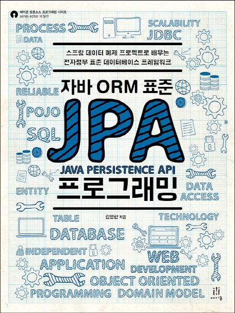

## contents

- [1장 JPA 소개](contents/1/README.md)
- [2장 JPA 시작](contents/2/README.md)
- [3장 영속성 관리](contents/3/README.md)
- [4장 엔티티 매핑](contents/4/README.md)
- [5장 연관관계 매핑 기초](contents/5/README.md)
- [6장 다양한 연관관계 매핑](contents/6/README.md)
- [7장 고급 매핑](contents/7/README.md)
- [8장 프록시와 연관관계 관리](contents/8/README.md)
- [9장 값 타입](contents/9/README.md)
- [10장 객체지향 쿼리 언어](contents/10/README.md)
- 11장 웹 애플리케이션 제작
- [12장 스프링 데이터 JPA](contents/12/README.md)
- [13장 웹 애플리케이션과 영속성 관리](contents/13/README.md)
- [14장 컬렉션과 부가 기능](contents/14/README.md)
- [15장 고급 주제와 성능 최적화](contents/15/README.md)
- 16장 트랜잭션과 락, 2차 캐시
