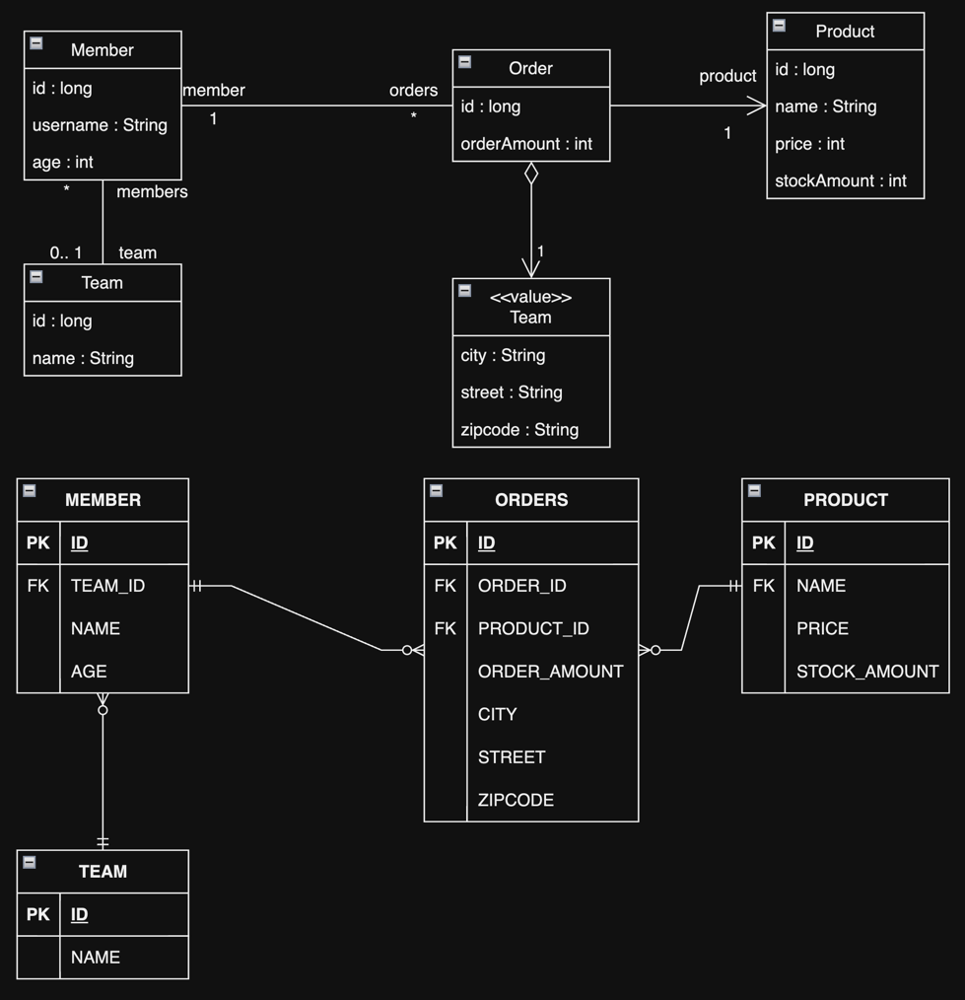

# 10. 객체지향 쿼리 언어

1. 객체지향 쿼리 소개
2. JPQL
3. Criteria
4. QueryDSL
5. 네이티브 SQL
6. 객체지향 쿼리 심화
7. 정리

---

## 1. 객체지향 쿼리 소개

- 테이블이 아닌 객체를 대상으로 검색하는 객체 지향 쿼리
- SQL을 추상화하여 DBMS 벤더에 의존하지 않음
- JPA가 지원하는 검색 방법
    - **JPQL, Java Persistence Query Language**
    - Criteria 쿼리 : JPQL을 편하게 작성하도록 도와주는 API
    - Native SQL : JPQL 대신 직접 SQL 사용
    - QueryDSL : Criteria 같이 JPQL을 편하게 작성하도록 도와주는 빌더 클래스, 비표준 오픈소스 프레임워크
    - JDBC API 직접 사용, Mybatis와 같은 SQL 매퍼 프레임워크 사용

### 1.1 JPQL 소개

- Entity 객체를 조회하는 개체지향 쿼리
- SQL을 추상화하여 특정 DBMS에 의존하지 않음
    - SQL 함수가 DBMS 별로 달라도 JPQL은 같음
- SQL보다 간결

````
Stirng jpql = "select m from IdolMember as m where m.memberName = '카리나'";
List<IdolMember> members = em.createQuery(jpql, IdolMember.class).getResultList();

-- 실제 sql
select m.member_id, m.member_name, m.team_id
from idol_member m
where m.member_name = '카리나';

````

### 1.2 Criteria 소개

- JPQL을 편하게 작성하도록 도와주는 API, JPQL 빌더
- 문자가 아닌 자바 코드로 JPQL 작성 가능
- 문자열 기반 쿼리는 런타임 시점에서 오류를 발견함
- 장점
    - 컴파일 시점에서 오류를 발견
    - IDE 자동완성 지원
    - 동적 쿼리 작성 용이
- 단점
    - 복잡하고 장황
    - 사용이 불편
    - 가독성이 좋지 않음

````
CriteriaBuilder cb = em.getCriteriaBuilder();
CriteriaQuery<IdolMember> query = cb.createQuery(IdolMember.class);

Root<IdolMember> m = query.from(IdolMember.class);

CriteriaQuery<IdolMember> cq = query.select(m).where(cb.equal(m.get("memberName"), "카리나"));
List<IdolMember> members = em.createQuery(cq).getResultList();
````

### 1.3 QueryDSL 소개 (김영한 님이 더 선호)

- Criteria 보다 간단한 빌더 클래스
- 오픈소스 프로젝트이나 spring data project가 지원 중

````
JPAQuery query = new JPAQuery(em);
QIdolMember m = QIdolMember.idolMember;

List<IdolMember> members = query.from(m)
                          .where(m.memberName.eq("카리나"))
                          .list(m);
````

- `QIdolMember` : `IdolMember` 클래스를 기반으로 생성한 QueryDSL 전용 클래스

### 1.4 네이티브 SQL 소개

- JPA가 제공하는 SQL을 직접 사용하는 기능
- 특정 DBMS에만 존재하는 함수 사용 시 유용
- 단점 : DBMS 의존적이라, DBMS 변경 시 SQL 수정 필요

````
String sql = "SELECT MEMBER_ID, MEMBER_NAME, TEAM_ID FROM IDOL_MEMBER WHERE MEMBER_NAME = '카리나'";
List<IdolMember> members = em.createNativeQuery(sql, IdolMember.class).getResultList();
````

### 1.5 JDBC 직접 사용, myBatis 같은 SQL 매퍼 프레임워크 사용

````
Session sess = em.unwrap(Session.class);
sess.doWork(new Work() {
    @Override
    public void execute(Connection connection) throws SQLException {
        // JDBC API 직접 사용 가능
    }
});
````

- JPA를 우회해서 DBMS에 접근하는 방법
    - = **JPA는 어떤 데이터를 수정하는지 모름**
- 영속성 컨텍스트를 적절한 시점에 강제로 `flush()` 해야 함
    - 그렇지 않으면, 영속성 컨텍스트의 데이터와 DB의 데이터가 다를 수 있음
- Spirng AOP를 이용해 트랜잭션을 시작하고 종료할 때 flush()를 호출하도록 할 수 있음

## 2. JPQL



### 2.1 기본 문법과 쿼리 API

````
select statement :: = 
    select_clause
    from_clause
    [where_clause]
    [groupby_clause]
    [having_clause]
    [orderby_clause]
    
update statement :: = 
    update_clause
    [where_clause]

delete statement :: =
    delete_clause
    [where_clause]
````

#### `SELECT` statement

````sql
SELECT m
FROM Member AS m
WHERE m.username = '카리나'
````

- 대소문자 구분 : Entity, 속성은 대소문자 구분
- Entity 이름 : `Member`는 Entity 이름, `@Entity(name = "Member")`로 지정한 값
- 별칭 필수, JPA에서는 identification variable이라 함

#### `TypeQuery`, `Query`

- `TypeQuery` : 반환 타입이 명확할 때 사용
- `Query` : 반환 타입이 명확하지 않을 때 사용

````
TypedQuery<Member> query = em.createQuery("SELECT m FROM Member m", Member.class);
List<Member> members = query.getResultList();

Query query = em.createQuery("SELECT m.username, m.age FROM Member m");
List resultList = query.getResultList();
````

#### 결과 조회

- `query.getResultList()` : 결과가 하나 이상일 때, 리스트 반환
- `query.getSingleResult()` : 결과가 정확히 하나, 단일 객체 반환
    - 결과가 없으면 : `javax.persistence.NoResultException` 발생
    - 둘 이상이면 : `javax.persistence.NonUniqueResultException` 발생

### 2.2 파라미터 바인딩

- named parameter가 position parameter보다 명확
- 파라미터 바인딩의 장점
    - JPA가 JPQL을 parsing하여 재사용
    - DBMS 내부에서 SQL을 parsing하여 재사용
- **바인딩이 아닌 직접 문자열로 SQL을 작성하면 안됨**
    - SQL 작성은 SQL Injection 공격에 취약

#### 이름 기준 파라미터 바인딩, named parameter

````
String usernameParam = "카리나";
TypedQuery<Member> query = em.createQuery("SELECT m FROM Member m WHERE m.username = :username", Member.class);
query.setParameter("username", usernameParam);
List<Member> resultList = query.getResultList();
````

````
// 메서드 체인 방식

List<Member> resultList = em.createQuery("SELECT m FROM Member m WHERE m.username = :username", Member.class)
                            .setParameter("username", usernameParam)
                            .getResultList();
````

#### 위치 기준 파라미터, positional parameter

````
List<Member> resultList = em.createQuery("SELECT m FROM Member m WHERE m.username = ?1", Member.class)
                              .setParameter(1, usernameParam);
````

### 2.3 프로젝션, projection

- SELECT 절에 조회할 대상을 지정하는 것
- 프로젝션 대상 : 엔티티, 임베디드 타입, 스칼라 타입

#### 엔티티 프로젝션

```sql
SELECT m
FROM Member m;

SELECT m.team
FROM Member m;
````

#### 임베디드 타입 프로젝션

- 임베디드 타입은 값 타입이므로 엔티티와 다르게 조회 결과를 영속성 컨텍스트에서 관리하지 않음

```sql
-- JPQL
SELECT o.address
FROM Order o;

-- 실제 SQL
SELECT o.zipcode, o.street, o.city
FROM Orders o;
````

#### 스칼라 타입 프로젝션

스칼라 타입 : 숫자, 문자, 날짜

````
List<String> resultList = em.createQuery("SELECT m.username FROM Member m", String.class)
                              .getResultList();
````

#### 여러 값 조회

- 필요한 데이터만 조회할 때
- Query 타입으로 조회

````
List<Object[]> resultList = em.createQuery("SELECT m.username, m.age FROM Member m")
                    .getResultList();
````

#### `new` 명령어

- `Object[]` 타입 말고, DTO로 바로 조회

```java
public class UserDTO {
    private String username;
    private int age;

    public UserDTO(String username, int age) {
        this.username = username;
        this.age = age;
    }
}

public class Foo {
    public void selectDTO(EntityManager em) {
        List<UserDTO> resultList = em.createQuery("SELECT new jpabook.jpql.UserDTO(m.username, m.age) FROM Member m", UserDTO.class)
                .getResultList();
    }
}
````

### 2.4 페이징 API

- `setFirstResult(int startPosition)` : 조회 시작 위치
- `setMaxResults(int maxResult)` : 조회할 데이터 수
- API를 DB 방언에 맞게 변환해서 호출

````
// 11번부터 30번까지 조회 (20개)
TypedQuery<Member> query = em.createQuery("SELECT m FROM Member m ORDER BY m.age DESC", Member.class)
                              .setFirstResult(10)
                              .setMaxResults(20);
````

```sql
-- 실제 sql (오라클)
SELECT *
FROM (SELECT ROW_.*, ROWNUM ROWNUM_
      FROM (SELECT M.ID AS ID1, M.AGE AS AGE2, M.TEAM_ID AS TEAM_ID3, M.NAME AS NAME4
            FROM MEMBER M
            ORDER BY M.AGE DESC) ROW_
      WHERE ROWNUM <= ?)
    )
WHERE ROWNUM_ > ?
```

### 2.5 집합과 정렬

#### `GROUP BY`, `HAVING`, `ORDER BY`

sql과 동일

### 2.6 JPQL 조인

#### 내부 조인

````
String teamName = "Aespa";
String query  = "SELECT m FROM Member m INNER JOIN m.team t WHERE t.name = :teamName";
List<Member> resultList = em.createQuery(query, Member.class)
                              .setParameter("teamName", teamName)
                              .getResultList();
````

````sql
-- JPQL
SELECT m
FROM Member m
         INNER JOIN m.team t -- Entity 연관관계를 활용함
WHERE t.name = :teamName;

-- 실제 SQL
SELECT M.ID AS ID, M.AGE AS AGE, M.TEAM_ID AS TEAM_ID, M.NAME AS NAME
FROM MEMBER M
         INNER JOIN TEAM T ON M.TEAM_ID = T.ID
WHERE T.NAME = ?
````

#### 외부 조인

```sql
-- JPQL
SELECT m
FROM Member m
         LEFT JOIN m.team t
WHERE t.name = :teamName;

-- 실제 SQL
SELECT M.ID AS ID, M.AGE AS AGE, M.TEAM_ID AS TEAM_ID, M.NAME AS NAME
FROM MEMBER M
         LEFT OUTER JOIN TEAM T ON M.TEAM_ID = T.ID
WHERE T.NAME = ?
````

#### 컬렉션 조인

1:N, N:M 같은 컬렉션을 조인할 때 사용

```sql
-- JPQL
SELECT t, m
FROM Team t
         LEFT JOIN t.members m;

-- 실제 SQL
SELECT T.ID AS ID, T.NAME AS NAME, M.ID AS ID1, M.AGE AS AGE, M.TEAM_ID AS TEAM_ID, M.NAME AS NAME1
FROM TEAM T
         LEFT OUTER JOIN MEMBER M ON T.ID = M.TEAM_ID
```

#### 세타 조인

- 내부 조인만 지원
- 전혀 관계 없는 엔티티를 조인할 때 사용

```sql
-- JPQL
SELECT COUNT(m)
FROM Member m,
     Team t
WHERE m.username = t.name;

-- 실제 SQL
SELECT COUNT(M.ID)
FROM MEMBER M,
     TEAM T
WHERE M.USERNAME = T.NAME
```

#### JOIN ON 절 (JPA 2.1부터 지원)

- 내부 JOIN의 `ON` 절은 `WHERE` 절과 같음
- 외부 JOIN 시 주로 사용
    - 조인 대상을 필터링하고 조인

```sql
-- JPQL
select m, t
from Member m
         left join m.team t on t.name = 'Aespa';

-- 실제 SQL
SELECT M.ID AS ID, M.AGE AS AGE, M.TEAM_ID AS TEAM_ID, M.NAME AS NAME, T.ID AS ID1, T.NAME AS NAME1
FROM MEMBER M
         LEFT OUTER JOIN TEAM T ON T.NAME = 'Aespa';
```

### 2.7 페치 조인, FETCH JOIN

- 연관된 Entity나 Collection을 SQL 한 번에 함께 조회하는 기능
- 별칭 사용 불가
    - hibernate는 가능

````
fetch jokin ::== [LEFT [OUTER] | INNER] JOIN FETCH 조인경로
````

#### Entity FETCH JOIN

- 지연 로딩을 설정해도 `fetch join`에는 즉시 로딩함

```sql
-- JPQL
SELECT m
FROM Member m
         JOIN FETCH m.team;

-- 실제 SQL
-- 지연 로딩 없음
SELECT M.*, T.*
FROM MEMBER M
         INNER JOIN TEAM T ON M.TEAM_ID = T.ID;
```

````
String jpql = "SELECT m FROM Member m JOIN FETCH m.team";
List<Member> members = em.createQuery(jpql, Member.class).getResultList();
````

#### Collection FETCH JOIN

1:N 관계

```sql
-- JPQL
select t
from Team t
         join fetch t.members
where t.name = 'Aespa';

-- 실제 SQL
SELECT T.*, M.*
FROM TEAM T
         INNER JOIN MEMBER M ON T.ID = M.TEAM_ID
WHERE T.NAME = 'Aespa';
```

````
String jpql = "SELECT t FROM Team t JOIN FETCH t.members WHERE t.name = 'Aespa'";
List<Team> teams = em.createQuery(jpql, Team.class).getResultList(); 
System.out.println("teams.size() = " + teams.size()); // teams.size() = [member 수] 
````

#### fetch join 과 DISTINCT

- JPQL의 `DISTINCT`는 SQL에 `DISTINCT`를 추가 + app 단에서 중복 제거
- 실제 SQL은 중복제거를 해도 조회하려는 객체의 중복 제거가 안됨
- select 결과를 한번더 app 단에서 중복 제거를 한번 더 함

```sql
-- JPQL
SELECT DISTINCT t
FROM Team t
         JOIN FETCH t.members
WHERE t.name = 'Aespa';

-- 실제 SQL
SELECT DISTINCT t.*, m.*
FROM TEAM T
         INNER JOIN MEMBER M ON T.ID = M.TEAM_ID
WHERE T.NAME = 'Aespa';
```

#### fetch join과 일반 join의 차이

- **일반 join은 연관관계 객체를 조회하지 않음**
    - 지연 로딩 설정 시 : 프록시 반환
    - 즉시 로딩 설정 시 : **연관 객체 SELECT 쿼리를 한번 더 실행**

```sql
-- JPQL : 일반 join
SELECT t
FROM Team t
         JOIN t.members m
WHERE t.name = 'Aespa';

-- 실제 SQL : 일반 join
SELECT T.* -- Entity만
FROM TEAM T
         INNER JOIN MEMBER M ON T.ID = M.TEAM_ID
WHERE T.NAME = 'Aespa';


-- JPQL : fetch join
SELECT t
FROM Team t
         JOIN FETCH t.members m
WHERE t.name = 'Aespa';

-- 실제 SQL : fetch join
SELECT T.*, M.* -- Entity + 연관관계 객체
FROM TEAM T
         INNER JOIN MEMBER M ON T.ID = M.TEAM_ID
WHERE T.NAME = 'Aespa';
```

#### fetch join의 특징과 한계

- sql 호출 회수 최적화 : sql 한번으로 연관 객체 조회
- global loading 전략보다 우선하여 사용됨
    - global loading 전략 : Entity에 직접 적용한 fetch 전략 e.g. `@OneToMany(fetch = FetchType.LAZY)`
    - **gloabl loading 전략은 지연 로딩하고, 필요할 때만 fetch join으로 즉시 로딩**
- 준영속 상태에서도 객체 그래프 탐색 가능
- fetch join 대상에 별칭 불가능
    - hibernate는 지원하지만, 무결성이 꺠질 수 있어 주의해서 사용
- 2개 이상의 컬렉션 fetch 불가
    - 구현체에 따라 지원하지만, 카테시안 곱이 발생할 수 있음
    - hibernate에선 `javax.persistence.PersistenceException` 발생
- 컬렉션 페치 조인 시 페이징 불가, `setFirstResult`, `setMaxResults`
    - 1:1, N:1은 페이징 가능
    - 컬렉션 페치 조인 시, 일대다 조인이 발생하므로 데이터가 예측할 수 없이 증가
        - hibernate는 메모리에서 페이징 처리를 하고, 경고 로깅을 남김 (성능 저하)
- **결론**
    - **fetch join은 객체그래프를 유지하면서 조회할 수 있어 편함**
    - **Entity가 가진 모양과 많이 다른 결과를 조회하고 싶다면 여러번 조회해서 DTO로 변환하여 반환하는 것이 효과적**

### 2.8 경로 표현식, path expression

`.`을 찍어 객체 그래프를 탐색하는 것

```sql
select m.username -- 상태 필드
from Member m
         join m.team t -- 연관 필드 (단일 값 연관 필드)
         join t.orders o -- 연관 필드 (컬렉션 값 연관 필드)
where m.team.name = 'Aespa';
```

```java

@Entity
public class Member {
    @Id
    @GeneratedValue
    private Long id;

    @Column(name = "USERNAME")
    private String username; // 상태 필드

    @ManyToOne
    @JoinColumn(name = "TEAM_ID")
    private Team team; // 연관 필드 (단일 값 연관 필드)

    @OneToMany(mappedBy = "member")
    private List<Order> orders = new ArrayList<>(); // 연관 필드 (컬렉션 값 연관 필드)

    //...
}
```

#### 경로 표현식의 용어 정리

- 상태 필드, state field : 단순히 값을 저장하기 위한 필드
- 연관 필드, association field : 연관관계를 위한 필드, 임베디드 타입 포함
    - 단일 값 연관 필드 : `@ManyToOne`, `@OneToOne`, 대상이 엔티티
    - 컬렉션 값 연관 필드 : `@OneToMany`, `@ManyToMany`, 대상이 컬렉션

#### 경로 표현식과 특징

- 상태 필드 경로 : 탐색의 끝, 더 이상 탐색 불가
- 단일 값 연관 경로 : 묵시적 내부 조인 발생, 계속 탐색 가능
- 컬렉션 값 연관 경로 : 묵시적 내부 조인 발생, 더 이상 탐색 불가
    - 단, `FROM` 절에서 별칭을 얻으면 별칭으로 탐색 가능
- 묵시적 조인 : 단일 값 연관 필드로 경로탐색 시 묵시적으로 SQL `INNER JOIN`
    - `SELECT m.team FROM Member m` : 묵시적 조인 발생

```sql
-- JPQL : 상태 필드 경로 탐색
SELECT m.username, m.age
FROM Member m;

-- 실제 SQL : 상태 필드 경로 탐색
SELECT M.USERNAME, M.AGE
FROM MEMBER M;

-- JPQL : 단일 값 연관 경로 탐색
SELECT o.member
FROM Order o;

-- 실제 SQL : 단일 값 연관 경로 탐색
SELECT M.*
FROM ORDERS O
         INNER JOIN MEMBER M ON O.MEMBER_ID = M.ID;

-- JPQL : 묵시적 조인을 이용한 경로 탐색
SELECT t.*
FROM Order o
WHERE o.product.name = 'NEXT_LEVEL'
  AND o.address.city = 'Seoul';

-- 실제 SQL : 묵시적 조인을 이용한 경로 탐색
SELECT T.*
FROM Orders O
         INNER JOIN MEMBER M ON O.MEMBER_ID = M.ID -- 묵시적 조인 (1)
         INNER JOIN TEAM T ON M.TEAM_ID = T.ID -- 묵시적 조인 (2)
         INNER JOIN PRODUCT P ON O.PRODUCT_ID = P.ID -- 묵시적 조인 (3)
WHERE P.PRODUCT_NAME = 'NEXT_LEVEL'
  AND O.CITY = 'Seoul';

-- JPQL : 컬렉션 값 연관 경로 탐색 (실패)
SELECT t.members.username
FROM Team t;

-- JPQL : 컬렉션 값 연관 경로 탐색 (성공)
SELECT m.username
FROM Team t
         JOIN t.members m -- 별칭 m을 얻어 m으로부터 경로 탐색 가능
;

-- JPQL : 컬렉션 사이즈 구하기
SELECT t.members.size
FROM Team t;
```

#### 경로 탐색을 사용한 묵시적 조인 시 주의사항

- 항상 `INNER JOIN `
- 컬렉션은 경로탐색의 마지막, 추가 탐색하려면 `JOIN`문으로 별칭을 얻어야함
- 경로 탐색은 주로 SELECT, WHERE 절에서 사용하지만, 묵시적 조인으로 인해 SQL의 FROM 절에 영향을 줌
- 묵시적 JOIN 보다는 명시적 JOIN을 추천 (성능)

### 2.9 서브 쿼리

`WHERE`, `HAVING` 절에서 사용 가능 (hibernate HQL은 `SELECT` 절까지 가능)

```sql
-- JPQL : 서브 쿼리 WHERE 절
SELECT m
FROM Member m
WHERE m.age > (SELECT AVG(m2.age) FROM Member m2);

````

#### 서브 쿼리 함수

```sql
-- [NOT] EXISTS (subquery) : 서브 쿼리에 결과가 존재하면 참
select m
from Member m
where exists(select t from m.team t where t.name = 'Aespa');

-- {ALL | ANY | SOME} (subquery) : 조건식을 만족하는지 비교
select m
from Member m
where m.team = ANY (select t from Team t);

-- [NOT] IN (subquery) : 서브 쿼리의 결과 중 하나라도 같은 것이 있으면 참
select t
from Team t
where t in (select t2
            from Team t2
                     join t2.members m2
            where m2.age > 10);
````

### 2.10 조건식

#### 타입 표현

| 종류      | 설명                                                                                         | 예시                                                               |
|---------|--------------------------------------------------------------------------------------------|------------------------------------------------------------------|
| 문자      | 작은따옴표로 감쌈<br/> '로 escape                                                                   | 'HELLO', 'She''s'                                                |
| 숫자      | L, D, F로 타입 지정                                                                             | 10, 10L, 10D                                                     |
| 날짜      | DATE {d 'yyyy-mm-dd'}<br/> TIME {t 'hh:mm:ss'}<br/> TIMESTAMP {ts 'yyyy-mm-dd hh:mm:ss.f'} | {d '2021-10-10'}<br/>m.createDate > {ts '2021-10-10 10:10:10.0'} |
| Boolean | TRUE, FALSE                                                                                | TRUE, FALSE                                                      |

#### 연산자 우선순위

1. 경로 탐색 연산 `.` (ex. `m.username`)
2. 수학 연산 : `*`, `/`, `%`
3. 비교 연산 : `=`, `>`, `<`, `>=`, `<=`, `<>`, `IS`, `LIKE`, `BETWEEN`, `IN`
4. 논리 연산 : `NOT`, `AND`, `OR`

#### 논리 연산과 비교식

- 논리 연산
    - `AND` : 둘다 만족하면 참
    - `OR` : 둘 중 하나만 만족해도 참
    - `NOT` : 논리값의 반대
- 비교식 : `=`, `>`, `<`, `>=`, `<=`, `<>`

#### `BETWEEN`, `IN`, `LIKE`, NULL 비교

- `BETWEEN` : `X [NOT] BETWEEN A AND B`
- `IN` : `X [NOT] IN (A, B, C)`
- `LIKE` : `X [NOT] LIKE 패턴값 [ESCAPE]`
- `NULL` 비교 : `IS [NOT] NULL`

#### 컬렉션 식

- **컬렉션에는 컬렉션 식 외에 다른 조건식 사용 불가**
- `IS [NOT] EMPTY` : 컬렉션이 비어있는지 검사
- `[NOT] MEMBER [OF]` : 컬렉션에 값이 포함되어 있는지 검사

```sql
-- JPQL
select t
from Team t
where t.members IS NOT EMPTY;

-- 실제 SQL
SELECT T.*
FROM TEAM T
WHERE EXISTS(SELECT 1
             FROM MEMBER M
             WHERE M.TEAM_ID = T.ID);

--JPQL : 컬렉션에 컬렉션 식 외의 조건식 사용 (실패)
select t
from Team t
where t.members is null;

-- JPQL
select t
from Team t
where :memberParam MEMBER OF t.members;
```

#### 스칼라 식

| 함수                                                             | 설명                                                                                       | 예시                          |
|----------------------------------------------------------------|------------------------------------------------------------------------------------------|-----------------------------|
| +, -, *, /                                                     | 사칙 연산                                                                                    | age + 10                    |
| CONCAT(문자1, 문자2, ...)                                          | 문자 연결                                                                                    | CONCAT('a', 'b')            |
| SUBSTRING(문자, 위치 [길이])                                         | 문자열 자르기                                                                                  | SUBSTRING(m.username, 2, 3) |
| TRIM([[LEADING &#124; TRAILING &#124; BOTH] [제거할 문자] FROM] 문자) | 문자열 공백 제거                                                                                | TRIM('  a  ')               |
| LOWER(문자), UPPER(문자)                                           | 소문자, 대문자로 변경                                                                             | LOWER(m.username)           |
| LENGTH(문자)                                                     | 문자 길이                                                                                    | LENGTH(m.username)          |
| LOCATE(찾을 문자, 원본 문자, [시작위치])                                   | 문자 위치 찾기                                                                                 | LOCATE('arin', m.username)  |
| ABS, SQRT, MOD, SIZE, INDEX                                    | 수학 함수 <br/> ABS : 절대값<br/>SQRT : 제곱근<br/>MOD : 나머지<br/>SIZE : 컬렉션 크기<br/>INDEX : 컬렉션 인덱스 | ABS(m.age), SIZE(t.members) |
| CURRENT_DATE, CURRENT_TIME, CURRENT_TIMESTAMP                  | 데이터베이스 시스템의 현재 날짜, 시간, 타임스탬프                                                             | CURRENT_DATE                |

#### CASE 식

- 기본 CASE : `CASE {WHEN <조건식> THEN <스칼라식>} + ELSE <스칼라식> END`
- 단순 CASE : `CASE <대상> {WHEN <스칼라식1> THEN <스칼라식2>} + ELSE <스칼라식3> END`
- `COALESCE` : 하나씩 조회해서 null이 아니면 반환
- `NULLIF` : 두 값이 같으면 null 반환, 다르면 첫번째 값 반환

```sql
-- JPQL : 기본 CASE
select case
           when m.username = '카리나' then '최애'
           when m.username = '하니' then '최애 두번쨰'
           else '최애 아님'
           end
from Member m;

-- JPQL : 단순 CASE
select case m.username
           when '카리나' then '최애'
           when '하니' then '최애 두번쨰'
           else '최애 아님'
           end
from Member m;

-- JPQL : COALESCE
-- username이 null이면 '이름 없는 회원' 반환
select coalesce(m.username, '이름 없는 회원')
from Member m;

-- JPQL : NULLIF
-- username이 '이름 없는 회원'이면 null 반환
select nullif(m.username, '이름 없는 회원')
from Member m;
```

### 2.11 다형성 쿼리

JPQL로 부모 Entity 조회시 자식 Entity도 함께 조회됨

```java

@Entity
@Inheritance(strategy = InheritanceType.SINGLE_TABLE)
@DiscriminatorColumn(name = "DTYPE")
public abstract class Person {
    //...
}

@Entity
@DiscriminatorValue("I")
public class Idol extends Person {
    //...
}

@Entity
@DiscriminatorValue("D")
public class Developer extends Person {
    //...
}
```

````
List<Person> result = em.createQuery("select p from Person p", Person.class)
                        .getResultList(); // Idol, Developer 모두 조회됨
````

```sql
-- JPQL
select p
from Person p


-- 실제 SQL : InheritanceType.SINGLE_TABLE
select p.*
from Person p;

-- 실제 SQL : InheritanceType.JOINED
select p.*, i.*, d.*
from Person p
         left outer join Idol i on p.id = i.id
         left outer join Developer d on p.id = d.id;
```

#### TYPE

Entity 상속 구조에서 조회 대상을 특정 자식 타입으로 한정할 떄

```sql
-- JPQL
select p
from Person p
where type(p) in (Idol, Developer);

-- 실제 SQL
select p.*
from Person p
where p.DTYPE in ('I', 'D');
``` 

#### TREAT(JPA 2.1)

- 상속 구조에서 부모 타입을 특정 자식 타입으로 다룰 때 사용
- JPA는 `FROM`, `WHERE`, hibernate는 `SELECT`에서 사용 가능

```sql
-- JPQL
select p
from Person p
where treat(p as Idol).groupName = 'Aespa';

-- 실제 SQL
select p.*
from person p
where p.DTYPE = 'I'
  and p.groupName = 'Aespa';
```

### 2.12 사용자 정의 함수 호출 (JPA 2.1)

- JPQL에서 사용자 정의 함수 호출 가능
- `function_invocation::== FUNCTION(function_name {, function_arg}*)`

```java
public class MySqlDialectCustom extends MySQL5Dialect {
    public MySqlDialectCustom() {
        super();
        registerFunction("group_concat", new StandardSQLFunction("group_concat", StandardBasicTypes.STRING));
    }
}
```

````
<!-- persistence.xml -->
<property name="hibernate.dialect" value="com.example.demo.MySqlDialectCustom"/>
````

```sql
-- jpql
select group_concat(m.username)
from Member m;
````

### 2.13 기타 정리

- enum은 `=` 비교연산자만 지원
- 임베디드 타입은 비교 지원 안함
- EMPTY STRING
    - JPA : 길이가 0인 문자열을 Empty String으로 정의
    - DBMS : 길이가 0인 문자열을 NULL로 정의하기도 함
- NULL
    - 조건을 만족하는 값이 하나도 없으면 NULL 이다.
    - NULl은 알 수 없는 값이다.
    - NULL == NULL 은 알 수 없는 값이다.
    - NULL is NULL 은 참이다.

### 2.14 Entity 직접 사용

#### 기본 키 값

JPQL에서 엔터티를 직접 사용시 자동으로 Entity의 기본 키 값을 사용

```sql
-- JPQL : 기본 키 값 사용
select count(m.id)
from Member m;

-- JQPL : Entity 직접 사용
select count(m)
from Member m;

-- 실제 SQL
-- 둘다 똑같음
select count(m.id)
from Member m;

-- JPQl
select m
from Member m
where m = :member;

-- 실제 SQL
select m.*
from Member m
where m.id = ?;
```

#### 외래 키 값

```sql
-- JPQL
select m
from Member m
where m.team = :team;

-- 실제 SQL
select m.*
from Member m
where m.team_id = ?;
```

### 2.15 Named 쿼리 : 정적 쿼리

- 동적 쿼리 : JPQL을 직접 문자열로 작성
    - runtime에 쿼리가 완성됨
    - e.g. `em.createQuery("select m from Member m where m.username = :username", Member.class);`
- 정적 쿼리 : 미리 정의한 쿼리
    - app 로딩 시점에 JPQL 문법 체크 후 parsing
    - 오류 체크
    - 성능 최적화 : 미리 parsing된 쿼리 재사용, DBMS 조회 성능 최적화
    - `@NamedQuery`, xml 에 등록

#### Named 쿼리를 어노테이션에 정의

```java

@Entity
@NamedQuery(
        name = "Member.findByTeamId",
        query = "select m from Member m where m.teamId = :teamId"
)
public class Member {
    //...
}

public class Foo {
    public void fooSelect() {
        List<Member> memberAespa = em.createNamedQuery("Member.findByTeamId", Member.class)
                .setParameter("teamId", "Aespa001")
                .getResultList();
    }
}
```

#### Named 쿼리를 XML에 정의

- named query는 xml이 더 편리함
- xml에 정의된 named query는 어노테이션에 정의된 named query를 오버라이딩 함

```xml
<?xml version="1.0" encoding="UTF-8"?>

<named-query name="Member.findByTeamId">
    <query>
        select m
        from Member m
        <CDATA[
        where m.teamId = :teamId
        ]]>
    </query>
</named-query>

        <!--persistance.xml-->
<persistence-unit name="jpabook">
<mapping-file>META-INF/orm.xml</mapping-file>
</persistence-unit>
```

## 3. Criteria

- JPQL을 편하게 작성할 수 있는 builder API
- 코드로 JPQL 작성 가능
    - compile-time에 sql 오류 잡을 수 있음
    - 코드가 복잡해지고 가독성이 떨어짐

### 3.1 Criteria 기본 API

`javax.persistence.criteria` 패키지

````
// 1. CriteriaBuilder 얻기
CriteriaBuilder cb = em.getCriteriaBuilder();

// 2. CriteriaQuery 생성, 반환타입 지정
CriteriaQuery<Member> query = cb.createQuery(Member.class);

// 3. FROM 절 생성, 쿼리 루트
Root<Member> m = query.from(Member.class);
// 4. SELECT 절 생성
query.select(m);

TypedQuery<Member> typedQuery = em.createQuery(query);
List<Member> members = typedQuery.getResultList();
````

````
CreteriaBuilder cb = em.getCriteriaBuilder();
CriteriaQuery<Member> query = cb.createQuery(Member.class);
Root<Member> m = query.from(Member.class);

// 1. 검색 조건 지정
Predicate predicate = cb.equal(m.get("username"), "Aespa");

// 2. 정렬 조건 지정
javax.persistence.criteria.Order order = cb.desc(m.get("age"));

// 3. 쿼리 생성
query.select(m)
        .where(predicate)
        .orderBy(order);
        
// 4. 쿼리 실행
List<Member> members = em.createQuery(query).getResultList();
````

````

Root<Member> m = query.from(Member.class);

Predicate predicate = cb.greaterThan(m.<Integer>get("age"), 10);

cq.select(m);
cq.where(predicate);
cq.orderBy(cb.desc(m.get("age")));
````

## 4. QueryDSL

## 5. 네이티브 SQL

## 6. 객체지향 쿼리 심화

## 7. 정리
