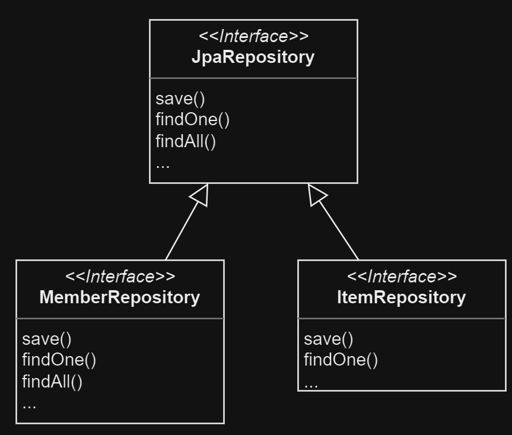
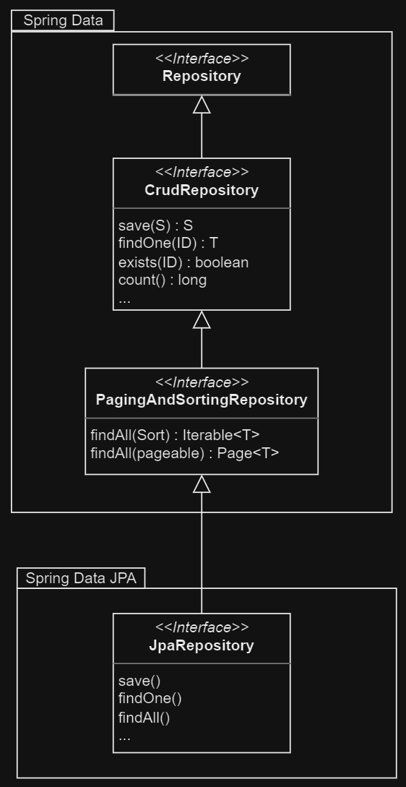

# 12. 스프링 데이터 JPA

1. 스프링 데이터 JPA 소개
2. 스프링 데이터 JPA 설정
3. 공통 인터페이스 기능
4. 쿼리 메소드 기능
5. 명세
6. 사용자 정의 리포지토리 구현
7. Web 확장
8. 스프링 데이터 JPA가 사용하는 구현체
9. JPA 샵에 적용
10. 스프링 데이터 JPA와 QueryDSL 통합
11. 정리

---

Data Access Layer의 중복 코드 (CRUD)를 JPA에서 해소하는 방법

## 1. 스프링 데이터 JPA 소개

- Spring Framework에서 JPA를 편리하게 사용할 수 있도록 지원하는 프로젝트
- Data Access Layer에서 반복되는 CRUD 코드 작성을 해결
- Repository 작성시 인터페이스만 정의하면, JPA가 구현객체를 동적으로 생성해서 주입
    - Repository 메서드 작성 시 메서드명을 분석해서 JPQL 생성



```java

public interface MemberRepository extends JpaRepository<Member, Long> {

    /**
     * JPQL :
     * select m
     * from Member m
     * where m.username = ?
     *          and m.age > ?
     * */
    List<Member> findByUsernameAndAgeGreaterThan(String username, int age);
}


public interface ItemRepository extends JpaRepository<Item, Long> {

    /**
     * JPQL :
     * select i
     * from Item i
     * where i.price < ?
     * */
    List<Item> findByPriceLessThan(int price);
}
````

## 2. 스프링 데이터 JPA 설정

- `spring-data-jpa` 라이브러리 추가
- jpa repository `base-package` 설정

## 3. 공통 인터페이스 기능



- `JpaRepository`의 제네릭으로 Entity와 식별자 타입을 전달
- `save(S)` : 새로운 엔티티는 저장하고, 이미 있는 엔티티는 병합
- `delete(T)` : 엔티티 하나를 삭제, `EntityManager.remove()`
- `findById(ID)` : 엔티티 하나를 조회, `EntityManager.find()`
- `getOne(ID)` : 엔티티를 프록시로 조회, `EntityManager.getReference()`
- `findAll(…)` : 모든 엔티티를 조회, 정렬(`Sort`)이나 페이징(`Pageable`) 조건을 파라미터로 제공 가능

```java
public interface MemberRepository extends JpaRepository<Member, Long> {

    //...
}
```

## 4. 쿼리 메소드 기능

- 메서드 이름으로 쿼리 생성
- 메서드 이름으로 JPA NamedQuery 호출
- `@Query` 어노테이션으로 리포지토리 인터페이스에 쿼리 직접 정의

### 4.1 메소드 이름으로 쿼리 생성

[Srping Data JPA docs 쿼리 메서드 작성법 참고](https://docs.spring.io/spring-data/jpa/docs/current/reference/html/#jpa.query-methods.query-creation)

```java
public interface MemberRepository extends JpaRepository<Member, Long> {

    // 이메일과 이름으로 회원 조회
    List<Member> findByEmailAndName(String email, String name);
}
```

```sql
-- JPQL
select m
from Member m
where m.email = ?
  and m.name = ?;

-- SQL
select m.*
from MEMBER m
where m.email = ?
  and m.name = ?;
```

### 4.2 JPA NamedQuery

```java
/**
 * Entity Member에 Member.findByUsername 쿼리 정의 전제
 * */
public interface MemberRepository extends JpaRepository<Member, Long> {

    public List<Member> findByUsername(@Param("username") String username);
}
```

### 4.3 `@Query`, 리포지토리 메서드에 쿼리 정의

- Repository에서 쿼리를 직접 정의
- `@org.springframework.data.jpa.repository.Query` 어노테이션 사용

```java
public interface MemberRepository extends JpaRepository<Member, Long> {

    @Query("select m from Member m where m.username = ?1")
    public List<Member> findByUsername(String username);

    @Query(nativeQuery = true, value = "SELECT * FROM MEMBER WHERE USERNAME = ?1")
    public List<Member> findByUsernameNative(String username);
}
```

### 4.4 파라미터 바인딩

- 위치 기반, 이름 기반 바인딩 둘 다 지원

```java
import org.springframework.data.repository.query.Param;

public interface MemberRepository extends JpaRepository<Member, Long> {

    @Query("select m from Member m where m.username = :username and m.age = :age")
    public List<Member> findUser(@Param("username") String username, @Param("age") int age);
}
```

### 4.5 벌크성 수정 쿼리

```java
public interface MemberRepository extends JpaRepository<Member, Long> {

    // @Modifying(cleanAutomatically = true)
    @Modifying
    @Query("update Member m set m.age = m.age + 1 where m.age >= :age")
    public int bulkAgePlus(@Param("age") int age);
}
```

- `@Modifying` : 벌크성 수정, 삭제 쿼리에 사용
- `@Modifying(clearAutomatically = true)` : 벌크성 쿼리 실행 후 영속성 컨텍스트 초기화
    - default = false

### 4.6 반환 타입

- 결과 한건 이상 : 컬렉션 인터페이스
    - `List<Member> findByUsername(String username);`
    - 결과 없으면 빈 컬렉션 반환
- 결과 한건 : 반환 타입 지정
    - `Member findByUsername(String username);`
    - 내부적으로 `Query.getSingleResult()` 호출하고,
        - 결과 없으면 `javax.persistence.NoResultException` 예외 발생
        - 예외 무시하고 `null` 반환

### 4.7 페이징과 정렬

- `org.springframework.data.domain.Sort` : 정렬 기능
- `org.springframework.data.domain.Pageable` : 페이징 기능
- 리턴 타입이 `Page` 일때 `count(*)` 쿼리를 자동으로 실행

````
// count 쿼리 사용
Page<Member> findByAge(int age, Pageable pageable);

// count 쿼리 사용 안함
List<Member> findByAge(int age, Pageable pageable);

List<Member> findByAge(int age, Sort sort);
````

```java
public interface MemberRepository extends JpaRepository<Member, Long> {

    Page<Member> findByName(String name, Pageable pageable);
}

public class MemberService {

    // ...

    public void findByName(String name, Pageable pageable) {
        PageRequest pageRequest = PageRequest.of(0, 3, Sort.by(Sort.Direction.DESC, "name")); // 0부터 시작, 3개씩, name 내림차순
        Page<Member> memberPage = memberRepository.findByName(name, pageRequest);

        List<Member> memberList = memberPage.getContent(); // 조회된 데이터
        long totalCount = memberPage.getTotalElements(); // 전체 데이터 수
        boolean hasNextPage = memberPage.hasNext(); // 다음 페이지 존재 여부
    }
}
```

### 4.8 힌트

- `org.springframework.data.jpa.repository.QueryHints` : JPA 쿼리 힌트 사용
- **SQL 힌트가 아닌, JPA 구현체에게 제공하는 힌트**

### 4.9 Lock

- `org.springframework.data.jpa.repository.Lock` : JPA Lock 사용

````
@Lock(LockModeType.PESSIMISTIC_WRITE)
List<Member> findByName(String name);
````

## 5. 명세, Specification

- 술어, predicate : 참 또는 거짓을 반환하는 함수
    - `AND`, `OR`로 조합 가능
    - 데이터를 검색하기위한 제약조건 하나하나를 의미
- `org.springframework.data.jpa.domain.Specification` : JPA 명세, Spring Data JPA의 술어 정의
- composite 패턴으로 작성되어 다양한 조합이 가능
- `org.springframework.data.jpa.repository.JpaSpecificationExecutor` : 명세를 사용하는 리포지토리 인터페이스

```java
public interface MemberRepository extends JpaRepository<Member, Long>, JpaSpecificationExecutor<Member> {

    List<Member> findAll(Specification<Member> spec);
}

public class MemberService {

    // ...

    public void findByName(String name) {
        List<Member> memberList = memberRepository.findAll(where(memberName(name)).and(isOrderStatus()));
    }
}

public class OrderSpec {
    public static Specification<Member> memberName(String name) {
        return (root, query, builder) -> builder.equal(root.get("name"), name);
    }

    public static Specification<Member> isOrderStatus() {
        return (root, query, builder) -> builder.equal(root.get("status"), OrderStatus.ORDER);
    }
}
```

## 6. 사용자 정의 리포지토리 구현

- \[Repository 인터페이스 이름] + Impl 로 구현하면 Spring Data JPA가 사용자 정의 구현체로 인식

```java
public interface MemberRepositoryCustom {
    public List<Member> findMemberCustom();
}

public class MemberRepositoryImpl implements MemberRepositoryCustom {

    // 사용자 정의 구현
    @Override
    public List<Member> findMemberCustom() {
        return entityManager.createQuery("select m from Member m")
                .getResultList();
    }
}

public interface MemberRepository extends JpaRepository<Member, Long>, MemberRepositoryCustom {

    // ...
}

```

## 7. Web 확장

Spirng MVC에서 사용할 수 있는 편리한 기능

### 7.1 설정

- 방법 : `org.springframework.data.web.config.SpringDataWebConfiguration` 을 스프링 빈으로 등록

### 7.2 도메인 클래스 컨버터 기능

- HTTP 파라미터를 식별자로 사용해서 Entity 객체를 찾아 바인딩
- **Controller에서 Entity를 수정해도 데이터베이스에 반영 안됨**
    - 영속성 컨텍스트의 동작 방식과 OSIV 때문

```java

@Controller
public class MemberController {

    @GetMapping("/members/{id}")
    public String findMember(@PathVariable("id") Member member) {
        return member.getUsername();
    }
}
```

### 7.3 페이징과 정렬 기능

- `PageableHandlerMethodArgumentResolver` : 페이징과 정렬 관련 파라미터를 분석해서 Pageable 타입 객체로 변환
- `SortHandlerMethodArgumentResolver` : 정렬 관련 파라미터를 분석해서 Sort 타입 객체로 변환

```java

@Controller
public class MemberController {

    // /members?page=0&size=3&sort=id,desc&sort=username,desc
    @RequestMapping(value = "/members", method = RequestMethod.GET)
    public String list(Pageable pageable, Model model) {
        Page<Member> page = memberRepository.findAll(pageable);
        model.addAttribute("page", page);
        return "members/list";
    }

    // /members?member_page=0&order_page=1
    @RequestMapping(value = "/members", method = RequestMethod.GET)
    public String list(@Qualifer("member") Pageable memberPageable,
                       @Qualifer("order") Pageable orderPageable,
                       Model model) {
        Page<Member> memberPage = memberRepository.findAll(memberPageable);
        Page<Order> orderPage = orderRepository.findAll(orderPageable);
        model.addAttribute("memberPage", memberPage);
        model.addAttribute("orderPage", orderPage);
        return "members/list";
    }
}
```

- `Pageable` : 페이징 관련 정보를 가지고 있음
    - `page` : 현재 페이지
    - `size` : 페이지 크기
    - `sort` : 정렬 정보

## 8. 스프링 데이터 JPA가 사용하는 구현체

- `org.springframework.data.jpa.repository.support.SimpleJpaRepository` : 스프링 데이터 JPA가 사용하는 구현체

```java
import java.io.Serializable;

@Repository
@Transactional(readOnly = true)
public class SimpleJpaRepository<T, ID extends Serializable> implements JpaRepository<T, ID>, JpaSpecificationExecutor<T> {

    @Transactional
    public <S extends T> S save(S entity) {
        if (entityInformation.isNew(entity)) {
            em.persist(entity);
            return entity;
        } else {
            return em.merge(entity);
        }
    }

    //...
}
```

- `@Repository` : JPA 예외를 스프링이 추상화한 예외로 변환
- `@Transactional` : 트랜잭션 처리
    - JPA의 모든 변경은 트랜잭션 안에서 동작해야 함
    - 사용자 인터페이스 DML 메서드에 자동으로 트랜잭션 처리가 됨
- `@Transactional(readOnly = true)` : 읽기 메서드
- `save()` : 새로운 Entity면 `persist()`, 이미 있는 Entity면 `merge()`
    - `Persistence` 인터페이스를 구현해서 판단 기준 정의 가능

## 9. JPA 샵에 적용

## 10. 스프링 데이터 JPA와 QueryDSL 통합

#### 통합 방법

- `org.springframework.data.querydsl.QueryDslPredicateExecutor`
- `org.springframework.data.querydsl.QueryDslRepositorySupport`

### 10.1 QueryDslPredicateExecutor 사용

```java
public interface ItemRepository extends JpaRepository<Item, Long>, QueryDslPredicateExecutor<Item> {

    // ...
}
```

````

QItem item = QItem.item;
Iterator<Item> iterator = itemRepository.findAll(item.price.gt(10000)).iterator();
````

### 10.2 QueryDslRepositorySupport 사용

QueryDSL의 모든 기능을 사용하기 위함

```java
public interface CustomOrderRepository {

    List<Order> search(OrderSearch orderSearch);
}

public class OrderRepositoryImpl extends QueryDslRepositorySupport implements CustomOrderRepository {


    public OrderRepositoryImpl() {
        super(Order.class);
    }

    @Override
    public List<Order> search(OrderSearch orderSearch) {
        QOrder order = QOrder.order;
        QMember member = QMember.member;

        JPQLQuery query = from(order);

        if (StringUtils.hasText(orderSearch.getMemberName())) {
            query.leftJoin(order.member, member)
                    .where(member.name.contains(orderSearch.getMemberName()));
        }

        if (orderSearch.getOrderStatus() != null) {
            query.where(order.status.eq(orderSearch.getOrderStatus()));
        }

        return query.list(order);
    }


}


```

## 11. 정리

SpringFramework과 JPA를 사용한다면 Spring Data JPA는 필수다
