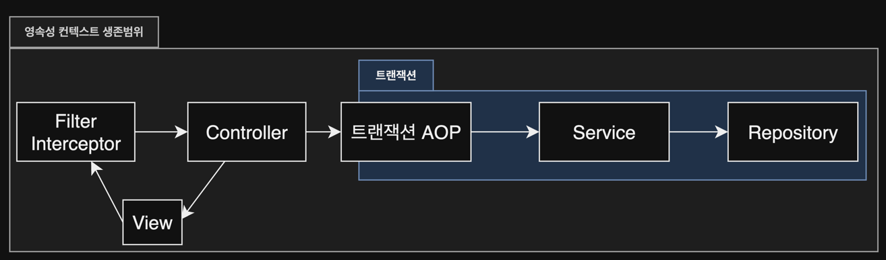

# 13. 웹 애플리케이션과 영속성 관리

1. 트랜잭션 범위의 영속성 컨텍스트
2. 준영속 상태와 지연 로딩
3. OSIV
4. 너무 엄격한 계층
5. 정리

---

## 1. 트랜잭션 범위의 영속성 컨텍스트

- 순수 J2SE 환경에서 JPA를 사용하면 개발자가 직접 EntityManager를 생성하고, 관리
- 스프링이나 J2EE 컨테이너 환경에서 JPA를 사용하면 **컨테이너가 제공하는 전략에 따름**

### 1.1 스프링 컨테이너의 기본 전략


- 트랜잭션 범위의 영속성 컨텍스트 전략 : 트랜잭션 범위와 영속성 컨텍스트의 생명주기가 같음
- 트랜잭션 시작 시 영속성 컨텍스트를 생성하고, 트랜잭션을 종료하면 영속성 컨텍스트도 종료
- 같은 트랜잭션 안에서는 같은 영속성 컨텍스트를 사용

```java

@Controller
public class MemberController {

    @Autowired
    MemberService memberService;

    public void foo() {
        Member member = memberService.findMember(memberId); // 준영속 상태
    }
}

@Service
public class MemberService {

    @Autowired
    EntityManager em;

    @Autowired
    MemberRepository memberRepository;

    @Transactional // 선언적 트랜잭션
    public Member findMember(Long memberId) {
        Member member = memberRepository.findById(memberId); // 영속 상태

        return member;
    }
}

@Repository
public class MemberRepository {

    @Autowired
    EntityManager em;

    public Member findById(Long id) {
        return em.find(Member.class, id); // 영속성 컨텍스트 접근
    }
}
```

#### 트랜잭션이 같으면 같은 영속성 컨텍스트를 사용한다

- 같은 트랜개션 안에 있다면 같은 영속성 컨텍스트를 사용
- `@Transactional` scope 안에서 접근하는 영속성 컨텍트는 같음
- 트랜잭션이 다르면 다른 영속성 컨텍스트를 사용한다

## 2. 준영속 상태와 지연 로딩

```java

@Entity
public class Member {

    @Id
    @GeneratedValue
    private Long id;

    @ManyToOne(fetch = FetchType.LAZY)
    @JoinColumn(name = "TEAM_ID")
    private Team team;

    // ...
}

@Controller
public class MemberController {

    @Autowired
    MemberService memberService;

    public void foo() {
        Member member = memberService.findMember(memberId); // 준영속 상태
        member.getTeam().getName(); // 지연 로딩시 예외 발생 : org.hibernate.LazyInitializationException
    }
}
```

- 트랜잭션 바깥 범위 (준영속 상태)에서는 변경 감지, 지연로딩 동작 안함
- 지연 로딩 연관객체가 프레젠테이션 계층에서 필요하다면,
    - 필요한 Entity를 미리 로딩
        - 글로벌 페치 전략 수정
        - JPQL fetch join
        - 강제로 초기화
    - OSIV를 사용하여 Entity를 항상 영속 상태로 유지

### 2.1 글로벌 페치 전략 수정

```java

@Entity
public class Member {

    @Id
    @GeneratedValue
    private Long id;

    @ManyToOne(fetch = FetchType.EAGER)
    @JoinColumn(name = "TEAM_ID")
    private Team team;

    // ...
}
```

- 미사용 Entity를 같이 로딩
    - 사용되지 않는 화면에서도 항상 같이 로딩
- **N+1 문제**
    - N 개의 Entity를 조회하면, 연관된 Entity를 조회하기 위해 추가로 N 번의 쿼리가 발생
    - **JPA가 JPQL 기반으로 SQL 생성 시 글로벌 페치전략을 참고하지 않음**
    - JPA를 사용하면서 가장 조심해야하는 부분 중 하나
    - **헤걀방법 : JPQL fetch join**

```sql
--  FetchType.EAGER > em.find()
SELECT M.*, T.*
FROM MEMBER M
         LEFT JOIN TEAM T ON M.TEAM_ID = T.ID;

-- FetchType.LAZY > em.createQuery()
SELECT M.*
FROM MEMBER M
WHERE M.ID = 'KARINA001';

SELECT T.*
FROM TEAM T
WHERE T.ID = ?;

SELECT T.*
FROM TEAM T
WHERE T.ID = ?;

SELECT T.*
FROM TEAM T
WHERE T.ID = ?;
...

```

### 2.2 JPQL fetch join

- 글로벌 페치조인을 즉시 로딩으로하면 APP 전체 성능에 영향을 줌
- JPQL을 사용하여 호출할 떄 함께 로딩할 Entity를 선택

```sql
-- JPQL fetch join
select m
from Member m
         left join fetch m.team;

-- SQL
SELECT M.*, T.*
FROM MEMBER M
         LEFT JOIN TEAM T ON M.TEAM_ID = T.ID;
```

#### JPQL fetch join 의 단점

- View와 Repository의 논리적인 의존성이 높아짐
    - 점점 View에 최적화된 쿼리가 늘어남
- 무분별한 최적화로 프레젠테이션 계층과 데이터 접근 계층간의 의존관계가 높아짐

### 2.3 강제로 초기화

- 영속성 컨텍스트가 살아있을 때, 연관된 Entity를 강제로 초기화
- 프레젠테이션 계층과 서비스 계층의 의존성이 높아짐

```java

@Serivce
public class MemberService {

    @Autowired
    EntityManager em;

    @Transactional
    public Member findMember(Long memberId) {
        Member member = memberRepository.findById(memberId); // 영속 상태
        member.getTeam().getName(); // 강제 초기화

        // Hibernate.initialize(member.getTeam()); // 강제 초기화 (JPA 표준은 아님)
        return member;
    }
}
```

### 2.4 FACADE 계층 추가


- 프레젠테이션 계층과 서비스 계층의 의존성을 낮추기 위해 FACADE 계층 추가
- FACADE 계층에서 프레젠테이션 계층에 필요한 프록시 Entity를 초기화

#### FACADE 계층의 역할과 특징

- 프레젠테이션 계층과 도메인 모델 계층간의 논리적 의존성 분리
- 프레젠테이션 계층에서 필요한 프록시 객체 초기화
- 서비스 계층을 호출해서 비즈니스 로직 수행
- Repository 계층을 호출해서 View가 요구하는 Entity 찾기

```java
public class MemberFacade {
    @Autowired
    private MemberService memberService;

    public Member findMember(Long memberId) {
        Member member = memberService.findMember(memberId);
        Hibernate.initialize(member.getTeam());
        return member;
    }
}

@Service
public class MemberService {
    @Autowired
    private MemberRepository memberRepository;

    @Transactional
    public Member findMember(Long memberId) {
        return memberRepository.findById(memberId);
    }
}
```

### 2.5 준영속 상태와 지연 로딩의 문제점

- View가 FACADE 계층에 의존
- FACADE 계층에 메서드가 많아짐
- **원인 : Entity가 Presentation 계층에서 준영속 상태이기 때문**

## 3. OSIV, Open Session In View, Open EntityManager In View

- OSIV : 영속성 컨텍스트를 View까지 유지하는 방법
    - View에서도 지연로딩이 가능하게 함

### 3.1 과거 OSIV : 요청 당 트랜잭션, Transaction Per Request


- client 요청이 들어오면 Servlet filter 나 Spring Interceptor에서 트랜잭션 시작

#### Transaction Per Request의 문제점

- 프레젠테이션 계층에서 Entity를 변경할 수 있음
    - Entity를 변경하면 트랜잭션 커밋 시점에 변경된 내용이 DB에 반영
    - **Entity를 변경하는 로직은 서비스 계층에 있어야 함**

#### 프레젠테이션 계층에서 Entity 변경을 막는 방법

- Entity를 읽기 전용 인터페이스로 제공
- Entity를 래핑
- DTO 반환
    - 가장 전통적인 방법
    - OSIV의 장점을 잃음
    - Entity와 거의 유사한 DTO를 만들어야 함
- **위 방법 모두 중복 코드량이 증가하므로 추천하지 않음**

```java
// Entity를 읽기 전용 인터페이스로 제공
public interface MemberView {
    public String memberName;

}

@Entity
public class Member implements MemberView {
    // ...
}

@Service
public class MemberService {
    public MemberView findMember(Long memberId) {
        Member member = memberRepository.findById(memberId);
        return member;
    }
}
```

```java
// Entity를 래핑
public class MemberWrapper {
    private Member member;

    public MemberWrapper(Member member) {
        this.member = member;
    }

    public String getMemberName() {
        return member.getName();
    }
}
```

```java
// DTO 반환
public class MemberDTO {
    private String memberName;

    public MemberDTO(String memberName) {
        this.memberName = memberName;
    }
    // getter, setter
}
```

### 3.2 스프링 OSIV : 비즈니스 계층 트랜잭션



`spirng-orm.jar` 라이브러리 추가

- hibernate OSIV servlet filter : `org.springframework.orm.hibernate5.support.OpenSessionInViewFilter`
- hibernate OSIV Spring Interceptor : `org.springframework.orm.hibernate5.support.OpenSessionInViewInterceptor`
- JPA OEIV servlet filter : `org.springframework.orm.jpa.support.OpenEntityManagerInViewFilter`
- JPA OSIV Spring Interceptor : `org.springframework.orm.jpa.support.OpenEntityManagerInViewInterceptor`

#### Spring OSIV 분석

- 프레젠테이션 계층에서는 트랜잭션을 시작하지 않음
- 서비스 계층에서 트랜잭션을 시작

1. client 요청 : servlet filter나 Spring Interceptor에서 영속성 컨텍스트 생성 (**트랜잭션 시작 안함**)
2. Service 계층 : `@Transactional`이 붙은 메서드 호출, 1번에서 생성해둔 영속성 컨텍스트에서 트랜잭션 시작
3. Service 종료 : `flush()`, 트랜잭션 반영 후 트랜잭션 종료, 영속성 컨텍스트는 유지
4. View 렌더링 : View에서도 영속성 컨텍스트에 접근 가능
5. Servlet Filter나 Spring Interceptor 에 요청이 들어오면 영속성 컨텍스트를 종료

#### 트랜잭션 없이 읽기, Nontransactional Read

- 영속성 컨텍스트에서 트랜잭션 밖에서 Entity를 읽는 것 (지연 로딩 포함)
- service 계층에서 이미 `EntityManager.close()`하므로, 밖에서 수정해도 `flush()`가 호출되지 않음
- 프레젠테이션 계층에서 `EntityManger.flush()` 호출하면 `TransactionRequiredException` 발생

```java

@Controller
public class MemberController {

    @Autowired
    private MemberService memberService;

    public Member viewMember() {
        Member member = memberService.findMember(1L);
        member.setName("View 전용 이름으로 수정"); // flush() 호출 안함
        return Member;
    }
}
```

#### Spring OSIV 주의사항

```java

@Controller
public class MemberController {

    @Autowired
    private MemberService memberService;

    public Member viewMember() {
        Member member = memberService.findMember(1L);
        member.setName("View 전용 이름으로 수정");

        memberService.logicSomething(); // 트랜잭션 시작
        return Member;
    }
}
```

- 트랜잭션이 시작되면서 기존의 영속성 컨텍스트에 대한 변경감지를 수행
- `member.setName()`으로 변경된 내용이 `flush()`되어 DB에 반영됨

### 3.3 OSIV 정리

- Spring OSIV 특징
    - Client의 요청이 들어올 때 영속성 컨텍스트 시작, 요청이 종료될 때 영속성 컨텍스트 종료
    - Entity 수정은 트랜잭션 계층에서만 동작
    - 트랜잭션이 없는 계층에선 지연로딩을 포함한 읽기만 가능
- Spring OSIV 단점
    - 같은 영속성 컨텍스트에서 여러 트랜잭션이 실행 될 수 있음
    - 프레젠테이션 계층에서도 지연로딩을 통한 `SELECT`가 들어올 수 있음
- OSIV vs FACADE vs DTO
    - OSIV가 아니면 코드량이 늘어남
- OSIV가 만능은 아님
    - 조회할 테이블이 많은 경우 복잡한 Join문으로 JPQL을 만들어서 적절한 DTO로 반환하는 것이 효과적
- OSIV는 같은 JVM 영역을 벗어나면 사용 불가
    - JSON, XML 생성 시 지연 로딩을 사용할 수 있음
    - 우너격지인 client-side에서는 지연 로딩 불가능
    - Entity를 직접 반환하거나, DTO를 만들어서 반환해야 함
        - Entity를 직접 반환하는 방법도 괜찮음 : Entity만 수정하면 됨

## 4. 너무 엄격한 계층


- 너무 엄격한 계층 분리는 비효율적
- 간단한 SELECT는 프레젠테이션 계층에서도 직접 접근하면 효율적

```java

@Controller
public class MemberController {

    // @Autowired
    // private MemberService memberService;

    @Autowired
    private MemberRepository memberRepository;

    public Member viewMember() {
        Member member = memberRepository.findById(1L);
        return Member;
    }
}
```

## 5. 정리

- Spring, J2EE에서 JPA를 사용하면,
    - 영속성 컨텍스트의 범위와 트랜잭션의 범위가 같음
    - 프레젠테이션 계층에서 지연로딩 되지 않는 문제 발생
- OSIV를 사용해서 해결
    - 프레젠테이션 계층에선 Read-only
    - 트랜잭션은 서비스 계층에서 시작