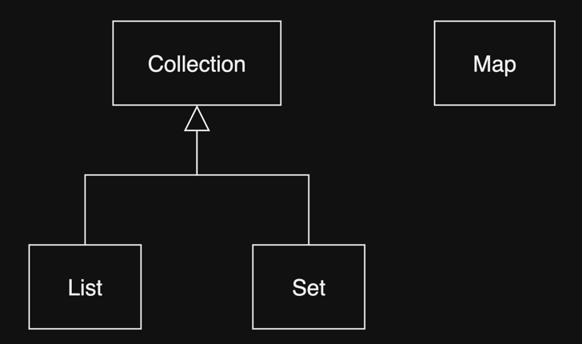
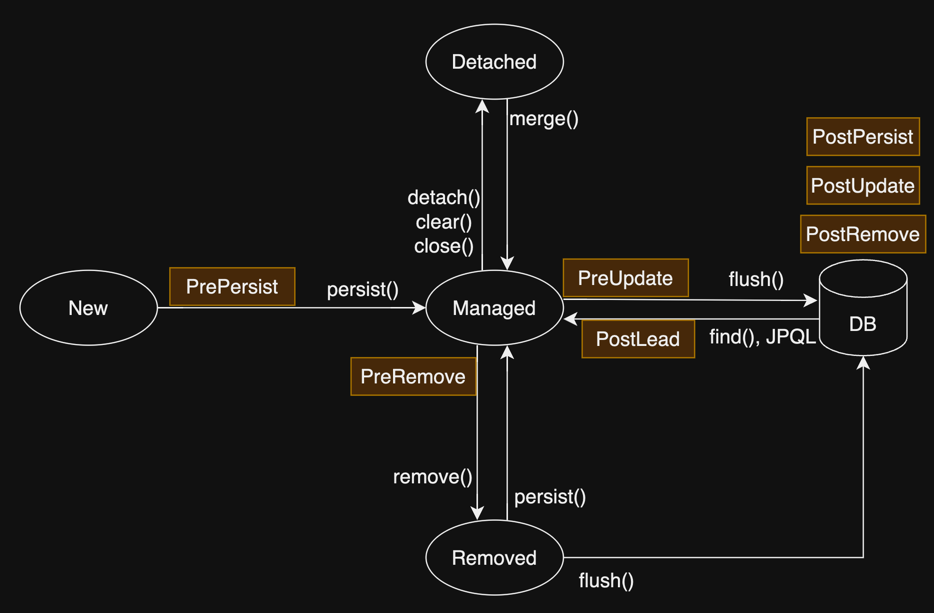

# 14. 컬렉션과 부가 기능

1. 컬렉션
2. @Converter
3. 리스너
4. 엔티티 그래프
5. 정리

---

## 1. 컬렉션



- `@OneToMany`와 `@ManyToMany`로 Entity 관계 매핑
- `@ElementCollection`으로 값 타입 컬렉션 매핑

### 1.1 JPA와 컬렉션

- Wrapper Colelction : hibernate는 Entity를 영속화할 때 컬렉션 필드를 hibernate 자체 컬렉션으로 감쌈

| Collection interface  | Wrapper Collection | 중복 허용 | 순서 보장 |
|-----------------------|--------------------|-------|-------|
| Collection, List      | PersistentBag      | O     | X     |
| Set                   | PersistentSet      | X     | X     |
| List + `@OrderColumn` | PersistentList     | O     | O     |

```java

@Entity
public class Team {
    // ...

    @OneToMany(mappedBy = "team")
    private Collection<Member> members = new ArrayList<>();

}
```

````
Team team = new Team();
System.out.println(team.getMembers().getClass()); // class java.util.ArrayList

em.persist(team);
System.out.println(team.getMembers().getClass()); // class org.hibernate.collection.internal.PersistentBag
````

### 1.2 Collection, List

- Entity 추가 시
    - 중복 여부를 판단하지 않고 저장
    - 지연 로딩된 컬렉션 초기화 안함

```java

@Entity
public class Team {
    @Id
    @GeneratedValue
    private Long id;

    @OneToMany(mappedBy = "team")
    private List<Member> members = new ArrayList<>();

}
```

````
List<Member> members = new ArrayList<>();
...

members.add(karina); // return true

members.contains(karina); // equals() 비교
members.remove(karina); // equals() 비교
````

### 1.3 Set

- Entity 추가 시
    - 중복 여부를 판단하여 저장
    - 지연 로딩된 컬렉션 초기화

```java

import java.util.HashSet;

@Entity
public class Team {
    @Id
    @GeneratedValue
    private Long id;

    @OneToMany(mappedBy = "team")
    private Set<Member> members = new HashSet<>();

}
```

````
Set<Member> members = new HashSet<>();
...

boolean result = members.add(karina); // hashcode + equals() 비교
members.contains(karina); // hashcode + equals() 비교
members.remove(karina); // hashcode + equals() 비교
````

### 1.4 List + `@OrderColumn`

- 1:N의 N 측에 순서 컬럼을 사용해서 데이터 저장
- 실무에서 잘 쓰이지 않음
- 직접 순서 컬럼을 관리하거나, `@OrderBy`를 권장
- 단점
    - 순서 컬럼정보가 부모 Entity에 있으므로, 자식 Entity는 자신의 순서를 직접 알지 못함
    - 순서 컬럼을 관리하기 위해 추가적인 `UPDATE` SQL 실행
    - 순서가 변경되면 모든 데이터의 순서를 변경하는 `UPDATE` SQL 실행
    - 순서 컬럼이 없으면 컬렉션에 Null이 저장되어, `NullPointerException` 발생 가능성

```java

import java.util.ArrayList;

@Entity
public class Team {
    @Id
    @GeneratedValue
    private Long id;

    @OneToMany(mappedBy = "team")
    @OrderColumn(name = "MEMBER_ORDER")
    private List<Member> members = new ArrayList<>();

}
```

````
Team aespa = new Team();
em.persist(aespa);

Member karina = new Member();
karina.setTeam(aespa);
aespa.getMembers().add(karina); // MEMBER_ORDER = 0
em.persist(karina);

Member winter = new Member();
winter.setTeam(aespa);
aespa.getMembers().add(winter); // MEMBER_ORDER = 1
em.persist(winter);

Member ningning = new Member();
ningning.setTeam(aespa);
aespa.getMembers().add(ningning); // MEMBER_ORDER = 2
em.persist(ningning);

Member giselle = new Member();
giselle.setTeam(aespa);
aespa.getMembers().add(giselle); // MEMBER_ORDER = 3
em.persist(giselle);
````

### 1.5 `@OrderBy`

- DB에서 순서 컬럼을 관리하고 있다면, `@OrderBy`를 사용해서 정렬
- 모든 컬렉션에 사용 가능
    - Set에 적용하면 순서 보장을 위해 내부적으로 `HashSet` 대신 `LinkedHashSet` 사용

```java

import java.util.ArrayList;

@Entity
public class Team {
    @Id
    @GeneratedValue
    private Long id;

    @OneToMany(mappedBy = "team")
    @OrderBy("memberOrder asc")
    private List<Member> members = new ArrayList<>();

}
```

## 2. @Converter

- Entity의 데이터를 데이터베이스에 저장할 때 특정 필드를 특정 타입으로 변환해서 저장

| Entity 필드 타입 | 데이터베이스 컬럼 타입          | 변환 클래스                     |
|--------------|-----------------------|----------------------------|
| Boolean      | VARCHAR<br/> `Y`, `N` | BooleanToYNConverter.class |

```java

@Entity
@Convert(converter = BooleanToYNConverter.class, attributeName = "isDebut")
public class Team {
    @Id
    @GeneratedValue
    private Long id;

    /**
     * 데뷔 여부
     * Y, true : 데뷔
     * N, false : 데뷔 안함
     * */
    @Convert(converter = BooleanToYNConverter.class)
    private boolean isDebut;
}

@Converter
public class BooleanToYNConverter implements AttributeConverter<Boolean, String> {

    @Override
    public String convertToDatabaseColumn(Boolean attribute) {
        return (attribute != null && attribute) ? "Y" : "N";
    }

    @Override
    public Boolean convertToEntityAttribute(String dbData) {
        return "Y".equals(dbData);
    }
}
```

### 2.1 글로벌 설정

- 모든 Boolean 타입에 적용하고 싶다면, `@Converter(autoApply = true)`를 사용

```java

@Entity
public class Team {
    @Id
    @GeneratedValue
    private Long id;

    private boolean isDebut;
}

@Converter(autoApply = true)
public class BooleanToYNConverter implements AttributeConverter<Boolean, String> {

    @Override
    public String convertToDatabaseColumn(Boolean attribute) {
        return (attribute != null && attribute) ? "Y" : "N";
    }

    @Override
    public Boolean convertToEntityAttribute(String dbData) {
        return "Y".equals(dbData);
    }
}
```

## 3. 리스너

### 3.1 이벤트 종류



- PostLoad : Entity가 영속성 컨텍스트에 조회된 직후
    - refresh 호출 직후 (2차 캐시에 저장되어있어도 호출)
- PrePersist : `persist()` 직전
    - Entity를 영속성 컨텍스트에 저장 직전
- PreUpdate : `flush()`, commit 직전
    - Entity를 데이터베이스에 반영 직전
- PreRemove : `remove()` 직전
    - Entity를 영속성 컨텍스트에서 제거 직전
    - 삭제 명령어로 영속성 전이가 일어날 떄
    - `orphansRemoval = true`로 설정된 컬렉션에서 commit, flush 직전
- PostPersist : `flush()`, `commit` 으로 `INSERT` SQL을 데이터베이스에 보낸 직후
    - Entity를 데이터베이스에 저장한 직후
    - 식별자 존재
- PostUpdate : `flush()`, `commit` 으로 `UPDATE` SQL을 데이터베이스에 보낸 직후
- PostRemove : `flush()`, `commit` 으로 `DELETE` SQL을 데이터베이스에 보낸 직후

### 3.2 이벤트 적용 위치

- Entity에 직접 적용
- 별도의 Listener 클래스를 만들어서 등록
- 기본 Listener 사용

리스너 우선순위

1. 기본 Listener
2. 부모 클래스 Listener
3. Listener
4. Entity Listener

#### Entity에 직접 적용

```java

@Entity
public class Team {

    @Id
    @GeneratedValue
    private Long id;

    private String name;

    @PrePersist
    public void onPrePersist() {
        System.out.println("Team.onPrePersist, id = " + id); // id = null
    }

    @PostPersist
    public void onPostPersist() {
        System.out.println("Team.onPostPersist, id = " + id);
    }

    @PostLoad
    public void onPostLoad() {
        System.out.println("Team.onPostLoad");
    }

    @PreRemove
    public void onPreRemove() {
        System.out.println("Team.onPreRemove");
    }

    @PostRemove
    public void onPostRemove() {
        System.out.println("Team.onPostRemove");
    }
}
```

#### 별도의 Listener 클래스를 만들어서 등록

```java

@Entity
@EntityListeners(TeamListener.class)
public class Team {

    @Id
    @GeneratedValue
    private Long id;

    private String name;
    // ...

}

public class TeamListener {
    @PrePersist
    public void onPrePersist() {
        System.out.println("Team.onPrePersist, id = " + id); // id = null
    }

    @PostPersist
    public void onPostPersist() {
        System.out.println("Team.onPostPersist, id = " + id);
    }

    @PostLoad
    public void onPostLoad() {
        System.out.println("Team.onPostLoad");
    }

    @PreRemove
    public void onPreRemove() {
        System.out.println("Team.onPreRemove");
    }

    @PostRemove
    public void onPostRemove() {
        System.out.println("Team.onPostRemove");
    }

}
```

#### 기본 Listener 사용

```xml
<?xml version="1.0" encoding="UTF-8"?>

<entity-mappings xmlns="http://java.sun.com/xml/ns/persistence/orm" version="1.0">
    <persistence-unit-metadata>
        <persistence-unit-defaults>
            <entity-listeners>
                <entity-listener class="com.example.demo.listener.DefaultListener"/>
            </entity-listeners>
        </persistence-unit-defaults>
    </persistence-unit-metadata>
</entity-mappings>
```

#### 더 세밀한 설정

- `javax.persistence.ExcludeDefaultListeners` : 기본 리스너를 제외
- `javax.persistence.ExcludeSuperclassListeners` : 부모 클래스의 리스너를 제외

```java

@Entity
@EntityListeners(TeamListener.class)
@ExcludeDefaultListeners
public class Team {

    @Id
    @GeneratedValue
    private Long id;

    private String name;
    // ...

}
```

## 4. 엔티티 그래프

- 글로벌 페치 전략은 `FetchType.LAZY`, 필요할때만 fetch join을 사용
- 이 방법이 좋지만, 중복 JPQL이 많아짐
- 엔티티 그래프 기능을 사용하면, **조회 시점에 같이 조회할 연관 Entity를 선택 가능**
- Named Entity Graph : 미리 정의한 엔티티 그래프
- Dynamic Entity Graph : 애플리케이션 실행 중에 동적으로 엔티티 그래프 정의

### 4.1 Named Entity Graph

```java

@Entity
@NamedEntityGraph(name = "Member.withTeam", attributeNodes = {@NamedAttributeNode("team")})
public class Member {

    // ...

    @ManyToOne(fetch = FetchType.LAZY, optional = false)
    @JoinColumn(name = "TEAM_ID")
    private Team team;

}
```

- `name` : 엔티티 그래프 이름
- `attributeNodes` : 함께 조회할 속성

### 4.2 `em.find()` 에서 Entity Graph 사용

````
EntityGraph entityGraph = em.getEntityGraph("Member.withTeam");

Map hints = new HashMap();
hints.put("javax.persistence.fetchgraph", entityGraph);

Member member = em.find(Member.class, 1L, hints);
````

```sql
SELECT M, *, T.*
FROM MEMBER M
         INNER JOIN TEAM T ON M.TEAM_ID = T.ID
WHERE M.ID = ?
```

### 4.3 subgraph

```java

@Entity
@NamedEntityGraph(name = "Member.withTeamAndEntertainment"
        , attributeNodes = {@NamedAttributeNode(value = "team", subgraph = "entertainment")}
        , subgraphs = @NamedSubgraph(name = "entertainment", attributeNodes = {@NamedAttributeNode("entertainment")}))
public class Member {

    // ...

    @ManyToOne(fetch = FetchType.LAZY, optional = false)
    @JoinColumn(name = "TEAM_ID")
    private Team team;

}
```

### 4.4 JPQL에서 Entity Graph 사용

````

Lsit<Member> memberList = em.createQuery("select m from Member m", Member.class)
        .setHint("javax.persistence.fetchgraph", em.getEntityGraph("Member.withTeamAndEntertainment")
        .getResultList();
````

### 4.5 동적 Entity Graph

````
EntityGrph<Member> entityGraph = em.createEntityGraph(Member.class);
entityGraph.addAttributeNodes("team");

Map hints = new HashMap();
hints.put("javax.persistence.fetchgraph", entityGraph);

Member member = em.find(Member.class, 1L, hints);
````

````
// subgraph
EntityGraph<Member> entityGraph = em.createEntityGraph(Member.class);
entityGraph.addAttributeNodes("team");

Subgraph<Team> teamSubgraph = entityGraph.addSubgraph("team");
teamSubgraph.addAttributeNodes("entertainment");

Map hints = new HashMap();
hints.put("javax.persistence.fetchgraph", entityGraph);

Member member = em.find(Member.class, 1L, hints);
````

### 4.6 Entity Graph 정리

- ROOT에서 시작
- 이미 로딩된 엔터티
    - 이미 로딩된 엔티티에 엔티티 그래프를 적용해도 쿼리에 영향을 주지 않음
- fetchgraph, loadgraph 차이
    - `javax.persistence.fetchgraph` : 설정한 속성만 EAGER로 가져옴
    - `javax.persistence.loadgraph` : 설정한 속성과 글로벌 전략이 EAGER인 속성을 함께 가져옴

## 5. 정리

- JPA가 지원하는 컬렉션의 종류, 특징
- `@Converter`를 사용해서 Entity의 필드 값을 변환해서 데이터베이스 저장
- Listener를 사용해서 Entity의 이벤트 감지
- Entity Graph를 사용해서 연관된 Entity를 함께 조회