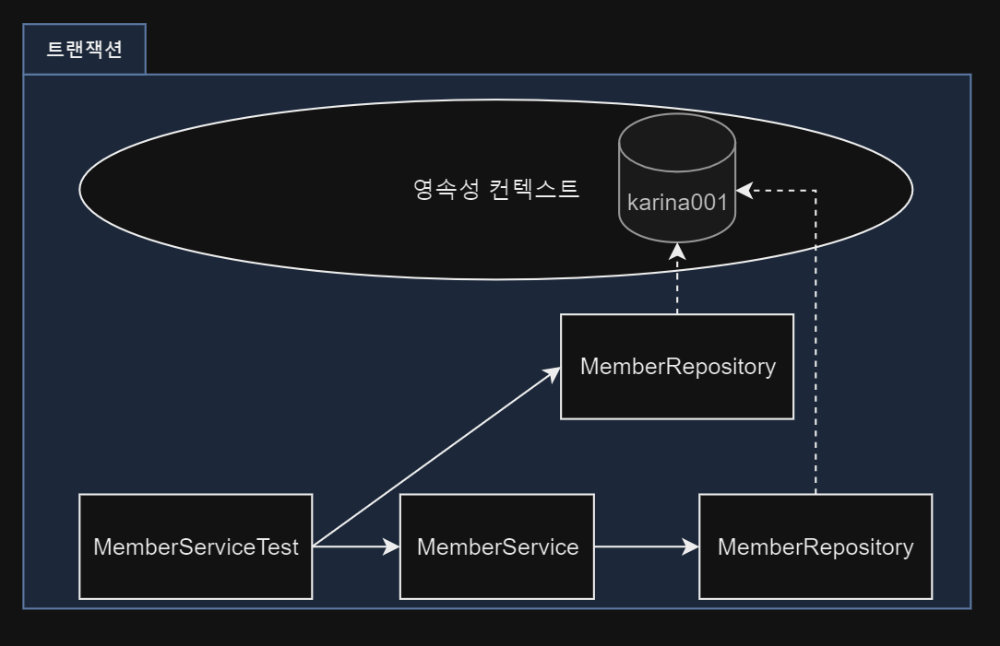
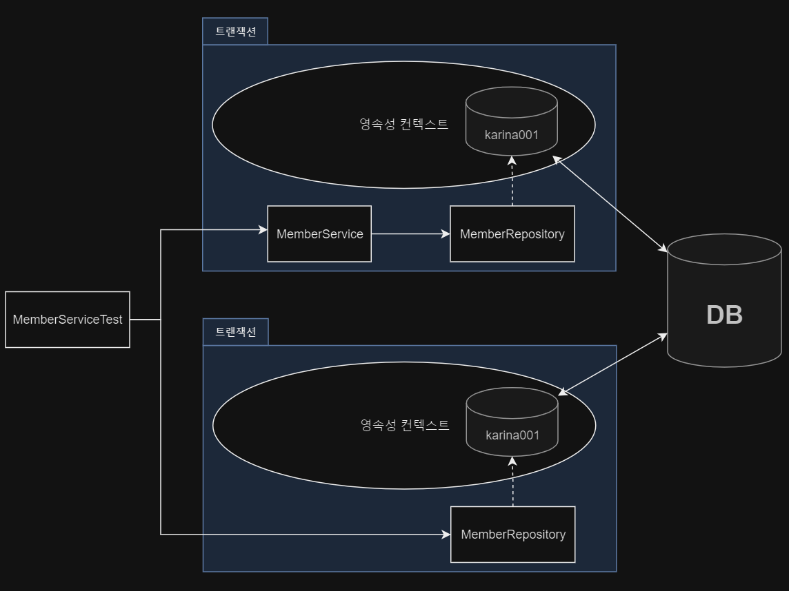
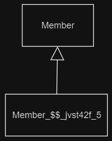
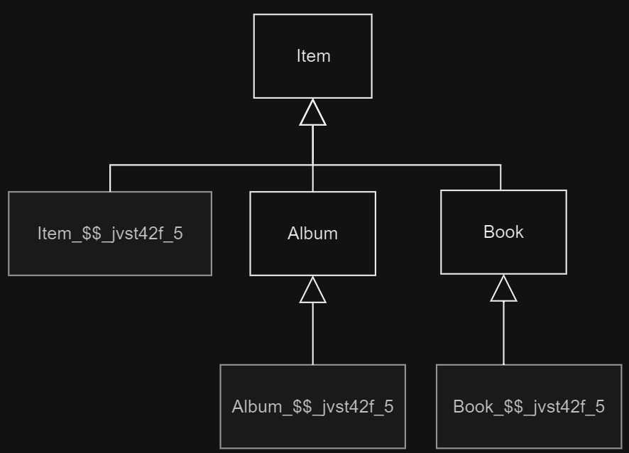
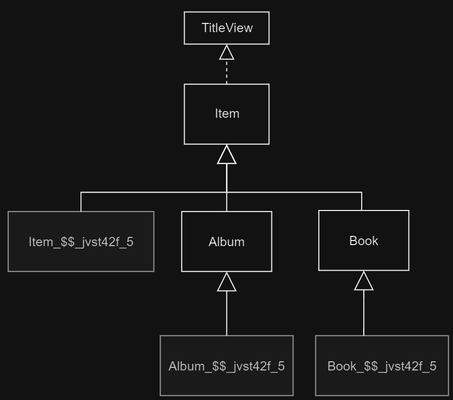
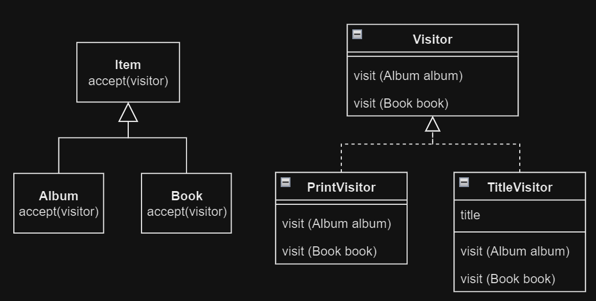

# 15. 고급 주제와 성능 최적화

1. 예외 처리
2. 엔티티 비교
3. 프록시 심화 주제
4. 성능 최적화
5. 정리

---

## 1. 예외 처리

### 1.1 JPA 표준 예외 정리

- `RuntimeException`의 자손 `javax.persistence.PersistenceException`
- JPA 표준 예외 : `javax.persistence.PersistenceException`의 자손들
    - 트랜잭션 Rollback 예외 : 심각한 예외, 복구하면 안됨, commit하려해도 Rollback됨
    - 트랜잭션 Rollback을 표시하지 않는 예외 : 개발자가 Rollback 여부를 선택할 수 있음

| 트랜잭션 Rollback 예외                                 | Description                                                 |
|--------------------------------------------------|-------------------------------------------------------------|
| `javax.persistence.EntityExistsException`        | `persist()` 호출 시 이미 DB에 같은 식별자를 가진 엔티티가 있으면 발생              |
| `javax.persistence.EntityNotFoundException`      | `getReference()` 호출 시 식별자에 해당하는 엔티티가 없으면 발생                 |
| `javax.persistence.OptimisticLockException`      | 낙관적 락 충돌 시 발생                                               |
| `javax.persistence.PessimisticLockException`     | 비관적 락 충돌 시 발생                                               |
| `javax.persistence.RollbackException`            | `commit()` 실패 시 발생                                          |
| `javax.persistence.TransactionRequiredException` | 트랜잭션이 필요한 상황에서 트랜잭션이 없으면 발생<br/>(주로 트랜잭션 없이 Entity 수정 시 발생) |

| 트랜잭션 Rollback을 표시하지 않는 예외                    | Description                            |
|----------------------------------------------|----------------------------------------|
| `javax.persistence.NoResultException`        | `getSingleResult()` 호출 시 결과가 없으면 발생    |
| `javax.persistence.NonUniqueResultException` | `getSingleResult()` 호출 시 결과가 둘 이상이면 발생 |
| `javax.persistence.LockTimeoutException`     | 비관적 락 시도 시 대기 시간 초과하면 발생               |
| `javax.persistence.QueryTimeoutException`    | 쿼리 시간 초과하면 발생                          |

### 1.2 Spring Framework의 JPA 예외 반환

- Spring Framework는 JPA 예외를 Spring 예외로 변환해서 반환
    - 서비스 계층이 데이터 접근 기술 (JPA, Mybatis 등)에 의존성이 높으면 안됨

| JPA 예외                                           | Spring 예외                                                        |
|--------------------------------------------------|------------------------------------------------------------------|
| `javax.persistence.PersistenceException`         | `org.springframework.orm.jpa.JpaSystemException`                 |
| `javax.persistence.NoResultException`            | `org.springframework.dao.EmptyResultDataAccessException`         |
| `javax.persistence.NonUniqueResultException`     | `org.springframework.dao.IncorrectResultSizeDataAccessException` |
| `javax.persistence.LockTimeoutException`         | `org.springframework.dao.CannotAcquireLockException`             |
| `javax.persistence.QueryTimeoutException`        | `org.springframework.dao.QueryTimeoutException`                  |
| `javax.persistence.EntityExistsException`        | `org.springframework.dao.DataViolationException`                 |
| `javax.persistence.EntityNotFoundException`      | `org.springframework.dao.DataRetrievalFailureException`          |
| `javax.persistence.OptimisticLockException`      | `org.springframework.dao.OptimisticLockingFailureException`      |
| `javax.persistence.PerssimisticLockException`    | `org.springframework.dao.PessimisticLockingFailureException`     |
| `javax.persistence.TransactionRequiredException` | `org.springframework.dao.InvalidDataAccessApiUsageException`     |                           
| `javax.persistence.RollbackException`            | `org.springframework.transaction.TransactionSystemException`     |                              

### 1.3 Spring Framework에 JPA 예외 변환기 적용

- `PersistenceExceptionTranslationPostProcessor` 빈 등록
    - `@Repository` 애노테이션이 붙은 빈에 변환기 AOP 적용
    - `@Repository` 애노테이션이 붙은 빈은 JPA 예외를 Spring 예외로 변환

```java

@Repository
public class MemberRepository {
    @PersistenceContext
    private EntityManager em;

    public Member findById(Long id) {
        return em.createQuery("select m from Member m where m.id = :id", Member.class)
                .setParameter("id", id)
                .getSingleResult();
        /**
         * getSingleResult() 호출 시 결과가 없으면 NoResultException 발생
         * findById()를 빠져나가면서 EmptyResultDataAccessException으로 변환
         * */
    }
}
```

### 1.4 트랜잭션 Rollback 시 주의사항

- 트랜잭션을 Rollback해도 영속성 컨텍스트의 데이터는 Rollback되지 않음
- 따라서, 트랜잭션이 Rollback 되었으면 영속성 컨텍스트를 초기화한 다음 사용해야 함 (`EntityManager.clear()`)
- 트랜잭션 당 영속성 컨텍스트 전략
    - 트랜잭션 AOP 종료 시점에서 트랜잭션을 Rollback하면서 영속성 컨텍스트도 같이 종료됨
- OSIV 전략
    - 하나의 영속성 컨텍스트에 여러 트랜잭션이 있음
    - 트랜잭션 하나가 Rollback해도 영속성 컨텍스트는 유지되는 문제
    - 따라서 Spring은 영속성 컨텍스트의 범위가 트랜잭션보다 넓을 때,
        - 하나의 트랜잭션에서 Rollback시 영속성 컨텍스트를 초기화해서 문제를 해결함 (`EntityManager.clear()`)
    - `org.springframework.orm.jpa.JpaTransactionManger`의 `doRollback()` 참고

## 2. 엔티티 비교

1차 캐시를 활용한 **애플리케이션 수준의 반복 가능한 읽기**

````
Member karina1 = memberRepository.findById('karina001`);
Member karina2 = memberRepository.findById('karina001`);

System.out.println(karina1 == karina2); // true
````

### 2.1 영속성 컨텍스트가 같을 떄 Entity 비교



```java

@Runwith(SpringJuit4ClassRunner.class)
// ...
@Transactional // 트랜잭션 안에서 테스트 실행
public class MemberServiceTest {

    //...

    @Test
    public joinTest() {
        // ...
        Member karina1 = new Member("karina001", "카리나", 20);
        memberService.join(karina1);

        Member karina2 = memberRepository.findById("karina001");
        assertTrue(karina1 == karina2); // success
    }

}
```

- 동일성, identity : `==` 비교
- 동등성, equality : `equals()` 비교
- 데이터베이스 동등성 : `@Id`로 식별

### 2.2 영속성 컨텍스트가 다를 때 Entity 비교



```java

@Runwith(SpringJuit4ClassRunner.class)
// ...
// @Transactional
public class MemberServiceTest {

    //...

    @Test
    public joinTest() {
        // ...
        Member karina1 = new Member("karina001", "카리나", 20);
        memberService.join(karina1);

        Member karina2 = memberRepository.findById("karina001");
        assertTrue(karina1 == karina2); // failed
    }

}
```

- MemberServiceTest 클래스에서 Member는 **준영속 상태**
- 영속성 컨텍스트 밖에서는 동일성 비교가 실패하므로, 동등성 비교를 해야함
- 동등성 비교시 `equals()` 메서드를 재정의해야 함
    - **비즈니스 키**를 활용해 재정의 e.g. 주민등록번호가 같으면 동일한 객체

## 3. 프록시 심화 주제

### 3.1 영속성 컨텍스트와 프록시

````
@Test
public void testProxy() {
    Member karina = new Member();
    karina.setName("카리나");

    em.persist(karina);
    em.flush();
    em.clear();

    Member refmember = em.getReference(Member.class, karina.getId()); // proxy 객체
    Member findMember = em.find(Member.class, karina.getId()); // proxy 객체

    System.out.println("refmember = " + refmember.getClass()); // refmember = class jpabook.jpashop.domain.Member_$$_jvst42f_5
    System.out.println("findMember = " + findMember.getClass()); refmember =  class jpabook.jpashop.domain.Member_$$_jvst42f_5

    assertTrue(refmember == findMember); // success
}
````

- 프록시 조회 -> 원본 데이터 조회
    - **프록시 객체를 반환**
- **프록시에 대해서도 같은 영속성 컨텍스트이면 동일성 보장**
- 원본 데이터 조회 -> 프록시 조회
    - **원본 데이터를 반환**
    - 이미 원본 데이터가 있으므로, 프록시를 반환할 필요 없음

### 3.2 프록시 타입 비교



프록시는 원본 Entity를 상속받아 만들어지므로, 타입 비교시 `instanceof`를 사용해야 함

````
@Test
public void testProxyType() {
    Member karina = new Member();
    karina.setName("카리나");

    em.persist(karina);
    em.flush();
    em.clear();

    Member refmember = em.getReference(Member.class, karina.getId()); // proxy 객체
    System.out.println("refmember = " + refmember.getClass()); refmember = class jpabook.jpashop.domain.Member_$$_jvstdd1_5

    assertFalse(Member.class == refmember.getClass());
    assertTrue(refmember instanceof Member);

}
````

### 3.3 프록시 동등성 비교

````
@Test
public void testProxyEquality() {
    Member karina = new Member();
    karina.setName("카리나");

    em.persist(karina);
    em.flush();
    em.clear();

    Member karinaNew = new Member(karina.getId(), karina.getName());
    Member karinaRef = em.getReference(Member.class, karina.getId());

    assertTrue(karinaNew.equals(karinaRef)); // failed

}
````

```java

@Entity
public class Member {

    // ...

    @Override
    public boolean equals(Object o) {
        if (this == o) return true;
        if (o == null || getClass() != o.getClass()) return false; // 문제 1

        Member member = (Member) o;

        if (!Objects.equals(id, member.id)) return false; // 문제 2
        if (!Objects.equals(name, member.name)) return false;
        if (!Objects.equals(address, member.address)) return false;
        return Objects.equals(orders, member.orders);
    }
}

```

- 문제 1 : 프록시는 원본 Entity를 상속받아 만들어지므로, 타입 비교시 `instanceof`를 사용해야 함
- 문제 2 : 프록시는 모든 필드를 원본 데이터에 둠, 따라서 `getter`를 사용해야 함

```java

@Entity
public class Member {

    // ...

    @Override
    public boolean equals(Object o) {
        if (this == o) return true;
        // if (o == null || getClass() != o.getClass()) return false;
        if (o == null || !(o instanceof Member)) return false;

        Member member = (Member) o;

        if (!Objects.equals(id, member.getId())) return false;
        if (!Objects.equals(name, member.getName())) return false;
        if (!Objects.equals(address, member.getAddress())) return false;
        // if (!Objects.equals(id, member.id)) return false;
        // if (!Objects.equals(name, member.name)) return false;
        // if (!Objects.equals(address, member.address)) return false;
        return Objects.equals(orders, member.orders);
    }
}

```

### 3.4 상속관계와 프록시



````
@Test
public void testProxyInherit() {
    Album nextlevel = new Album();
    nextlevel.setName("Next Level");
    nextlevel.setArtist("Aespa");
    nextlevel.setPrice(20000);

    em.persist(nextlevel);
    em.flush();
    em.clear();

    Item proxyItem = em.getReference(Item.class, nextlevel.getId());

    System.out.println("proxyItem = " + proxyItem.getClass()); // proxyItem = class jpabook.jpashop.domain.item.Item_$$_jvstd8d_7

    if (proxyItem instanceof Album) { // false
        System.out.println("proxyItem instanceof Album");
        Album album = (Album) proxyItem; // java.lang.ClassCastException
        System.out.println("album = " + album);
    }

    assertFalse(proxyItem.getClass() == Album.class); // Succeed
    assertFalse(proxyItem instanceof Album); // Succeed
    assertTrue(proxyItem instanceof Item); // Succeed

}
````

- 프록시를 부모타입으로 조회하면, 부모타입을 상속 받는 프록시가 생성됨
- `instancof` 불가능, 다운 캐스팅 불가능

#### 다형성과 프록시 문제

````
@Test
public void testProxyPoly() {
    Album album = new Album();
    album.setName("Next Level");
    album.setArtist("Aespa");
    album.setPrice(20000);
    em.persist(album);

    OrderItem orderItem = new OrderItem();
    orderItem.setCount(1);
    orderItem.setItem(album);
    em.persist(orderItem);

    em.flush();
    em.clear();

    OrderItem orderItemNextLevel = em.find(OrderItem.class, orderItem.getId());
    Item itemNextLevel = orderItemNextLevel.getItem();

    System.out.println("itemNextLevel = " + itemNextLevel.getClass()); // itemNextLevel = class jpabook.jpashop.domain.item.Item_$$_jvst9fa_7

    assertFalse(itemNextLevel.getClass() == Album.class); // Succeed
    assertFalse(itemNextLevel instanceof Album); // Succeed
    assertTrue(itemNextLevel instanceof Item); // Succeed
}
````

- 프록시는 부모 객체의 하위 타입으로 반환됨

#### 해결방법 1 : JPQL로 대상 직접 조회

- 다형성을 활용할 수 없음

````
Album jpqlAlbum = em.createQuery("select a from Album a where a.id = :id", Album.class)
                    .setParameter("id", album.getId())
                    .getSingleResult();
````

#### 해결방법 2  : 프록시 벗기기

- Hibernate가 제공하는 메서드로 프록시를 벗김
- **프록시와 원본 데이터의 동일성이 깨짐**

````
Item unproxyItem = unProxy(itemNextLevel);
assertTrue(unproxyItem instanceof Album); // Succeed
assertFalse(unproxyItem == itemNextLevel); // Succeed

...

public static <T> T unProxy(Object entity) {
    if (entity instanceof HibernateProxy) {
        entity = ((HibernateProxy) entity).getHibernateLazyInitializer().getImplementation();
    }
    return (T) entity;
}
````

#### 해결방법 3 : 전용 인터페이스 제공

- 다형성 활용 가능
- 클라이언트는 대상 객체의 프록시 여부를 알 필요 없음



```java
public interface TitleView {
    String getTitle();
}

@Entity
@Inheritance(strategy = InheritanceType.SINGLE_TABLE)
@DiscriminatorColumn(name = "DTYPE")
public abstract class Item implements TitleView {
    // ...
}

@Entity
@DiscriminatorValue("A")
public class Album extends Item {
    // ...

    @Override
    public String getTitle() {
        return "앨범명 : " + getName() + "  아티스트 : " + getArtist();
    }
}

@Entity
public class OrderItem {

    // ...

    public void printItem() {
        System.out.println("item title = " + item.getTitle());
    }

}
```

````
OrderItem orderItemNextLevel = em.find(OrderItem.class, orderItem.getId());
orderItemNextLevel.printItem(); // item title = 앨범명 : Next Level  아티스트 : Aespa
````

### 해결방법 4 : 비지터 패턴, Visitor Pattern

- 장점
    - 기능 추가 시 Visitor에만 추가하면 됨
    - 프록시를 의식하지 않고 원본 Entity에 접근
    - `instanceof`, Type Casting 없이 다형성 활용 가능
- 단점
    - Double Dispatch, 복잡, 이해하기 어려움
    - 객체 구조 변경 시 모든 Visitor 수정 필요



```java
public interface Visitor {
    void visit(Album album);

    void visit(Book book);

    void visit(Movie movie);
}

public class PrintVisitor implements Visitor {
    @Override
    public void visit(Album album) {
        System.out.println("앨범명 : " + album.getName() + "  아티스트 : " + album.getArtist());
    }

    @Override
    public void visit(Book book) {
        // ...
    }

    @Override
    public void visit(Movie movie) {
        // ...
    }
}

public class TitleVisitor implements Visitor {
    private String title;

    public String getTitle() {
        return title;
    }

    @Override
    public void visit(Album album) {
        title = "앨범명 : " + album.getName() + "  아티스트 : " + album.getArtist();
    }

    @Override
    public void visit(Book book) {
        // ...
    }

    @Override
    public void visit(Movie movie) {
        // ...
    }

}
```

대상 클래스

```java

@Entity
@Inheritance(strategy = InheritanceType.SINGLE_TABLE)
@DiscriminatorColumn(name = "DTYPE")
public abstract class Item {
    // ...

    public abstract void accept(Visitor visitor);

}

@Entity
@DiscriminatorValue("A")
public class Album extends Item {
    // ...

    @Override
    public void accept(Visitor visitor) {
        visitor.visit(this);
    }
}
```

Visitor 사용

````
@Test
public void testVisitor() {
     ....
     
    OrderItem orderItemNextLevel = em.find(OrderItem.class, orderItem.getId());
    Item itemNextLevel = orderItemNextLevel.getItem();

    //PrintVisitor
    itemNextLevel.accept(new PrintVisitor());
}
````

## 4. 성능 최적화

### 4.1 N+1 문제

````java

@Entity
public class Team {
    // ...

    @OneToMany(mappedBy = "team", Fetch = FetchType.EAGER)
    private List<Member> memberList = new ArrayList<>();

    // ...
}

@Entity
public class Member {

    // ...

    @ManyToOne
    @JoinColumn(name = "TEAM_ID")
    private Team team;

    // ...
}
````

#### 즉시 로딩과 N+1

- JPQL은 JPQL을 기반으로 SQL 생성
- N+1 문제 : 5개의 row 조회시 5개의 SQL이 생성됨

```sql
-- JPQL
select t
from Team t;

-- SQL
SELECT *
FROM TEAM;

SELECT *
FROM MEMBER
WHERE TEAM_ID = ?;

SELECT *
FROM MEMBER
WHERE TEAM_ID = ?;

SELECT *
FROM MEMBER
WHERE TEAM_ID = ?;

...
```

#### 지연 로딩과 N+1

```java

@Entity
public class Team {
    // ...

    @OneToMany(mappedBy = "team", Fetch = FetchType.LAZY)
    private List<Member> memberList = new ArrayList<>();

    // ...
}
```

```sql
-- JPQL
select t
from Team;

-- SQL
SELECT *
FROM TEAM;
```

```
for(Team team : teamList) {
    List<Member> memberList = team.getMemberList(); // 지연 로딩
}
```

- 지연 로딩을 N 번 실행하면서 발생

#### 해결방법 1 : fetch join

- N+1 문제를 해결하는 가장 일반적인 방법

```sql
-- JPQL
select t
from team t
         join fetch t.memberList;

-- SQL
SELECT T.*, M.*
FROM TEAM T
         INNER JOIN MEMBER M ON T.TEAM_ID = M.TEAM_ID;
```

#### 해결방법 2 : Hibernate `@BatchSize`

- `org.hibernate.annotations.BatchSize` 어노테이션
- 지정된 사이즈만큼 SQL 에 `IN` 절 사용

```java

@Entity
public class Team {
    // ...

    @org.hibernate.annotations.BatchSize(size = 5)
    @OneToMany(mappedBy = "team", Fetch = FetchType.EAGER)
    private List<Member> memberList = new ArrayList<>();

}
```

```sql
SELECT *
FROM MEMBER
WHERE TEAM_ID IN (?, ?, ?, ?, ?);
```

#### 해결방법 3 : Hibernate `@Fetch(FetchMode.SUBSELECT)`

- 서브쿼리를 활용해서 해결

```java

@Entity
public class Team {
    // ...

    @org.hibernate.annotations.Fetch(FetchMode.SUBSELECT)
    @OneToMany(mappedBy = "team", Fetch = FetchType.EAGER)
    private List<Member> memberList = new ArrayList<>();

}
```

```sql
-- JPQL
select t
from Team t
where t.id > 10;

-- SQL
SELECT M.*
FROM MEMBER M
WHERE M.TEAM_ID IN (SELECT T.ID FROM TEAM T WHERE T.ID > 10);
```

#### N+1 정리

- 즉시로딩을 사용하지 말고, 지연 로딩만 사용
    - 즉시로딩은 N+1을 유발하고, 필요없는 Entity를 로딩함, 성능 최적화가 어려움
- 지연로딩만 사용하고 필요한 곳에만 `fetch join`을 사용
- `@OneToOne`, `@ManyToOne` : 기본이 즉시 로딩
- `@OneToMany`, `@ManyToMany` : 기본이 지연 로딩

### 4.2 읽기 전용 쿼리의 성능 최적화

- 영속성 컨텍스트에 Entity를 관리하면
    - Entity Snapshot instance를 메모리에 보관
    - 변경감지 시 Snapshot 비교
    - 1차 캐시
- 읽기 전용 Entity는 변경감지, 1차 캐시가 필요 없을 수도 있음
    - e.g. 1천건의 판매 내역 데이터를 단순 조회화면에만 사용하면서, 1차캐시에 로딩하면 메모리에 부담

| 목적                       | 방법                                    |
|--------------------------|---------------------------------------|
| 메모리 최적화                  | 스칼라 타입으로 조회<br/>Hibernate 읽기 전용 쿼리 힌트 |
| 속도 최적화<br/>(flush 호출 막음) | 읽기 전용 트랜잭션<br/>트랜잭션 밖에서 읽기<br/>       |

#### 스칼라 타입으로 조회

- 가장 확실한 방법
- 스칼라 타입은 영속성 컨텍스트가 관리하지 않음

```sql
-- JPQL
select m.id, m.name, m.age
from Member m;
```

#### 읽기 전용 쿼리 힌트 사용

`org.hibernate.readOnly` 힌트 사용

````
TypedQuery<Member> query = em.createQuery("select m from Member m", Member.class);
query.setHint("org.hibernate.readOnly", true);
````

#### 읽기 전용 트랜잭션 사용

- Spring Framework
- `@Transactional(readOnly = true)` : `org.Hibernate.Session` flush 모드를 `FlushMode.MANUAL`로 변경
- 강제로 `flush()`하지 않는 한 flush가 일어나지 않음

#### 트랜잭션 밖에서 읽기

- `@Transactional(propagation = Propagation.NOT_SUPPORTED)` : 트랜잭션 없이 데이터 조회

#### 안전하게 같이 사용

````
@Transaction(readOnly = true) // 읽기 전용 트랜잭션
public List<Member> findMembers() {
    return em.createQuery("select m from Member m", Member.class)
            .setHint("org.hibernate.readOnly", true) // 읽기 전용 쿼리 힌트ㅣ
            .getResultList();
}
````

### 4.3 배치 처리

#### JPA 등록 배치 `INSERT`

- 수만 건의 Entity가 계속해서 영속성 컨텍스트에 쌓이지 않도록 해야함
- 일정 주기로 Entithy를 DB에 `flush`하고, 영속성 컨텍스트를 `clear`해야 함

````
EntityManager em = emf.createEntityManager();
EntityTransaction tx = em.getTransaction();
tx.begin(); // 트랜잭션 시작

for(int i =  0; i < 100000;  i++){
    Product p = new Product("item" + i, i);
    
    //100건마다 영속성 컨텍스트 초기화
    if(i % 100 == 0){
        em.flush();
        em.clear();
    }
}

tx.commit();
em.close();

````

#### JPA 수정 배치 처리 `UPDATE`

대용량 데이터를 한번에 메모리에 올리는 것이 부담스러워 다음 2가지를 이용

- 페이징 처리 : DB 페이징 기능 활용
- CURSOR : DB CURSOR 기능 활용

#### 페이징 처리

````
EntitManager em = emf.createEntityManager();
EntityTransaction tx = em.getTransaction();

tx.begin();

int pageSize = 100;

for(int i = 0; i < 1000; i++){
   List<Member> memberList = em.createQuery("select m from Member m", Member.class)
                                .setFirstResult(i * pageSize)
                                .setMaxResults(pageSize)
                                .getResultList();
                    
    
    // 비즈니스 로직 실행                
    for(Member member : memberList){
        member.setAge(member.getAge() + 1);
    }
    
    em.flush();
    em.clear();
}

tx.commit();
em.close();

````

#### Hibernate scroll 사용

- JPA 는 DB Cursor를 미지원
- Hibernate는 scroll로 JDBC Curosor 지원

````
EntityManager em = emf.createEntityManager();
EntityTransaction tx = em.getTransaction();

Session session = em.unwrap(Session.class);

tx.begin();

ScrollableResults scroll = session.createQuery("select m from Member m")
                                 .setCacheMode(CacheMode.IGNORE) // 2차 캐시 off
                                 .scroll(ScrollMode.FORWARD_ONLY);

int count = 0;

while(scroll.next(){
  Member member = (Member) scroll.get(0);
  member.setAge(member.getAge() + 1);
        
    if(++count % 100 == 0){
        session.flush();
        session.clear();
    }
}

tx.commit();
session.close();
em.close();

````

#### Hibernate 무상태 세션 사용

- Hibernate가 제공하는 특별한 기능
- 영속성 컨텍스트 미생성, 2차 캐시 사용 안함
- Entity를 수정하려면 `update()` 직접 호출

````
SessonFactory sf = emf.unwrap(SessionFactory.class);
StatelessSession session = sf.openStatelessSession();l
Transaction tx = session.beginTransaction();
ScrollbarResults scroll = session.createQuery("select m from Member m")
                                  .scroll();
                                  
while(scroll.next()){
    Member member = (Member) scroll.get(0);
    member.setAge(member.getAge() + 1);
    session.update(member); // 직접 호출
}

tx.commit();
session.close();
````

#### 4.4

### 4.4 SQL 쿼리 힌트 사용

- JPA는 DBMS 벤더의 SQL 힌트 미지원
- 힌트 사용 위해선 Hibernate를 직접 사용

````
Session session = em.unwrap(Session.class); // Hibernate 직접 사용

List<Member> memberLsit = session.createQuery("select m from Member m")
                                 .addQueryHint("FULL (MEMBER)") // SQL Hint 추가
                                 .getResultList();
````

```sql
SELECT
    /*+ FULL (MEMBER) */
    ID,
    AGE,
    NAME,
    TEAM_ID
FROM MEMBER
```

### 4.5 트랜잭션을 지원하는 쓰기 지연과 성능 최적화

#### 트랜잭션을 지원하는 쓰기 지연과 JDBC 배치

- SQL 문을 모았다가 한번에 DB에 보내서 실행하는 기능
    - **데이터베이스와 한번만 통신**
- `IDENTITY` 생성 전략은 식별자가 필요해서 바로 `INSERT`를 실행함
    - 쓰기지연 활용 못함

````
<property name="hibernate.jdbc.batch_size" value="50"/>

em.persist(member1);
em.persist(member2);
em.persist(member3); // SQL 배치 실행
em.persist(team1); // SQL 배치 실행
em.persist(member4);
em.persist(member5);
...
````

#### 트랜잭션을 지원하는 쓰기 지연과 애플리케이션 확장성

- **DB row에 lock이 걸리는 시간 최소화**
- flush하고, 바로 commit

````
update(member1); (row lock)
.... (비즈니스로직)
commit(); (row lock 해제)
````

## 5. 정리

- JPA 예외는 Rollback 예외와 Rollback 하지 않는 예외로 나뉨
    - Rollback 예외는 심각한 예외로 강제로 COMMIT하려해도 못함
- Spring Framework는 JPA의 예외를 Spring 예외로 변환해줌
- 같은 영속성 컨텍스트에서는 동일성 보장
    - 영속성 컨텍스트가 다를때는 동일성 비교 실패, 비즈니스 키를 활용해 동등성 비교
- 프록시를 사용하는 클라이언트는 Entity의 프록시 여부에 상관 없이 사용 가능해야함
- JPA의 N+1 문제를 가장 주의해야하고, 주로 `fetch join` 으로 해결
- Entity를 읽기 전용으로 조회하면 Snapshot을 메모리에 유지할 필요 없고,
    - 영속성 컨텍스트의 대용량 flush도 없음
- 대량의 Entity 배치 처리 시 적절한 시점레 `flush` 하고, `clear` 해야함
- JPA는 쿼리 Hint를 미지원하지만, Hibernate 를 사용하면 SQL 힌트를 사용할 수 있음
- 트랜잭션을 지원하는 쓰기 지연으로 SQL 배치 기능 사용

