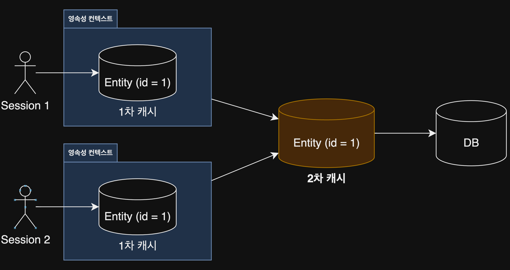
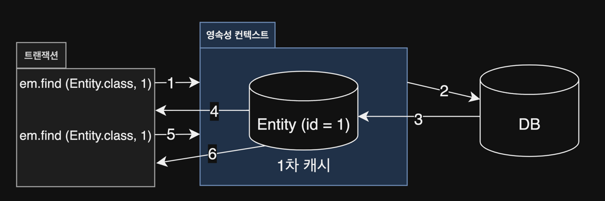
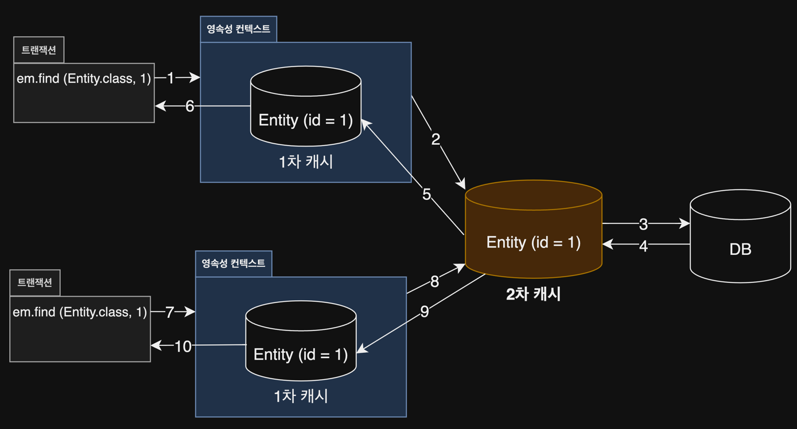

# 16. 트랜잭션과 락, 2차 캐시

1. 트랜잭션과 락
2. 2차 캐시
3. 정리

---

## 1. 트랜잭션과 락

- 원자성, Atomicity : 트랜잭션 내의 작업이 하나의 작업으로 간주, 모두 성공하거나 실패해야함
- 일관성, Consistency : 트랜잭션의 작업 처리 결과는 항상 일관성이 있어야함
- 격리성, Isolation : 트랜잭션을 수행하는 동안 다른 트랜잭션과 서로 영향을 미치면 안됨
- 지속성, Durability : 트랜잭션이 성공적으로 완료되었으면, 결과는 영구적으로 반영되어야함

#### ANSI 표준 트랜잭션 격리 수준 4단계

DBMS들은 대부분 READ COMMITTED를 기본으로 사용하고, 특별한 경우에만 트랜잭션이 제공하는 LOCK 기능을 활용

- READ UNCOMMITTED : 커밋하지 않은 데이터를 읽을 수 있음
- READ COMMITTED : 커밋한 데이터만 읽을 수 있음
- REPEATABLE READ : 반복 가능한 읽기
- SERIALIZABLE : 직렬화 가능

| 격리 수준            | DIRTY READ | NON-REPEATABLE READ | PHANTOM READ |
|------------------|------------|---------------------|--------------|
| READ UNCOMMITTED | O          | O                   | O            |
| READ COMMITTED   | X          | O                   | O            |
| REPEATABLE READ  | X          | X                   | O            |
| SERIALIZABLE     | X          | X                   | X            |

- DIRTY READ : 커밋되지 않은 데이터를 읽음
- NON-REPEATABLE READ : 같은 트랜잭션 안에서 같은 데이터를 다시 읽었을 때, 다른 데이터가 나옴
- PAHNTOM READ : 같은 트랜잭션 안에서 같은 쿼리를 두 번 실행했을 때, 결과 집합이 다름

#### READ UNCOMMITTED

- Dirty Read를 허용하는 격리 수준
- Dirty Read한 데이터를 읽고, 수정하면 데이터 정합성에 문제 발생 가능

#### READ COMMITTED

- DIRTY READ 미허용
    - COMMIT한 데이터만 읽음
- NON-REPEATABLE READ 허용

#### REPEATABLE READ

- DIRTY READ, NON-REPEATABLE READ 미허용
- PHANTOM READ 허용

#### SERIALIZABLE

- 가장 엄격한 트랜잭션 격리 수준
- 동시성 처리 성능이 떨어짐

### 1.2 낙관적 락과 비관적 락 기초

- JPA는 DB의 격리수준이 READ COMMTIED로 가정
    - 더 높은 격리 수준이 필요하면 낙관적/비관적 LOCK을 활용
- 낙관적 락, optimistic lock
    - 트랜잭션의 충돌이 발생하지 않는다고 가정
    - JPA가 제공하는 버전관리 기능 사용
- 비관적 락, pessimistic lock
    - 트랜잭션의 충돌이 발생한다고 가정
    - 우선 Lock을 걸고 봄
    - DB의 기능 사용 `SELECT FOR UPDATE`
- second lost update problem, 두번 갱신 분실 문제
    - 트랜잭션의 범위를 넘어서는 문제
    - 2번 쓰기가 발생했을 대 첫번째 쓰기가 덮어 씌어짐
    - 해결방법
        - 마지막 커밋만 인정 (기본 사용) : 마지막 session의 commit만 인정
        - 최초 커밋만 인정 : 마지막 session의 commit은 무시
        - 충돌하는 갱신 내용 병합 : 충돌하는 내용을 병합해서 갱신

### 1.3 `@Version` : 최초 커밋만 인정

- **최초 커밋만 인정**
- Long(long), Ineger(int), Short(short), Timestamp(java.sql.Timestamp) 타입의 필드에만 사용 가능
- Entiity를 수정할 때마다 version이 하나씩 올라감
- Entity 수정 시점에 조회시점의 version과 다르면 예외 발생
- 버전 증가 시점
    - Entity 속성 수정
    - 값타입 임베디드 타입, 컬렉션 수정
    - 연관관계 필드는 해당 안됨
- 벌크 연산은 직접 증가시켜야함 `UPDATE BOARD SET ... VERSION = VERSION + 1;`

```java

@Entity
public class Board {

    // ...

    @Version
    private Integer version;
}
```

````
// session 1
Board board = em.find(Board.class, 1L);

// session 2
Board board = em.find(Board.class, 1L);
board.setTitle("new title"); //version up
save(board);
tx.commit();

// sesison 1
board.setTitle("new title2"); //version up
save(board);
tx.commit(); // 예외 발생

````

#### 버전 정보 비교 방법

- Entity 수정 후 `flush`할 때 `UPDATE` 에 버전정보를 남김
- 이미 버전이 올라갔으면, UPDATE 대상 row를 찾지 못하고 JPA 예외 발생

````sql
UPDATE BOARD
SET TITLE   = ?,
    VERSION = ? -- ++version
WHERE ID = ?
  AND VERSION = ? -- 조회 시점의 version

````

### 1.4 JPA 락 사용

- READ COMMITED + 낙관적 Lock을 권장
- `EntityManager.lock()`, `EntityManager.find()`, `EntityManager.refresh()`
- `Query,setLockMode()`
- `@NamedQuery`

| Lock Mode | Type                        | 설명                             |
|-----------|-----------------------------|--------------------------------|
| 낙관적 락     | OPTIMISTIC                  | 낙관적 락 사용                       |
| 낙관적 락     | OPTIMISTIC_FORCE_INCREMENT  | 낙관적 락 사용 + 버전 증가               |
| 비관적 락     | PESSIMISTIC_READ            | 비관적 락, 읽기 락 사용                 |
| 비관적 락     | PESSIMISTIC_WRITE           | 비관적 락, 쓰기 락 사용                 |
| 비관적 락     | PESSIMISTIC_FORCE_INCREMENT | 비관적 락 + 버전 증가                  |
| 기타        | NONE                        | 락 사용 안함                        |
| 기타        | READ                        | OPTIMISTIC과 같음                 |
| 기타        | WRITE                       | OPTIMISTIC_FORCE_INCREMENT와 같음 |

### 1.5 JPA 낙관적 락

- `@Version` 사용
- 트랜잭션 commit 시점에 충돌을 알 수 있음
- 발생 가능 예외
    - `javax.persistence.OptimisticLockException`
    - `org.hibernate.StaleObjectStateException`
    - `org.springframework.orm.ObjectOptimisticLockingFailureException`

#### `NONE`

Lock을 사용하지 않아도 `@Version`만 있으면 낙관적 Lock이 구현됨

| 용도          | 동작                                                       | 이점                            |
|-------------|----------------------------------------------------------|-------------------------------|
| 조회~수정 시점 보장 | Entity를 수정하는 시점에 버전 체크 후 증가<br/>조회 시점의 버전과 최신 버전이 다르면 예외 | second lost update problem 해결 |

#### `OPTIMISTIC`

- Entity 조회, 수정 시점에 둘다 버전 체크
- 조회한 Entity는 트랜잭션 종료될 때까지 다른 트랜잭션이 변경하지 않음을 보장
- `NONE`은 Entity를 수정해야함 버전을 비교하지만, `OPTIMISTIC`은 수정하지 않아도 버전을 비교함

| 용도                                            | 동작                                           | 이점                                               |
|-----------------------------------------------|----------------------------------------------|--------------------------------------------------|
| 조회 시점부터 수정시점까지 Entity가 다른 트랜잭션에 의해 수정되지 않음 보장 | COMMIT 시점에 `SELECT`로 현재 버전 조회<br/>버전이 다르면 예외 | DIRTY READ, NON-REPEATABLE READ, PHANTOM READ 해결 |

````
// session 1
Board board1 = em.find(Board.class, 1L);

// session 2
Board board2 = em.find(Board.class, 1L);
board2.setTitle("new title");
save(board2);
tx.commit(); // version up

// session 1
tx.commit(); // 예외 발생
````

#### `OPTIMISTIC_FORCE_INCREMENT`

낙관적 락을 사용하면서, 강제로 버전정보 증가

| 용도                                          | 동작                                                                                                                     | 이점                                 |
|---------------------------------------------|------------------------------------------------------------------------------------------------------------------------|------------------------------------|
| 논리적인 단위로 Entity 묶음 관리 <br/>연관관계가 수정되도 버전 증가 | Entity 수정이 없어도 commit 시에 `UPDATE` 로 버전 증가<br/>데이터베이스 버전이 Entity 버전과 다르면 예외<br/>Entity 수정시 `UPDATE` 버전 추가 (2번 버전 증가 가능) | 강제로 버전을 증가해서 논리적인 Entity 묶음의 버전 관리 |

````
Board board = em.find(Board.class, 1L);
tx.commit(); // version up
````

### 1.6 JPA 비관적 락

- `SELECT FOR UPDATE` 사용, DB 기능에 의존
- 주로 `PERMISSIVE_WRITE` 사용
- Entity가 아닌 스칼라 타입 조회에도 가능
- 수정 즉시 충돌 감지
- 발생 가능 예외
    - `javax.persistence.PessimisticLockException`
    - `org.springframework.dao.PessimisticLockingFailureException`

#### `PESSIMISTIC_WRITE`

- 비관적 락의 일반적이 옵션

| 용도              | 동작                  | 이점                     |
|-----------------|---------------------|------------------------|
| 데이터베이스에 쓰기 락을 검 | `SELECT FOR UPDATE` | NON-REPEATABLE READ 해결 |

#### `PESSIMISTIC_READ`

- 반복 읽기만 하고, 수정하지 않는 용도로 거는 락
- 잘 쓰이지 않음
- MySQL : lock in share mode
- PostgreSQL : for share

#### `PESSIMISTIC_FORCE_INCREMENT`

- 비관적 락 중 유일하게 버전 정보 사용
- Oracle : for update nowait
- PostgreSQL : for update nowait

### 1.7 비관적 락과 타임아웃

- 락을 획득할 때까지 대기하는 시간을 지정 가능
- 대기시간이 지나도 획득하지 못하면 `javax.persistence.LockTimeoutException` 예외 발생

````
Map<String, Object> properties = new HashMap<>();

// 타임아웃 10초 설정
properties.put("javax.persistence.lock.timeout", 10000);

Board board = em.find(Board.class, 1L, LockModeType.PESSIMISTIC_WRITE, properties); // 10초까지 기다려도 획득 못하면 예외 발생
````

## 2. 2차 캐시



JPA가 제공하는 Application 범위의 Cache

### 2.1 1차 캐시와 2차 캐시

- 네트워크를 통한 DB 접근은 JVM의 메모리 캐시에 접근하는 비용보다 훨씬 비쌈

#### 1차 캐시



- 영속성 컨텍스트 내부에 존재하는 캐시
- 생명주기 : 영속성 컨텍스트와 같음
    - 트랜잭션이 종료되면 1차 캐시가 없어짐
    - OSIV의 경우 Client의 요청이 끝나면 1차 캐시가 없어짐
- 키고 끌수 있는 옵션 아님
- 사실상 영속성 컨텍스트가 1차 캐시 그 자체
- 같은 Entity가 이ㅏㅆ으면 해당 Entity를 그대로 반환 (동일성 보장)

### 2차 캐시, 공유 캐시, Shared Cache, L2 Cache



- Application 범위의 Cache
- 생명주기 Application이 종료될 때까지 유지
- 2차 캐시를 반환 시 복사본 반환
    - 동시성 문제 해결
    - 2차 캐시는 영속성 컨텍스트가 다르면 서로 다른 객체 (동일성 보장 안함)

### 2.2 JPA 2차 캐시 기능

#### 캐시 모드 설정

`ojavax.persistence.Cacheable` : 캐시 사용 여부 설정

```java

@Entity
@Cacheable
public class Board {
    // ...
}
````

persistence.xml

````
<persistence-unit="test">
    <shared-cache-mode>ENABLE_SELECTIVE</shared-cache-mode>
</persistence-unit>
````

Spring Framewok

````
<bean id="entityManagerFactory" class="org.springframework.orm.jpa.LocalContainerEntityManagerFactoryBean">
    <property name="sharedCacheMode" value="ENABLE_SELECTIVE"/>
</bean>
````

| Cache Mode        | 설명                                       |
|-------------------|------------------------------------------|
| ALL               | 모든 Entity에 대해 캐시 사용                      |
| NONE              | 모든 Entity에 대해 캐시 사용 안함                   |
| ENABLE_SELECTIVE  | `@Cacheable(true)`인 Entity에 대해 캐시 사용     |
| DISABLE_SELECTIVE | `@Cacheable(false)`인 Entity에 대해 캐시 사용 안함 |
| UNSPECIFIED       | JPA 구현체 설정에 따름                           |

#### 캐시 조회, 저장 방식


## 3. 정리
