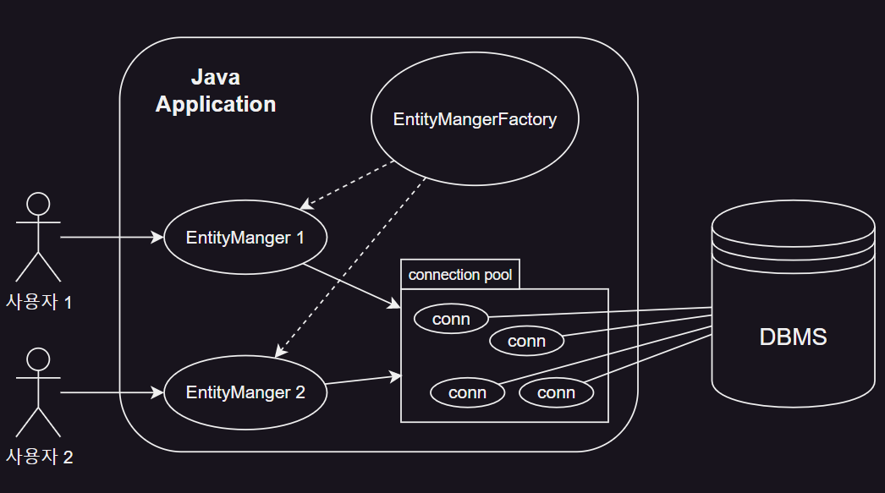
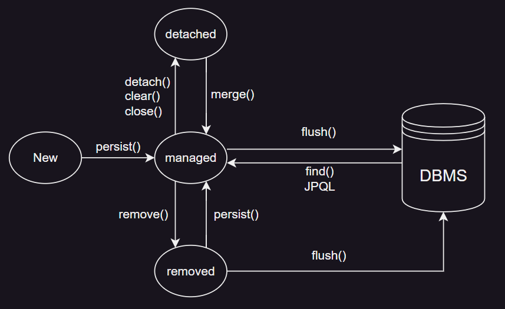

# 3장 영속성 관리

1. 엔티티 매니저 팩토리와 엔티티 매니저
2. 영속성 컨텍스트란?
3. 엔티티의 생명주기
4. 영속성 컨텍스트의 특징
5. 플러시
6. 준영속
7. 정리

---

JPA = Entity와 Table을 mapping + **mapping한 Entity 사용**

- mapping한 Entity를 EntityManger를 통해 사용하는 방법
- `EntityManager` : Entity를 저장, 수정, 삭제, 조회 등을 처리
    - Entity를 저장하는 가상의 데이터베이스

## 1. 엔티티 매니저 팩토리와 엔티티 매니저



````
// 공장 만들기, 비용이 아주 많이 듦
EntityManagerFactory emf = Persistence.createEntityManagerFactory("jpabook");

// 공장에서 EntityManager를 만들어서 사용, 비용 거의 없음
EntityManager em = emf.createEntityManager();
````

- `META-INF/persistence.xml`를 기반으로 `EntityManagerFactory`를 생성

#### EntityManagerFactory

- `EntityManager`를 만드는 공장
- 공장 생성 비용이 큼
- 따라서 한개만 맏들어서 applciation 전체에 공유
- 여러 thread가 동시에 접근해도 안전하므로 공유해도 됨
- 생성시 Connection Pool 생성

#### EntityManager

- 공장에서 만들어 줆
- thread 간 공유 불가능 : **동시성 문제 발생**

## 2. 영속성 컨텍스트란? persistence context

- `EntityManger`가 Entity를 관리하고 영구 저장하는 환경

````
em.persist(member); // EntityManger를 사용해 Member Entity를 영속성 컨텍스트에 저장
````

## 3. 엔티티의 생명주기



#### 4가지 상태

- 비영속, new/transient : 영속성 컨텍스트와 전혀 관계가 없는 상태
- 영속, managed : 영속성 컨텍스트에 저장된 상태
- 준영속, detached : 영속성 컨텍스트에 저장되었다가 분리된 상태
- 삭제, removed : 삭제된 상태

#### 비영속, new/transient

- Entity 객체를 생성했으나 아직 저장하지 않음
- 순수 객체 상태
- persistence context, DB와 전혀 관계 없음

````
Member karina = new Member();
karina.setId("member01");
karina.setMembername("카리나");
````

#### 영속, managed

- `EntityManager.persist()`를 통해 영속성 컨텍스트에 저장된 상태
- persistence context에 의해 관리되는 상태

````
em.persist(karina);
````

#### 준영속, detached

- persistence context가 관리하다가 분리된 상태

````
em.detach(karina);
````

#### 삭제, removed

- Entity를 persistence context와 DB에서 삭제한 상태

````
em.remove(karina);
````

## 4. 영속성 컨텍스트의 특징

#### 영속성 컨텍스트와 식별자 값

- Entity를 `@Id` 식별자 값으로 구분
- **영속 상태는 식별자 값이 반드시 있어야함**

#### 영속성 컨텍스트와 데이터베이스 저장

- `flush` : 트랜잭션을 COMMIT 하는 순간 영속성 컨텍스트에 새로 저장된 Entity를 DB에 반영

#### 영속성 컨텍스트가 엔티티를 관리하면 다음과 같은 장점이 있다

- 1차 캐시
- 동일성 보장
- 트랜잭션을 지원하는 쓰기 지연
- 변경 감지
- 지연 로딩

### 4.1 엔티티 조회

#### 1차 캐시에서 조회

- persistence context 내부 캐시
- 영속 상태의 Entity는 모두 이곳에 저장
- \<`@Id`, Entity Instance\> 형태로 저장
- `@Id` : persistence context 내부의 key, DB의 PK
    - persistence context에 저장하고 조회하는 기준
- **DB 조회 없으므로 성능 이점**

````
Member member = em.find(Member.class, "member01"); // key 값으로 조회
````

- `find()` : 1차 캐시에서 조회하고 없으면 DB에 조회

````
Member karina = new Member();
member.setId("member01");
member.setMembername("카리나");

em.persist(member); // 1차 캐시에 저장

Member findMember = em.find(Member.class, "member01"); // 1차 캐시에서 조회
````

#### 데이터베이스에서 조회

- 1차 캐시에 없으면 DB에서 조회
- 조회 후 `EntityManger`에 저장 후 반환

#### 영속성 Entity의 동일성 보장, identity

````
Member karina1 = em.find(Member.class, "member01");
Member karina2 = em.find(Member.class, "member01");

System.out.println(karina1 == karina2); // true
````

- 성능상 이점과 동일성을 동시에 보장

### 4.2 엔티티 등록

## 5. 플러시

## 6. 준영속

## 7. 정리
