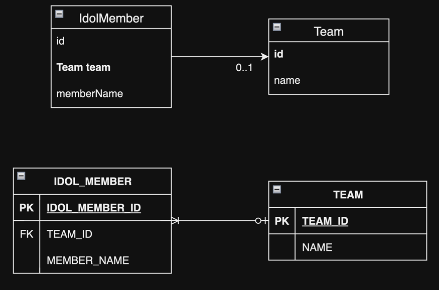

## 5. 연관관계 매핑 기초

1. 단방향 연관관계
2. 연관관계 사용
3. 양방향 연관관계
4. 연관관계의 주인
5. 양방향 연관관계 저장
6. 양방향 연관관계의 주의점
7. 정리

- 실전예제 2. 연관관계 매핑 시작

---

객체는 참조 (주소)로 관계를 맺고, 데이터베이스 테이블은 외래 키로 관계를 맺는다.  
ORM은 객체의 참조와 테이블의 외래 키를 매핑해야 한다.

- 방향, Direction
    - 단방향, 양방향
- 다중성, Multiplicity
    - N:1, 1:N, 1:1, N:M
- 연관관계의 주인, Owner
    - 양방향 연관관계 시 주인을 정해야함

## 1. 단방향 연관관계

- 아이돌 멤버와 팀이 있다
- 아이돌 멤버는 하나의 팀에만 소속될 수 있다
- 아이돌 멤버와 팀은 다대일 관계다



#### 객체 연관관계

- IdolMember.team 필드로 연관 객체 참조
- 회원 객체와 팀객체는 **단방향 관계**
    - `idolMember.getTeam()` 가능, `team.getIdolMembers()` 불가능

#### 테이블 연관관계

- IDOL_MEMBER 테이블의 TEAM_ID FK를 통해 연관관계 맺음
- 회원 테이블과 팀 테이블은 **양방향 관계**
    - `IDOL_MEMBER.TEAM_ID`로 조인 가능, `TEAM.IDOL_MEMBER_ID`로 조인 가능

#### 객체 연관관계와 테이블 연관관계의 가장 큰 차이

- 객체 연관 관계는 단방향 뿐이다
    - **서로 다른 단방향을 구현해서 양방향 처럼 보이게 할 뿐이다**
    - e.g. `idolMember.getTeam()` 과 `team.getIdolMembers()` 은 서로 다른 단방향 관계

#### 객체 연관관계 vs 테이블 연관관계 정리

- 객체 :  참조(주소) 로 연관관계 맺음
- DB 테이블 : FK로 연관관계 맺음
- 참조를 사용하는 객체는 단방향, FK를 사용하는 테이블은 양방향
    - class A -> class B : A는 B를 참조할 수 있지만, B는 A를 참조할 수 없다
    - A join B 이 가능하면 B join A도 가능하다
- 객체를 양방향 관계로 구현하려면 단방향을 2개 구현해야 한다
    1. class A -> class B
    2. class B -> class A

### 1.1 순수한 객체 연관관계

```java
public class IdolMember {
    private Long id;
    private String name;
    private Team team;
    // ...
}

public class Team {
    private Long id;
    private String name;
    // ...
}

public class Foo {
    public static void main(String[] args) {
        Team asepa = new Team();
        asepa.setName("Aespa");
        aespa.setId(1111);

        IdolMember karina = new IdolMember();
        karina.setName("Karina");
        karina.setId(2222);
        karina.setTeam(aespa); // 연관관계 매핑

        IdolMember giselle = new IdolMember();
        giselle.setName("Giselle");
        giselle.setId(3333);
        giselle.setTeam(aespa); // 연관관계 매핑
    }
}
```


### 1.1 테이블 연관관계

```sql
CREATE TABLE TEAM
(
    TEAM_ID BIGINT NOT NULL,
    NAME    VARCHAR(255),
    PRIMARY KEY (TEAM_ID)
);

CREATE TABLE IDOL_MEMBER
(
    IDOL_MEMBER_ID BIGINT NOT NULL,
    NAME           VARCHAR(255),
    TEAM_ID        BIGINT,
    PRIMARY KEY (IDOL_MEMBER_ID)
);

ALTER TABLE IDOL_MEMBER
    ADD CONSTRAINT FK_IDOL_MEMBER_TEAM_ID FOREIGN KEY (TEAM_ID)
        REFERENCES TEAM (TEAM_ID);

INSERT INTO TEAM (TEAM_ID, NAME)
VALUES (1111, 'Aespa');
INSERT INTO IDOL_MEMBER (IDOL_MEMBER_ID, NAME, TEAM_ID)
VALUES (2222, 'Karina', 1111);
INSERT INTO IDOL_MEMBER (IDOL_MEMBER_ID, NAME, TEAM_ID)
VALUES (3333, 'Giselle', 1111);
COMMIT;
```

### 1.3 객체 관계 매핑


```java

@Entity
public class IdolMember {

    @Id
    @Column(name = "IDOL_MEMBER_ID")
    private Long id;
    private String name;

    @ManyToOne
    @JoinColumn(name = "TEAM_ID")
    private Team team;

    public void setTeam(Team team) {
        this.team = team;
    }
    // ...
}

@Entity
public class Team {

    @Id
    @Column(name = "TEAM_ID")
    private Long id;
    private String name;
    // ...
}
```

- `@ManyToOne` : N:1 관계 매핑
- `@JoinColumn` : FK 매핑

### 1.4 `@JoinColumn`

| 속성                                                                                                 | 기능              | 기본값                     |
|----------------------------------------------------------------------------------------------------|-----------------|-------------------------|
| `name`                                                                                             | 매핑할 FK 컬럼명      | [필드명]_[참조하는 테이블 PK 컬럼명] |
| `referencedColumnName`                                                                             | 참조하는 테이블의 컬럼명   | 참조하는 테이블의 PK 컬럼명        |
| `foreignKey` DDL                                                                                   | 외래키 제약조건을 직접 지정 |                         |
| `unique`   <br/>`nullable` <br/>`insertable` <br/>`updatable` <br/>`columnDefinition` <br/>`table` | `@Column`과 같음   |                         |

> #### `@JoinColumn` 생략 시
>
> - 기본 전략 사용
> - 기본 전략 : [필드명] + _ + [참조하는 테이블의 PK 컬럼명]
> - e.g. `TEAM_IDOL_MEMBER_ID`

### 1.5 `@ManyToOne`

| 속성             | 기능                            | 기본값                                                               |
|----------------|-------------------------------|-------------------------------------------------------------------|
| `optional`     | 연관 Entity 필수 여부               | true                                                              |
| `fetch`        | 연관 Entity 조회 방식               | `@ManyToOne = FetchType.EAGER` <br/>`@OneToOne = FetchType.EAGER` |
| `cascade`      | 연관 Entity 영속성 전이              |                                                                   |
| `targetEntity` | 연관 Entity 타입 지정 <br/>거의 사용 안됨 |                                                                   |

<details>
<summary>`targetEntity` 사용예시</summary>

````
@OneToMany(targetEntity = IdolMember.class)
private List idolMembers;

@OneToMany
private List<IdolMember> idolMembers;
````

</details>

## 2. 연관관계 사용

### 2.1 저장

````
Team aespa = new Team(1, "Aespa");
em.persist(aespa);

IdolMember karina = new IdolMember(1, "Karina");
karina.setTeam(aespa);
em.persist(karina);

IdolMember giselle = new IdolMember(2, "Giselle");
giselle.setTeam(aespa);
em.persist(giselle);
````

### 2.2 조회

- 객체 그래프 탐색
- 객체 지향 쿼리 사용, JPQL

#### 객체 그래프 탐색

````
IdolMember karina = em.find(IdolMember.class, 1L);
Team aespa = karina.getTeam();
````

#### 객체 지향 쿼리 사용, JPQL

````
Stirng jpql = "select m from IdolMember m join m.team t where t.name = :teamName";

List<IdolMember> members = em.createQuery(jpql, IdolMember.class)
    .setParameter("teamName", "Aespa")
    .getResultList();
    
for(IdolMember member : members) {
     Team team = member.getTeam();
}
````

```sql
-- JPQL
SELECT m.*
FROM IdolMember m
         INNER JOIN Team t ON m.TEAM_ID = t.TEAM_ID
WHERE t.NAME = 'Aespa';

-- SQL
SELECT m.*
FROM IdolMember m
         INNER JOIN Team t ON m.TEAM_ID = t.TEAM_ID
WHERE t.NAME = 'Aespa';
````

### 2.3 수정

````
Team aespaUnit = new Team(2, "Aespa Unit");
em.persist(aespaUnit);

IdolMember karina = em.find(IdolMember.class, 1L);
karina.setTeam(aespaUnit);
````

```sql
UPDATE IDOL_MEMBER
SET TEAM_ID = 2
WHERE IDOL_MEMBER_ID = 1;
````

### 2.4 연관관계 제거

````
IdolMember karina = em.find(IdolMember.class, 1L);
karina.setTeam(null);
````

```sql
UPDATE IDOL_MEMBER
SET TEAM_ID = NULL
WHERE IDOL_MEMBER_ID = 1;
````

### 2.5 연관된 엔티티 삭제

- 연관된 엔터티 삭제 시 기존에 있던 연관관계를 먼저 제거해야 함
- `Cannot delete or update a parent row: a foreign key constraint fails` 에러 발생

````
karina.setTeam(null);
giselle.setTeam(null);
em.remove(aespa);
````

## 3. 양방향 연관관계


### 3.1 양방향 연관관계 매핑

```java

@Entity
public class Team {

    @Id
    @Column(name = "TEAM_ID")
    private Long id;
    private String name;

    @OneToMany(mappedBy = "team")
    private List<IdolMember> idolMembers = new ArrayList<>();

    // ...
}
````

- `@OneToMany(mappedBy = "team")` : 양방향일 때, 반대쪽 매핑 필드 이름

### 3.2 1:N 컬렉션 조회

````
Team aespa = em.find(Team.class, 1L);
List<IdolMember> idolMembers = aespa.getIdolMembers(); // 객체 그래프 탐색
````

## 4. 연관관계의 주인

- 주인, Owner : 연관관계 중 외래키를 관리하는 관계
    - **주인을 정하는 것 = 외래키 관리자를 정하는 것**
- 데이터베이스 : FK 하나로 양방향 연관관계를 관리
    - real 양방향
    - e.g `TEAM INENR JOIN IDOL_MEMBER`, `IDOL_MEMBER INNER JOIN TEAM`
- Java 객체 : 각 class의 참조형 필드로 양방향 연관관계를 관리
    - 단방향을 2개로 양방향을 구현함
    - e.g. Aespa -> Karina, Karina -> Aespa
    - 따라서 두가지 단 방향 중 FK 를 관리하는 주인 선택 필요

### 4.1 양방향 매핑의 규칙 : 연관관계의 주인

- 양방향 연관관계는 반드시 주인을 정해야함
- 주인은 DB 연관관계와 매핑, FK를 관리 (등록, 수정, 삭제)
- 주인이 아닌 관계는 읽기만 가능
- `mappedBy` 속성 : 주인을 정함
    - 주인은 `mappedBy` 속성 사용 안함
    - 주인이 아닌 관계는 `mappedBy` 속성으로 주인을 지정

### 4.2 연관관계의 주인은 FK가 있는 곳


**연관관계의 주인은 FK 가 실제로 있는 곳으로 해야한다.**  
FK는 IDOL_MEMBER 테이블에 있기 떄문에, idolMembers 필드가 주인이다.

```java
public class Team {
    @OneToMany(mappedBy = "team")
    private List<IdolMember> idolMembers = new ArrayList<>();
}
````

- `@ManyToOne` : 연관관계의 주인
    - 데이터베이스는 N 측에 FK가 있음

## 5. 양방향 연관관계 저장

```java
public class Foo {
    public void saveAespa() {
        Team aespa = new Team(1L, "Aespa");
        em.persist(aespa);

        IdolMember karina = new IdolMember(1L, "Karina");
        karina.setTeam(aespa);
        em.persist(karina);

        IdolMember giselle = new IdolMember(2L, "Giselle");
        giselle.setTeam(aespa);
        em.persist(giselle);
    }
}
```

#### 주인이 아닌 측은 읽기 전용이다.

````
aespa.getIdolMembers().add(ningning); // 주인 아님, 무시됨
ningning.setTeam(aespa); // 연관관계 주인, 저장됨
````

## 6. 양방향 연관관계의 주의점

### 6.1 순수한 객체까지 고려한 양방향 연관관계

- **객체의 양방향 연관관계는 양방향으로 모두 관계를 맺어준다.**

```java
public class Foo {
    public void saveAesap() {
        Team aespa = new Team(1L, "Aespa");

        IdolMember karina = new IdolMember(1L, "Karina");
        karina.setTeam(aespa);
        em.persist(karina);

        IdolMember giselle = new IdolMember(2L, "Giselle");
        giselle.setTeam(aespa);
        em.persist(giselle);

        aespa.getIdolMembers().getSize(); // 0, 문제 발생

    }
}
```

```java
public class Foo {
    public void saveAesap() {
        Team aespa = new Team(1L, "Aespa");
        em.persist(aespa);

        IdolMember karina = new IdolMember(1L, "Karina");
        karina.setTeam(aespa);
        aespa.getIdolMembers().add(karina); // 읽기 전용, 무시
        em.persist(karina);

        IdolMember giselle = new IdolMember(2L, "Giselle");
        giselle.setTeam(aespa);
        aespa.getIdolMembers().add(giselle); // 읽기 전용, 무시
        em.persist(giselle);

        aespa.getIdolMembers().getSize(); // 2

    }
}
```

### 6.2 연관관계 편의 메소드

````java
public class IdolMember {
    //...
    public void setTeam(Team team) {
        this.team = team;
        team.getIdolMembers().add(this);
    }
}

public class Foo {
    public void saveAesap() {
        Team aespa = new Team(1L, "Aespa");
        em.persist(aespa);

        IdolMember karina = new IdolMember(1L, "Karina");
        karina.setTeam(aespa);
        // aespa.getIdolMembers().add(karina); // 읽기 전용, 무시
        em.persist(karina);

        IdolMember giselle = new IdolMember(2L, "Giselle");
        giselle.setTeam(aespa);
        // aespa.getIdolMembers().add(giselle); // 읽기 전용, 무시
        em.persist(giselle);

        aespa.getIdolMembers().getSize(); // 2

    }
}
````

### 6.3 연관관계 편의 메소드 작성 시 주의사항

````
karina.setTeam(aespa);
karina.setTeam(newJeans);
aespa.getIdolMembers(); // karina 있음
````

- 양방향 관계는 관계 수정 시 양방향 모두를 견고하게 수정해주어야 함

```java
public class Member {
    //...
    public void setTeam(Team team) {
        if (this.team != null) {
            this.team.getIdolMembers().remove(this);
        }
        this.team = team;
        team.getIdolMembers().add(this);
    }
}


```

## 7. 정리

- 단방향은 항상 연관관계의 주인
- 양방향은 단방향 (주인) + 단방향
- 양방향의 장점은 반대쪽에서도 객체 그래프 탐색 가능 (읽기 전용)
- 양방향 매핑은 양쪽에서 모두 관계를 관리하는 코드가 추가되어야 함
- **연관관계 주인 선정 기준 : FK가 있는 쪽임, 비즈니스 중요도가 아님**

> ### 양방향 무한 루프 주의사항
>
> - 양방향 시 `toString()`같은 메서드에서 순환참조 일어남
> - JSON 라이브러리 등에서 많이 발생하고, 관련 방지 기능도 같이 제공함

## 실전예제 2. 연관관계 매핑 시작