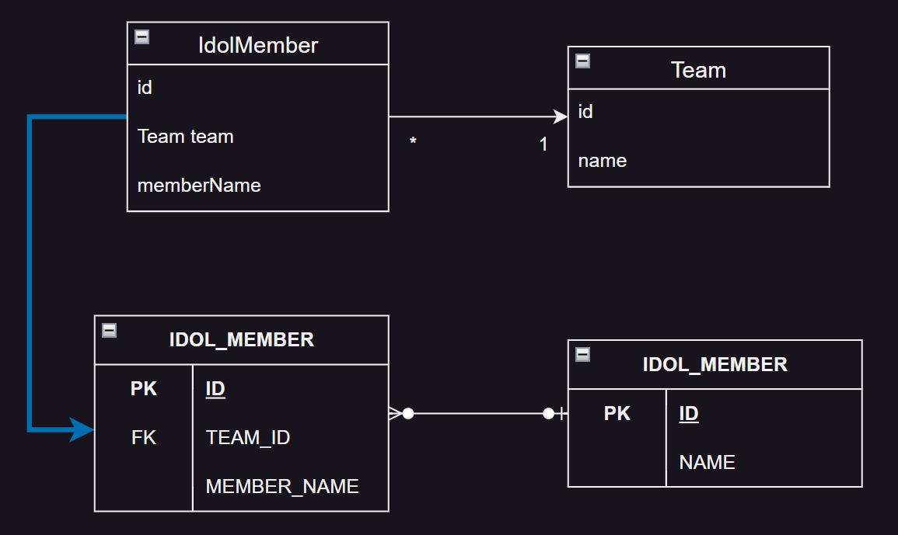
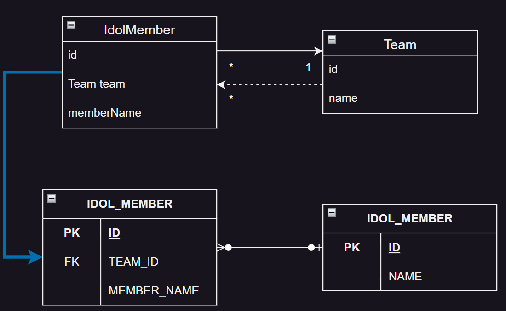
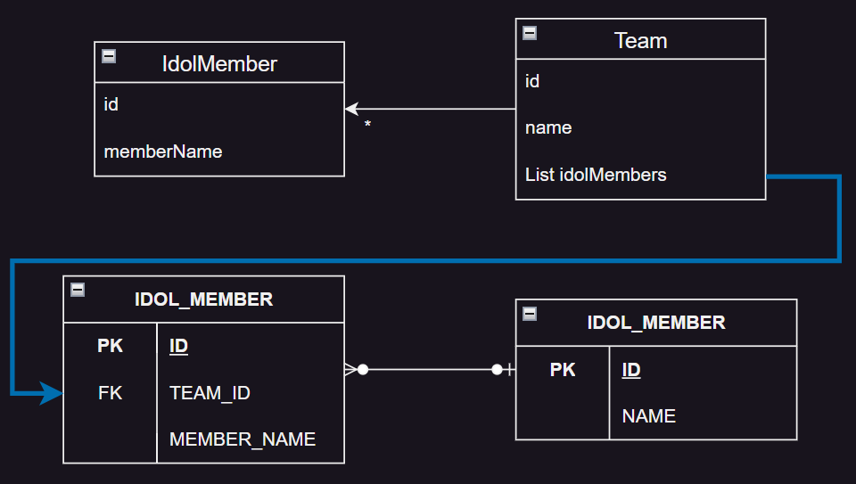
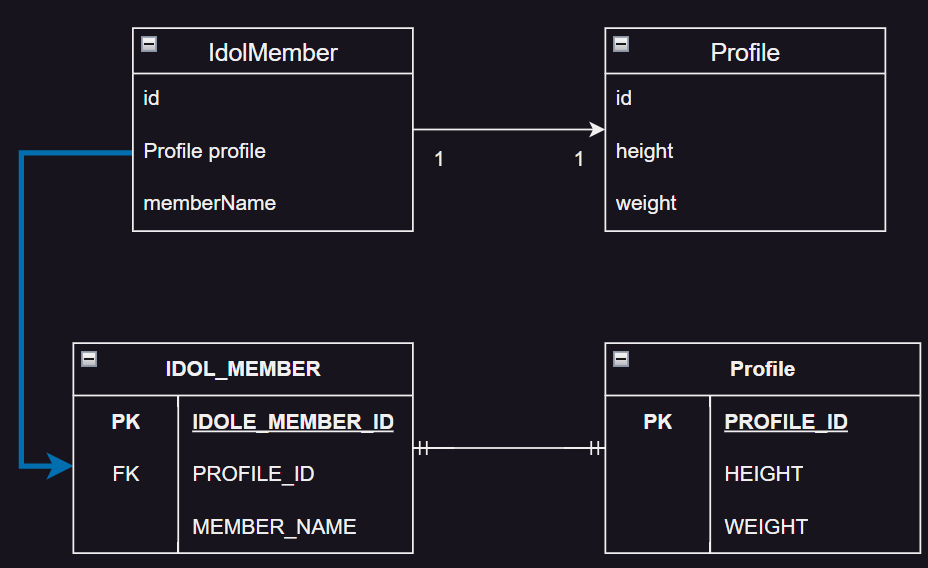
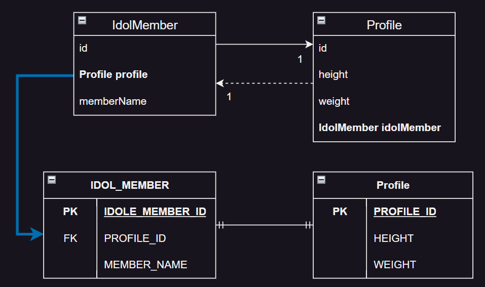
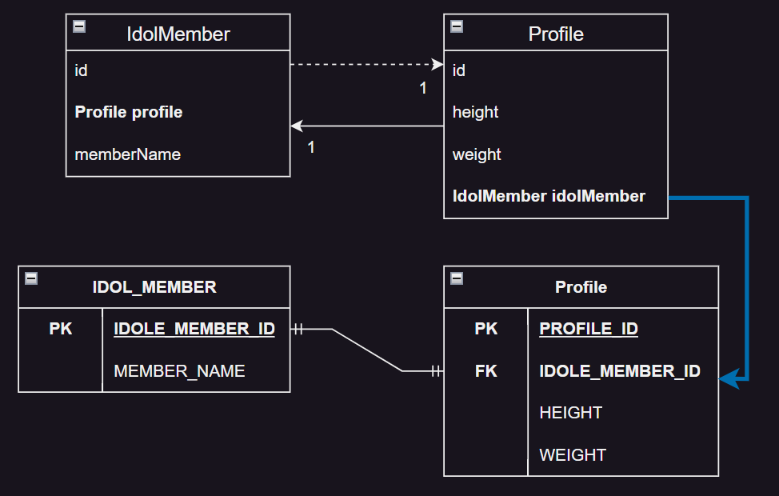
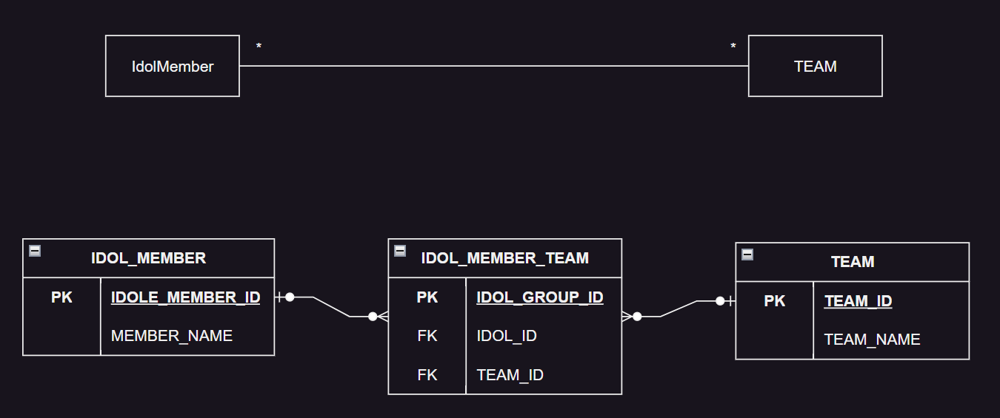
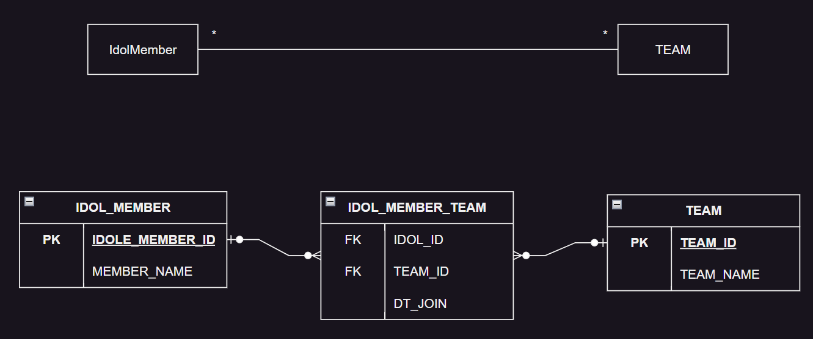
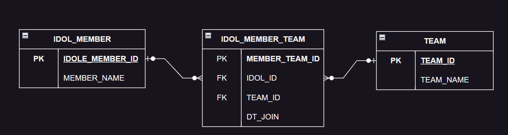

# 6. 다양한 연관관계 매핑

1. 다대일
2. 일대다
3. 일대일, 1:1
4. 다대다, N:N
5. 정리

- 실전 예제 3. 다양한 연관관계 매핑

---

연관관계 매핑시 고려할 것

- 다중성
- 단방향, 양방향
- 연관관계의 주인

#### 다중성

- 다대일 `@ManyToOne`
    - 실무에서 자주 사용
- 일대다 `@OneToMany`
- 일대일 `@OneToOne`
- 다대다 `@ManyToMany`
    - 실무에서 거의 사용 X

#### 단방향, 양방향

테이블은 FK 로 양방향 조회가 가능하나, Java 객체관계에서는 양방향 관계를 위해서는 서로 필드를 가지고 있어야 한다.

#### 연관관계의 주인

- 데이터베이스는 FK 하나가 연관관계의 주인
- 객체관계에서 양방향은 서로를 참조하는 필드를 각자 하나씩 가지고 있음
- 객체관계는 연관계를 관리할 주인을 정해야함
- 보통 FK가 있는 측의 테이블과 매핑된 Entity가 연관관계의 주인

#### 연관관계 경우의 수

- 다대일 : 단방향, 양방향
- 일대다 : 단방향, 양방향
- 일대일
    - 주 테이블 단방향, 양방향
    - 대상 테이블 단방향, 양방향
- 다대다 : 단방향, 양방향

## 1. 다대일

- 데이터베이스의 다대일 관계에서 FK는 항상 다(N) 쪽에 있음
- 따라서 다대일 양방향의 주인은 항상 다(N) 쪽

### 1.1 다대일 단방향, N:1



```java
public class IdolMember {
    @Id
    @GeneratedValue
    @Column(name = "MEMBER_ID")
    private Long id;

    private String userName;

    @ManyToOne
    @JoinColumn(name = "TEAM_ID")
    private IdolTeam idolTeam;

    //..
}

public class Team {
    @Id
    @GeneratedValue
    @Column(name = "TEAM_ID")
    private Long id;

    private String name;

    //...
}
```

### 1.2 다대일 양방향, N:1



```java

@Entity
public class IdolMember {
    @Id
    @GeneratedValue
    @Column(name = "MEMBER_ID")
    private Long id;

    private String userName;

    @ManyToOne
    @JoinColumn(name = "TEAM_ID")
    private Team team;

    public void setTeam(Team team) {
        this.team = team;

        if (!team.getMembers().contains(this)) {
            team.getMembers().add(this);
        }
    }
    //..
}

@Entity
public class Team {
    @Id
    @GeneratedValue
    @Column(name = "TEAM_ID")
    private Long id;

    private String name;

    @OneToMany(mappedBy = "team") // 주인이 아니므로 명시
    private List<IdolMember> idolMembers = new ArrayList<>();

    public void addMember(IdolMember idolMember) {
        this.idolMembers.add(idolMember);

        if (idolMember.getTeam() != this) {
            idolMember.setTeam(this);
        }
    }

    //...
}
```

#### 양방향은 외래 키가 있는 쪽이 연관관계 주인이다

- 일대다와 다대일 연관관계는 항상 다(N)에 외래 키가 있음
- `IdolMember.team`이 연관관계의 주인
- JPA는 외래키를 관리할 때 연관관계의 주인만 사용
- 주인이 아닌 `Team.idolMembers`는 JPQL, 객체 그래프 탐색 시 사용

#### 양방향 연관관계는 항상 서로를 참조해야 한다

- 한쪽만 참조하면 양방향 연관관계가 아님
- 양방향 관계는 편의메서드를 만들어주어야함
    - e.g. `IdolMember.setTeam()`, `Team.addMember()`

## 2. 일대다

- `Collection`, `List`, `Set`, `Map` 중 하나를 사용

### 일대다 단방향, 1:N

JPA 2.0부터 지원



- 외래키를 관리하지 않는 테이블의 Entity가 주인이 됨
- FK 측 Entity에 참조하는 필드가 없음

````java

@Entity
public class IdolMember {
    @Id
    @GeneratedValue
    @Column(name = "MEMBER_ID")
    private Long id;

    private String userName;

    //..
}

@Entity
public class Team {
    @Id
    @GeneratedValue
    @Column(name = "TEAM_ID")
    private Long id;

    private String name;

    @OneToMany
    @JoinColumn(name = "TEAM_ID") // FK
    private List<IdolMember> idolMembers = new ArrayList<>();

    //...
}
````

#### 일대다 단방향 매핑의 단점

- 관계의 주인 쪽에 FK가 없음
- 주인측에 FK가 없으면 주인 측 INSERT 시 반대방향을 UDPAE하는 SQL이 추가로 필요함
- e.g. INSERT aespa -> UPDATE karina.team_id

````
IdolMember karina = new IdolMember();
karina.setUserName("카리나");

Team aespa = new Team();
aespa.setName("에스파");

aespa.getIdolMembers().add(karina);

em.persist(karina); // INSERT INTO IDOL_MEMBER ...
em.persist(aespa); // INSERT INTO TEAM ... / UPDATE IDOL_MEMBER SET TEAM_ID = ? WHERE MEMBER_ID = karina.id

tx.commit(); 
````

#### 일단 단방향 매핑보다는 다대일 양방향 매핑을 사용하자

- 성능 문제 : UPDATE 문 추가
- 관리 문제 : FK 가 없는 Entity가 주인이 됨
- 다대일 양방향으로 FK가 있는 측에 주인을 두는 것을 권장

### 2.2 일대다 양방향, 1:N, N:1

- 일대다 양방향은 존재하지 않음
- 대신 다대일 양방향을 사용할 것
- RDBMS는 N 쪽에 FK가 있기 떄문
- `@ManyToOne`에는 `mappedBy` 속성이 없음`
- 예시처럼 비슷하게 구현은 가능하나, 될수 있으면 다대일 양방향을 사용할 것

<details>
<summary>예시 : 일대다 양방향 비슷하게 구현</summary>

````java

@Entity
public class IdolMember {
    @Id
    @GeneratedValue
    @Column(name = "MEMBER_ID")
    private Long id;

    @ManyToOne
    @JoinColumn(name = "TEAM_ID", insertable = false, updatable = false) // 읽기 전용
    private Team team;

    //...
}

@Entity
public class Team {
    @Id
    @GeneratedValue
    private Long id;

    @OneToMany
    @JoinColumn(name = "TEAM_ID")
    private List<IdolMember> idolMembers = new ArrayList<>();

    //...

}
````

</details>

## 3. 일대일, 1:1

- 데이터베이스에서 일대일 관계는 어느쪽이건 FK를 가질 수 있음

#### 주 테이블에 FK

- 주객체가 대상 객체를 참조하듯이 주 테이블에 외래 키를 두는 방법
- 객체지향적으로 사용할 수 있음

#### 대상 테이블에 FK

- 데이터베이스 전통적인 방식
- 장점 : 1:1에서 1:N으로 변경 시 테이블 구조를 유지할 수 있음

### 3.1 주 테이블에 FK

#### 단방향

- IDOL_MEMBER : 주 테이블
- PROFILE : 대상 테이블



```java

@Entity
public class IdolMember {
    @Id
    @GeneratedValue
    @Column(name = "IDOL_MEMBER_ID")
    private Long id;

    private String memberName;

    @OneToOne
    @JoinColumn(name = "PROFILE_ID")
    private Profile profile;

    //...

}

@Entity
public class Profile {
    @Id
    @GeneratedValue
    @Column(name = "PROFILE_ID")
    private Long id;

    private int height;
    private int weight;

    //...
}
```

#### 양방향



```java

@Entity
public class IdolMember {
    @Id
    @GeneratedValue
    @Column(name = "IDOL_MEMBER_ID")
    private Long id;

    private String memberName;

    @OneToOne
    @JoinColumn(name = "PROFILE_ID")
    private Profile profile;

    //...

}

@Entity
public class Profile {
    @Id
    @GeneratedValue
    @Column(name = "PROFILE_ID")
    private Long id;

    private int height;
    private int weight;

    @OneToOne(mappedBy = "profile")
    private IdolMember idolMember;

    //...
}
```

### 3.2 대상 테이블에 FK

#### 단방향

- JPA에서 허용하지 않음

#### 양방향



```java

@Entity
public class IdolMember {
    @Id
    @GeneratedValue
    @Column(name = "IDOL_MEMBER_ID")
    private Long id;

    private String memberName;


    @OneToOne(mappedBy = "idolMember")
    private Profile profile;

    //...

}

@Entity
public class Profile {
    @Id
    @GeneratedValue
    @Column(name = "PROFILE_ID")
    private Long id;

    private int height;
    private int weight;

    @OneToOne
    @JoinColumn(name = "IDOL_MEMBER_ID")
    private IdolMember idolMember;

    //...
}
```

> ### 주의사항
>
> - 1:1 관계에서 프록시 사용 시 주인이 아닌 Entity 측은 지연로딩으로 설정해도 즉시 로딩됨
> - 위 예시에서 IdolMember.profile 은 지연로딩으로 설정해도 즉시 로딩됨

## 4. 다대다, N:N



- 데이터베이스는 N:N관계를 연결테이블을 통해 표현
- 객체는 N:N 관계를 `@ManyToMany` 로 표현

### 4.1 다대다 : 단방향

```java

@Entity
public class IdolMember {
    @Id
    @GeneratedValue
    @Column(name = "IDOL_MEMBER_ID")
    private Long id;

    private String memberName;


    @ManyToMany
    @JoinTable(name = "IDOL_MEMBER_GROUP"
            , joinColumns = @joinCoulmn(name = "IDOL_MEMBER_ID")
            , inverseJoinColumns = @JoinColumn(name = "TEAM_ID"))
    private List<TEAM> teams = new ArrayList<>();

    //...

}

@Entity
public class TEAM {
    @Id
    @GeneratedValue
    @Column(name = "TEAM_ID")
    private Long id;
    //...

}
```

- `@JoinTable` : 연결 테이블 사용
- `@JoinTable.name` : 연결 테이블 이름
- `@JoinTable.joinColumns` : 현재 엔티티와 매핑할 조인 컬럼
- `@JoinTable.inverseJoinColumns` : 반대방향 엔티티와 매핑할 조인 컬럼

````
Team aespa = new Team();
aespa.setTeamName("에스파");
em.persist(aespa);


IdolMember karina = new IdolMember();
karina.setMemberName("카리나");
karina.getTEAMs().add(aespa); // 연관관계 설정
em.persist(karina);
````

````sql
INSERT INTO TEAM...;
INSERT INTO IDOL_MEMBER...;
INSERT INTO IDOL_MEMBER_GROUP...;
````

### 4.2 다대다 : 양방향

```java

@Entity
public class IdolMember {
    @Id
    @GeneratedValue
    @Column(name = "IDOL_MEMBER_ID")
    private Long id;

    private String memberName;


    @ManyToMany
    @JoinTable(name = "IDOL_MEMBER_GROUP"
            , joinColumns = @joinCoulmn(name = "IDOL_MEMBER_ID")
            , inverseJoinColumns = @JoinColumn(name = "TEAM_ID"))
    private List<TEAM> teams = new ArrayList<>();

    public void addTeam(TEAM team) {
        this.teams.add(team);
        team.getIdolMembers().add(this);
    }

    //...

}

@Entity
public class TEAM {
    @Id
    @GeneratedValue
    @Column(name = "TEAM_ID")
    private Long id;

    @ManyToMany(mappedBy = "teams")
    private List<IdolMember> idolMembers = new ArrayList<>();
    //...

}
```

### 4.3 다대다: 매핑의 한계와 극복, 연결 엔티티 사용



- 위처럼 조인 테이블에 FK외의 컬럼이 생기면 `@ManyToMany` 를 사용할 수 없음

````java

@Entity
public class IdolMember {
    @Id
    @GeneratedValue
    @Column(name = "IDOL_MEMBER_ID")
    private Long id;

    private String memberName;


    //...

}

@Entity
public class TEAM {
    @Id
    @GeneratedValue
    @Column(name = "TEAM_ID")
    private Long id;

    private String teamName;

    //...

}

@Entity
@IdClass(IdolMemberTeamId.class)
public class IdolMemberTeam {

    @Id
    @ManyToOne
    @JoinColumn(name = "IDOL_MEMBER_ID")
    private IdolMember idolMember;

    @Id
    @ManyToOne
    @JoinColumn(name = "TEAM_ID")
    private TEAM team;

    @Temporal(TemporalType.TIMESTAMP)
    private Date dtJoin;

    //...
}

// 식별자 클래스
public class IdolMemberTeamId implements Serializable {
    private Long idolMember;
    private Long team;
    // hashCode, equials, toString

}
````

저장

````
Team aespa = new Team();
aespa.setTeamName("에스파");
em.persist(aespa);

IdolMember karina = new IdolMember();
karina.setMemberName("카리나");
em.persist(karina);

IdolMemberTeam idolMemberTeam = new IdolMemberTeam();
idolMemberTeam.setIdolMember(karina);
idolMemberTeam.setTeam(aespa);
idolMemberTeam.setDtJoin(new Date());
em.persist(idolMemberTeam);
````

조회

````
IdoleMemberTeamId id = new IdolMemberTeamId();
id.setIdolMember(1111);
id.setTeam(2222);

IdolMemberTeam idolMemberTeam = em.find(IdolMemberTeam.class, id);
IdolMember karina = idolMemberTeam.getIdolMember();
TEAM aespa = idolMemberTeam.getTeam();
````

#### 복합 기본 키와 식별자 클래스

- JPA에서 복합키를 구현하기 위해서는 별도의 식별자 클래스를 만들어야 함
- `@IdClass` : 식별자 클래스를 지정
- 식별자 클래스의 특징
    - 복합 키는 별도의 식별자 클래스로 만들어야 함
    - `Serializable` 인터페이스를 구현해야 함
    - `equals` , `hashCode` 메서드를 구현해야 함
    - 기본 생성자가 있어야 함;
    - 식별자 클래스는 `public` 이어야 함
    - `@EmbeddedId` 를 사용할 수도 있음

#### 식별 관계, identifying relationship

- 부모 테이블의 기본키를 자식 테이블의 기본키 + FK로 사용하는 것

### 4.4 다대다 : 새로운 기본키 사용



- 복합키를 사용하는 것은 ORM 쪽에서 할일이 매우 많음
    - 식별자 클래스 생성, 식별자 클래스로 조회 등
- 복합키 대신에 일반적인 대리키를 사용하는 것이 더 편리함
- 영구히 쓸 수 있고, 비즈니스에 의존하지 않음

````java

@Entity
public class IdolMemberTeam {

    @Id
    @GeneratedValue
    @Column(name = "MEMBER_TEAM_ID")
    private Long id;

    @ManyToOne
    @JoinColumn(name = "IDOL_MEMBER_ID")
    private IdolMember idolMember;

    @ManyToOne
    @JoinColumn(name = "TEAM_ID")
    private TEAM team;

    @Temporal(TemporalType.TIMESTAMP)
    private Date dtJoin;

    //...
}
````

저장

````

Team aespa = new Team();
aespa.setTeamName("에스파");
em.persist(aespa);

IdolMember karina = new IdolMember();
karina.setMemberName("카리나");
em.persist(karina);

IdolMemberTeam idolMemberTeam = new IdolMemberTeam();
idolMemberTeam.setIdolMember(karina);
idolMemberTeam.setTeam(aespa);
idolMemberTeam.setDtJoin(new Date());
em.persist(idolMemberTeam);
````

조회

````
IdolMemberTeam idolMemberTeam = em.find(IdolMemberTeam.class, 1L);
IdolMember karina = idolMemberTeam.getIdolMember();
TEAM aespa = idolMemberTeam.getTeam();
````

### 4.5 다대다 연관관계 정리

- 식별 관계 : 받아온 식별자를 기본키 + FK로 사용
- 비식별 관계 **(추천)** : 식별자를 FK로 사용, 별도의 식별자 추가

## 5. 정리


