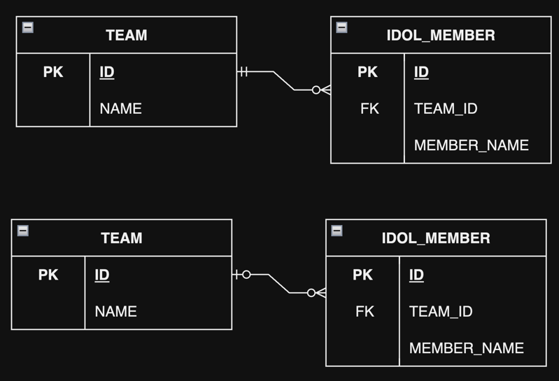

# 7. 고급 매핑

1. 상속 관계 매핑
2. @MappedSuperclass
3. 복합 키와 식별 관계 매핑
4. 조인 테이블
5. 엔티티 하나에 여러 테이블 매핑
6. 정리

- 실전 예제 4. 상속 관계 매핑

---

- 상속 관계 매핑 : 객체의 상속 관계를 데이터베이스에 매핑
- `@MappedSuperclass` : Entity에서 사용하는 공통 속성을 상속 받아서 사용할 수 있게 해줌 e.g. 등록일, 수정일
- 복합 키와 식별 관계 매핑 : 데이터베이스의 식별/비식별 개념, 데이터베이스 식별자가 2개 이상일 떄 매핑하는 방법
- 조인 테이블 : 연관관계를 관리하는 테이블
- Entity 하나에 여러 테이블 매핑하기

## 1. 상속 관계 매핑


- ORM의 상속 관계 매핑은 DB의 슈퍼타입 서브타입 관계를 매핑하는 것
- 각각의 테이블로 변환 : JPA의 조인 전략
- 통합 테이블로 변환 : JPA의 단일 테이블 전략
- 서브타입 테이블로 변환 : JPA의 구현 클래스마다 테이블 전략

### 1.1 조인 전략, Joined Strategy


- Entity 각각을 모두 DB 테이블로 만듦
- 자식 테이블이 부모 테이블의 기본 키를 받아서 기본 키 + 외래 키로 사용
- 조회 시 Join이 자주 사용됨
- 타입을 구분하는 컬럼을 추가해야 함
- 장점
    - 정규화
    - FK 제약조건 사용 가능
    - 저장공간 효율
- 단점
    - SELECT에 JOIN이 자주 발생
    - SELECT 쿼리가 복잡함
    - 데이터 저장 시 INSERT SQL 2번 실행

````java

@Entity
@Inheritance(strategy = InheritanceType.JOINED)
@DiscriminatorColumn(name = "DTYPE")
public class Person {
    @Id
    @GeneratedValue
    @Column(name = "PERSON_ID")
    private Long id;

    private String name;
}

@Entity
@DiscriminatorValue("A")
public class Developer extends Person {
    private String lang;
    private String company;
    private String linkGithub;
}

@Entity
@DiscriminatorValue("B")
public class IdolMember extends Person {
    private String nickname;
    private String team;
    private int birthDebut;
}

@Entity
@DiscriminatorValue("C")
@PrimaryKeyJoinColumn(name = "PHOTOGRAPHER_ID")
public class Photographer extends Person {
    //...
}
````

- `@Inheritance(strategy = InheritanceType.JOINED)` : 상속 관계 매핑 전략을 조인 전략으로 지정
- `@DiscriminatorColumn(name = "DTYPE")` : 자식 테이블을 구분하는 컬럼을 지정
- `@DiscriminatorValue("A")` : 자식 테이블을 구분하는 컬럼의 값 지정
- `@PrimaryKeyJoinColumn(name = "PHOTOGRAPHER_ID")` : 부모 테이블의 기본 키 컬럼명을 변경해서 자식 테이블에 기본키로 사용할 떄 사용

### 1.2 단일 테이블 전략, Single Table Strategy


- 하나의 테이블에 모든 컬럼을 다 넣음
- 구분 컬럼 `DTYPE`을 사용하여 타입 구분
- 주의점 : 자식 Entity의 모든 컬럼이 NULLABLE
- `@DiscriminatorColumn` 필수
- 장점
    - SELECT 시 JOIN 없음, 일반적으로 빠름
    - 조회 쿼리가 단순함
- 단점
    - 자식 Entity에 매핑한 컬럼은 모두 NULLABLE
    - 테이블이 커질 수 있음, 오히려 성능 저하

````java

@Entity
@Inheritance(strategy = InheritanceType.SINGLE_TABLE)
@DiscriminatorColumn(name = "DTYPE")
public abstract class Person {
    @Id
    @GeneratedValue
    @Column(name = "PERSON_ID")
    private Long id;
    private String name;
    //...

}

@Entity
@DiscriminatorValue("A")
public class Developer extends Person {
    private String lang;
    private String company;
    private String linkGithub;
}

//...
````

### 1.3 구현 클래스마다 테이블 전략, Table Per Class Strategy


- 자식 Entity마다 테이블을 만들고 자식 테이블에 필요한 컬럼을 모두 포함
- **비추**
- ORM, 데이터베이스 양측에서 비효율
- 구분컬럼 없음
- 장점
    - 서브 타입을 명확하게 구분해서 처리할 때 효과적
    - NOT NULL 제약조건 가능
- 단점
    - 여러 자식테이블 조회 시 UNION 필요
    - 자식 테이블을 통합해서 쿼리하기 어려움

````java

@Entity
@Inheritance(strategy = InheritanceType.TABLE_PER_CLASS)
public abstract class Person {
    @Id
    @GeneratedValue
    @Column(name = "PERSON_ID")
    private Long id;
    private String name;
    //...

}

@Entity
public class Developer extends Person {
    private String lang;
    private String company;
    private String linkGithub;
}

//...
````

## 2. @MappedSuperclass


- 부모 클래스는 Entity가 아님, 테이블에 매핑 x
- 부모 클래스는 자식 클래스에게 매핑 정보만 제공
- 추상 클래스와 비슷
- 주로 등록일자, 삭제일자, 수정자 등의 공통 속성을 효과적으로 관리

````java

@MappedSuperclass
public class BaseEntity {
    @Id
    @GeneratedValue
    private Long id;
    private String name;
    //...
}

@Entity
public class Developer extends BaseEntity {
    private String lang;
    private String company;
    private String linkGithub;
    //...
}

@Entity
public class IdolMember extends BaseEntity {
    private String nickname;
    private String team;
    private int birthDebut;
    //...
}

@Entity
@AttributeOverrides({
        @AttributeOverride(name = "id", column = @Column(name = "PHOTOGRAPHER_ID")),
        @AttributeOverride(name = "name", column = @Column(name = "PHOTOGRAPHER_NAME"))
})
public class Photographer extends BaseEntity {
    //...
}
````

- `@AttributeOverrides` : 부모로부터 물려받은 컬럼 속성 재정의

## 3. 복합 키와 식별 관계 매핑

### 3.1 식별 관계 vs 비식별 관계

FK가 기본키에 포함되어있는지에 따라 구분

- 식별 관계, identifying relationship
- 비식별 관계, non-identifying relationship
    - 최근의 추세

#### 식별 관계


- 부모 테이블의 기본키가 자식 테이블의 기본키의 일부이자, FK

### 비식별 관계



- 부모테이블의 기본키를 자식 테이블의 FK로만 사용
- 필수적 비식별 관계 (위) : 자식 테이블의 FK는 NOT NULL
- 선택적 비식별 관계 (아래) : 자식 테이블의 FK는 NULLABLE

### 3.2 복합 키 : 비식별 관계 매핑

- JPA는 복합키를 매핑하려면 별도의 식별자 클래스를 만들어야 함
- 영속성 컨텍스트에서 Entity를 구분할 때 식별자를 이용
    - 식별자로 `equals()`와 `hashCode()`를 구현해 동등성 비교
    - 식별자 클래스를 구현할때 직접 `equals()`와 `hashCode()`를 구현해야 함
- `@IdClass` : 식별자 클래스에 매핑, DB 적인 방법
- `@EmbeddedId` : 식별자 클래스를 내장, 객체지향적 방법

#### `@IdClass`


````java
import java.lang.annotation.Inherited;

public class TeamId implements Serializable {
    private String id1;
    private String id2;

    @Override
    public boolean equals(Object o) {
        //...
    }

    @Override
    public int hashCode() {
        //...
    }
}

@Entity
@IdClass(TeamId.class)
public class Team {
    @Id
    @Column(name = "TEAM_ID1")
    private String id1; // TeamId.id1과 매핑
    @Id
    @Column(name = "TEAM_ID2")
    private String id2; // TeamId.id2과 매핑
    private String name;
    //...
}

@Entity
public class IdolMember {
    @Id
    @GeneratedValue
    @Column(name = "IDOL_MEMBER_ID")
    private Long id;

    @ManyToOne
    @JoinColumns({
            @JoinColumn(name = "TEAM_ID1", referencedColumnName = "TEAM_ID1"),
            @JoinColumn(name = "TEAM_ID2", referencedColumnName = "TEAM_ID2")
    })
    private Team team;
    //...
}
````

````
// 저장
Team aespa = new Team();
aespa.setId1("Aespa");
aespa.setId2("001");
aespa.setName("에스파");
em.persist(aespa);

// 조회
TeamId teamId = new TeamId("Aespa", "001");
Team aespa = em.find(Team.class, teamId);
````

- 저장시 식별자 클래스를 직접 사용하지 않음
- Entity 등록 전 영속성 컨텍스트에서 내부적으로 식별자 클래스를 생성해 사용

#### `@EmbeddedId`

````java

@Embeddable
public class TeamId implements Serializable {
    @Column(name = "TEAM_ID1")
    private String id1;
    @Column(name = "TEAM_ID2")
    private String id2;

    // hashCode(), equals() 재정의
}

@Entity
public class Team {
    @EmbeddedId
    private TeamId id;
    private String name;
    //...
}
````

````
// 저장
TeamId teamId = new TeamId("Aespa", "001");
Team aespa = new Team();
aespa.setId(teamId);
aespa.setName("에스파");
em.persist(aespa);


// 조회
TeamId teamId = new TeamId("Aespa", "001");
Team aespa = em.find(Team.class, teamId);
````

- 저장시 식별자 클래스를 직접 사용

#### 복합 키와 equals(), hashCode()

- 복합키는 필수로 `equals()`와 `hashCode()`를 구현해야 함
- 영속성 컨텍스트에서 Entity 관리시 식별자로 식별자 클래스를 사용
- 식별자 클래스의 `equals()`와 `hashCode()`를 구현하지 않으면 동일성 비교를 해서, 값이 같은 식별자여도 다른 식별자로 인식

````
TeamId teamId1 = new TeamId("Aespa", "001");
TeamId teamId2 = new TeamId("Aespa", "001");
teamId1.equals(teamId2); // false : 영속성 컨텍스트에서 문제 발생
````

#### `@IdClass` vs `@EmbeddedId`

- `@EmbeddedID`가 좀더 객체지향 적이나, JPQL이 복잡해짐

````
em.createQuery("select m.id.id1, m.id.id2 from IdolMember m"); // @EmbeddedId
em.createQuery("select m.id from IdolMember m"); // @IdClass
````

### 3.3 복합 키 : 식별 관계 매핑


#### `@IdClass`와 식별 관계

````java

@Entity
public class Team {
    @Id
    @Column(name = "TEAM_ID")
    private String id;
    private String name;
    //...
}

@Entity
@IdClass(IdolMemberId.class)
public class IdolMember {

    @Id // 기본키 매핑
    @ManyToOne
    @JoinColumn(name = "TEAM_ID") // FK 매핑
    private Team team;

    @Id
    @Column(name = "MEMBER_ID")
    private String memberId;

    private String memberName;
    //...
}

public class IdolMemberId implements Serializable {
    private String team; // IdolMember.team 식별자
    private String memberId; // IdolMember.memberId 식별자

    // equals(), hashCode() 구현
}

@Entity
@IdClass(AlbumId.class)
public class Album {
    @Id // 기본키 매핑
    @ManyToOne
    @JoinColumns({
            @JoinColumn(name = "TEAM_ID"),
            @JoinColumn(name = "MEMBER_ID")
    }) // FK 매핑
    private IdolMember idolMember;

    @Id
    @Column(name = "ALBUM_ID")
    private String albumId;

    // ...
}

public class AlbumId implements Serializable {
    private IdolMemberId idolMember; // Album.idolMember 식별자
    private String albumId; // Album.albumId 식별자

    // equals(), hashCode() 구현
}
````

#### `@EmbeddedId`와 식별 관계

````java
@Entity
pbulic

class Team {
    @Id
    @Column(name = "TEAM_ID")
    private String id;
    private String name;
    //...
}

@Entity
public class IdolMember {
    @EmbeddedId
    private IdolMemberId id;

    @MapsId("teamId") // @EmbeddedId를 사용한 식별 관계 매핑
    @ManyToOne
    @JoinColumn(name = "TEAM_ID")
    private Team team;

    private String memberName;

}

@Embeddable
public class IdolMemberId implements Serializable {
    private String teamId; // @MapsId("teamId")로 매핑

    @Column(name = "IDOL_MEMBER_ID")
    private String id;

    // equals(), hashCode() 구현
}

@Entity
public class Album {
    @EmbeddedId
    private AlbumId id;

    @MapsId("idolMemberId") // @EmbeddedId를 사용한 식별 관계 매핑
    @ManyToOne
    @JoinColumns({
            @JoinColumn(name = "TEAM_ID"),
            @JoinColumn(name = "IDOL_MEMBER_ID")
    })
    private IdolMember idolMember;
}

@Embeddable
public class AlbumId implements Serializable {

    private IdolMemberId idolMemberId; // @MapsId("idolMemberId")로 매핑

    @Column(name = "ALBUM_ID")
    private String albumId;

    // equals(), hashCode() 구현
}
````

### 3.4 비식별 관계로 구현


````java

@Entity
public class Team {
    @Id
    @GeneratedValue
    @Column(name = "TEAM_ID")
    private String id;
    private String name;
    //...
}

@Entity
public class IdolMember {
    @Id
    @GeneratedValue
    @Column(name = "IDOL_MEMBER_ID")
    private String id;

    @ManyToOne
    @JoinColumn(name = "TEAM_ID")
    private Team team;

    private String memberName;
    //...
}

@Entity
public class Album {
    @Id
    @GeneratedValue
    @Column(name = "ALBUM_ID")
    private String id;

    @ManyToOne
    @JoinColumn(name = "IDOL_MEMBER_ID")
    private IdolMember idolMember;

    // ...
}
````

### 3.5 일대일 식별 관계


````java

@Entity
public class Album {

    @Id
    @GeneratedValue
    @Column(name = "ALBUM_ID")
    private Long id;

    private String albumName;

    @OneToOne(mappedBy = "album")
    private AlbumDetail albumDetail;

    // ...
}

@Entity
public class AlbumDetail {

    @Id
    private Long albumId;

    @MapsId // @Id로 매핑한 필드와 연결
    @OneToOne
    @JoinColumn(name = "ALBUM_ID")
    private Album album;

    private int rating;

    // ...
}

public class Foo {
    public void saveAlbum() {
        Album nextLevel = new Album();
        nextLevel.setAlbumName("Next Level");
        em.persist(nextLevel);

        AlbumDetail nextLevelDetail = new AlbumDetail();
        nextLevelDetail.setRating(5);
        nextLevelDetail.setAlbum(nextLevel);
        em.persist(nextLevelDetail);
    }
}
````

### 3.6 식별, 비식별 관계의 장단점

**비식별관계 + Long 타입의 대리키를 사용하자**  
**선택적 비식별 관계보다 필수적 비식별 관계를 사용하자**

#### 식별관계의 단점

- 식별관계는 자식으로 갈수록 기본키의 컬럼 개수가 늘어남
    - join 조건이 길어지고, 기본키 index가 커짐
    - 식별관계는 복합키를 만들 경우가 많음
    - JPA의 복합키는 별도의 식별자 클래스가 필요
- 식별관계에는 자연키의 사용이 많아짐
- 식별관계는 유연하지 못함
- JPA에서 대리키는 `@GeneratedValue`로 간단하게 지원

#### 식별관계의 장점

- 부모 테이블의 기본키로 자식, 손자까지 대대로 찾을 수 있음

## 4. 조인 테이블

데이터베이스의 연관관계 설계 방법

- 조인 컬럼 사용 (FK)
    - 기본으로 조인컬럼을 사용하고, 필요할 때 조인 테이블을 사용
- 조인 테이블 사용
    - a.k.a 연결 테이블, 링크 테이블

#### 조인 컬럼 사용, FK


- 선택적 비식별 관계 : IDOL_MEMBER 테이블의 TEAM_ID NULL을 허용
- Outer Join을 사용해야함

#### 조인 테이블 사용


### 4.1 1:1: 조인 테이블


```java

@Entity
public class Team {
    @Id
    @GeneratedValue
    @Column(name = "TEAM_ID")
    private Long id;

    private String name;

    @OneToOne
    @JoinTable(name = "IDOL_MEMBER_TEAM", JoinColumns = @JoinColumn(name = "TEAM_ID"), inverseJoinColumns = @JoinColumn(name = "IDOL_MEMBER_ID"))
    private IdolMember idolMember;

    // ...
}

@Entity
public class IdolMember {

    @Id
    @GeneratedValue
    @Column(name = "IDOL_MEMBER_ID")
    private Long id;

    private String memberName;

    // ...
}
````

### 4.2 1:N 조인 테이블


```java

@Entity
public class Team {
    @Id
    @GeneratedValue
    @Column(name = "TEAM_ID")
    private Long id;

    @OneToMany
    @JoinTable(name = "IDOL_MEMBER_TEAM", joinColumns = @JoinColumn(name = "TEAM_ID"), inverseJoinColumns = @JoinColumn(name = "IDOL_MEMBER_ID"))
    private List<IdolMember> idolMembers = new ArrayList<>();

    // ...
}

@Entity
public class IdolMember {
    @Id
    @GeneratedValue
    @Column(name = "IDOL_ID")
    private Long id;

    private String memberName;

    // ...
}
```

### 4.3 N:1 조인 테이블

````java

@Entity
public class Team {
    @Id
    @GeneratedValue
    @Column(name = "TEAM_ID")
    private Long id;

    @OneToMany(mappedBy = "team")
    private List<IdolMember> idolMembers = new ArrayList<>();

    // ...
}

@Entity
public class IdolMember {
    @Id
    @GeneratedValue
    @Column(name = "IDOL_MEMBER_ID")
    private Long id;

    @ManyToOne(optional = false)
    @JoinTable(name = "IDOL_MEMBER_TEAM", joinColumns = @JoinColumn(name = "IDOL_MEMBER_ID"), inverseJoinColumns = @JoinColumn(name = "TEAM_ID"))
    private Team team;

    private String memberName;

    // ...

}


````

### 4.4 N:M 조인 테이블


```java

@Entity
public class Team {

    @Id
    @GeneratedValue
    @Column(name = "TEAM_ID")
    private Long id;

    private String teamName;

    @ManyToMany
    @JoinTable(name = "TEAM_IDOL_MEMBER", joinColumns = @JoinColumn(name = "TEAM_ID"), inverseJoinColumns = @JoinColumn(name = "IDOL_MEMBER_ID"))
    private List<IdolMember> idolMembers = new ArrayList<>();
    //...
}

@Entity
public class IdolMember {

    @Id
    @GeneratedValue
    @Column(name = "IDOL_ID")
    private Long id;
    private String memberName;

    //...
}
````

## 5. 엔티티 하나에 여러 테이블 매핑

- 잘 사용하지 않음
- `@SecondaryTable` : 하나의 Entity에 여러 테이블 매핑

````java

@Entity
@Table(name = "ALBUM")
@SecondaryTable(name = "ALBUM_DETAIL", pkJoinColumns = @PrimaryKeyJoinColumn(name = "ALBUM_DETAIL_ID"))
public class Album {

    @Id
    @GeneratedValue
    @Column(name = "ALBUM_ID")
    private Long id;

    private String name;

    @Column(table = "ALBUM_DETAIL")
    private int rating;

    // ...
}
````

- `@SecondaryTables` : 하나의 Entity에 여러 테이블 매핑

## 6. 정리