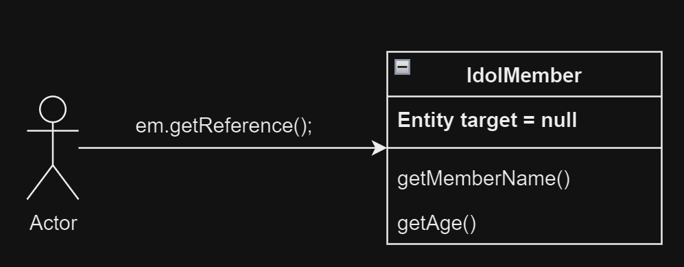
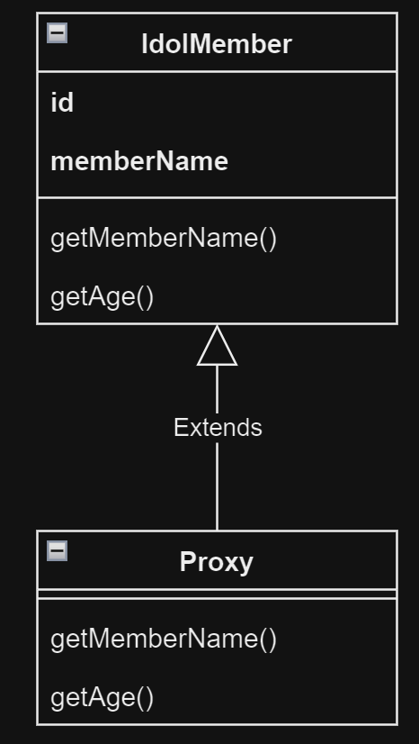
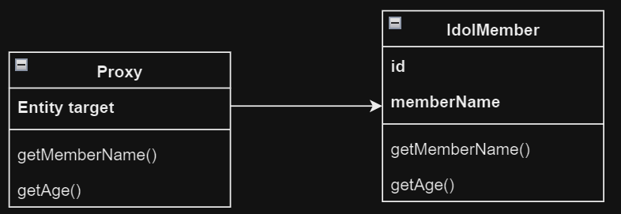
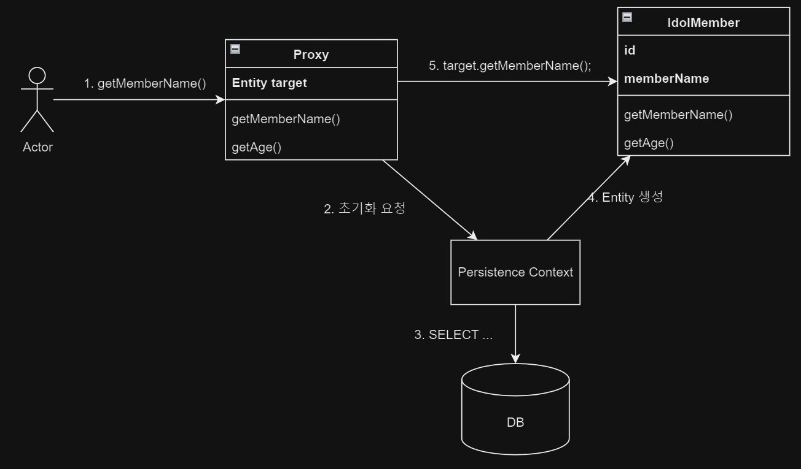

# 8. 프록시와 연관관계 관리

1. 프록시
2. 즉시 로딩과 지연 로딩
3. 지연 로딩 활용
4. 영속성 전이 : CASCADE
5. 고아 객체
6. 영속성 전이 + 고아 객체, 생명주기
7. 정리

---

- 프록시와 즉시로딩, 지연로딩 : 데이터베이스에 저장된 데이터에 대한 객체그래프 탐색을 위해 JPA는 프록시를 사용
    - 실제 객체 사용 시점에서 DB SELECT
- 영속성 전이와 고아 객체 : 연관된 객체를 함께 저장하거나 삭제

## 1. 프록시

````
IdolMember karina = em.find(IdolMember.class, "aespa001");
System.out.println("karina = " + karina.getName());
// System.out.println("karina's team = " + karina.getTeam().getName());
````

- `team` 객체 탐색이 없다면 테이블 `TEAM`을 join 하는 것이 불필요함
- 지연로딩
    - JPA는 프록시 객체를 로딩해두고 실제 객체 탐색 시점에 DB SELECT 진행
- JPA는 지연로딩 구현 방법은 JPA 구현체들에 위임
    - 지금부터 hibernate의 구현방법을 사용

### 1.1 프록시 기초



````
IdolMember karina = em.getReference(IdolMember.class, "aespa001");
````

- `EntityManger.getReference()` : 프록시 객체 조회, DB SELECT하지 않음

#### 프록시의 특징



- 프록시 객체는 실제 클래스를 상속받아 만들어짐
    - 사용자는 실제인지 프록시인지 구분하지 않고 사용



- 프록시는 실제 객체에 대한 참조를 보관하고 있음

#### 프록시 객체의 초기화



- `member.getMemberName()`처럼 실제 객체가 사용될 떄 데이터베이스를 조회
- 프록시 객체의 초기화 : 실제 사용될 때 Entity instance 생성
- 프록시 초기화 과정
    1. proxy객체의 `getMemberName()` 호출
    2. 실제 Entity가 없다면 영속성 컨텍스트에 Entity 생성 요청
    3. 영속성 컨텍스트가 DB SELECT, Entity 객체 생성
    4. 프록시의 변수 `target`에 실제 Entity 객체 참조
    5. 프록시 객체가 실제 Entity 객체에게 `getMemberName()` 호출 후 반환

#### 프록시의 특징

- 처음 사용시에 한번만 초기화됨
- 초기화했다고, 프록시 객체가 Entity로 바뀌는 것이 아님
    - 앞으로 프록시를 통해 Entity에 접근하게 됨
- 프록시 객체는 원본 Entity를 상속받아서 만들어짐
    - 타입 체크시 주의해야함
    - `instanceof` 사용시 프록시 객체는 원본 Entity의 타입이 아님
- 영속성 컨텍스트에게 생성 요청 시 이미 Entity가 있다면 DB SELECT 안함
    - 이 떄는 `em.getReference()`를 호출해도 프록시 객체가 아닌 실제 Entity 반환
- 영속성 컨텍스트 없이 프록시 초기화는 불가능
    - 준영속 상태의 프록시 초기화 요청 시 `org.hibernate.LazyInitializationException` 발생

#### 준영속 상태와 초기화

````
IdolMember karina = em.getReference(IdolMember.class, "aespa001");
tx.commit(em);
em.close(); // karina 준영속 상태

karina.getMemberName(); // org.hibernate.LazyInitializationException 발생!
````

### 1.2 프록시와 식별자

````
IdolMember karina = em.getReference(IdolMember.class, "aespa001");
karina.getId(); // 프록시 초기화되지 않음
````

- 프록시 내부적으로 식별자 값을 가지고 있음
- 식별자 값 사용시에는 프록시 초기화 작업을 진행하지 않음
- `@Access(AccessType.PROPERTY)` : 프로퍼티 접근 방식, 식별자 값 사용시 프록시 초기화 안함
- `@Access(AccessType.FIELD)` : 필드 접근 방식, 식별자 값 사용시 프록시 초기화 진행
- 연관관계 매핑은 식별자만 사용하므로 DB SELECT 없이 할 수 있는 장점

````
// SELECT TEAM 없이 karina 연관관계 매핑
Team aespa = em.getReference(Team.class, "aespa");

IdolMember karina = em.getReference(IdolMember.class, "aespa001");
karina.setTeam(aespa); 
````

### 1.3 프록시 확인

- `PersistenceUnitUtil.isLoaded(Object entity)` : 프록시 인스턴스 초기화 여부 확인

````
boolean isLoaded = emf.getPersistenceUnitUtil().isLoaded(karina);
````

## 2. 즉시 로딩과 지연 로딩

- 프록시 객체는 주로 연관된 Entity의 지연 로딩에 사용됨

````
IdolMember karina = em.find(IdolMember.class, "aespa001");
Team aespa = karina.getTeam(); // 객체 그래프 탐색
System.out.println("karina's team = " + aespa.getName()); // Team Entity 사용 
````

- 즉시 로딩 : Entity 조회시 연관 Entity도 함께 조회
    - `@ManyToOne(fetch = FetchType.EAGER)` : 즉시 로딩 설정
- 지연 로딩 : 연관 Entity를 실제 사용할 때 조회
    - `@ManyToOne(fetch = FetchType.LAZY)` : 지연 로딩 설정

### 2.1 즉시 로딩, EAGER LOADING

- `@ManyToOne(fetch = FetchType.EAGER)`
- 즉시 로딩 최적화를 위해 대부분 JOIN을 사용

````java

@Entity
public class IdolMember {

    //...

    @ManyToOne(fetch = FetchType.EAGER)
    @JoinColumn(name = "TEAM_ID")
    private Team team;

    //...

}
````

```SQL
SELECT *
FROM IDOL_MEMBER M
         LEFT OUTER JOIN TEAM T ON M.TEAM_ID = T.ID
WHERE M.ID = 'aespa001'
```

> ### JPA의 INNER JOIN, OUTER JOIN
>
> - 일반적으로 INNER JOIN이 더 성능이 좋음
> - `@JoinColumn(nullable = false)` : INNER JOIN
> - `@JoinColumn(nullable = true)` : OUTER JOIN

### 2.2 지연 로딩, LAZY LOADING

- `@ManyToOne(fetch = FetchType.LAZY)`
- 프록시 객체를 조회하고, 실제 사용시점까지 DB 조회를 미룸
- 이미 영속성 컨텍스트에 있는 Entity면 프록시 사용안함

````java

@Entity
public class IdolMember {

    //...

    @ManyToOne(fetch = FetchType.LAZY)
    @JoinColumn(name = "TEAM_ID")
    private Team team;

    //...

}
````

```sql
-- 객체 조회 시
SELECT *
FROM IDOL_MEMBER M
WHERE M.ID = 'aespa001'

-- 연관객체 실제 사용 시
SELECT *
FROM TEAM T
WHERE T.ID = 'aespa'
```

### 2.3 즉시 로딩, 지연 로딩 정리

- 어느 것이 좋은지는 case by case

## 3. 지연 로딩 활용

````java

@Entity
public class IdolMember {
    //...

    @ManyToOne(fetch = FetchType.EAGER)
    @JoinColumn(name = "TEAM_ID")
    private Team team;

    @OneToMany(mappedBy = "idolMember", fetch = FetchType.LAZY)
    private List<Schedule> schedules = new ArrayList<>();

    //...
}
````

````sql
-- 객체 조회 시
SELECT *
FROM IDOL_MEMBER M
         LEFT JOIN TEAM T ON M.TEAM_ID = T.ID
WHERE M.ID = 'aespa001'

-- Schedule 사용 시
SELECT *
FROM SCHEDULE S
WHERE S.IDOL_MEMBER_ID = 'aespa001'
````

### 3.1 프록시와 컬렉션 래퍼

````
IdolMember karina = em.find(IdolMember.class, "aespa001");
List<Schedule> schedules = karina.getSchedules(); // 프록시 객체 반환
System.out.println("schedules = " + schedules.getClass.getName()); // schedules = org.hibernate.collection.internal.PersistentBag

````

- 컬렉션 래퍼 : Entity를 영속상태로 만들 때, hibernate가 제공하는 내장 컬렉션으로 원본 컬렉션을 변경하는 것
    - 컬렉션 래퍼는 원본 컬렉션에 대한 프록시 역할 수행
    - **같은 프록시임**

### 3.2 JPA 기본 Fetch 전략

- `@ManyToOne`, `@OneToOne` : 즉시 로딩
- `@OneToMany`, `@ManyToMany` : 지연 로딩
- 연관 Entity가 하나면 즉시 로딩, 컬렉션이면 지연 로딩
    - 컬렉션은 대체로 로딩 비용이 많이 듦. e.g. 1:1억 관계
- **추천 : 모든 관계에 지연 로딩을 사용, 개발 완료시점에서 상황을 보고 꼭 필요한 부분에만 즉시 로딩**

### 3.3 컬렉션에 `fetch = FetchType.EAGER` 사용 시 주의점

- 컬렉션을 하나 이상 즉시 로딩하는 것은 비추
    - 1:N, 1:M 즉시 로딩 시 N * M개의 데이터가 조회됨
    - JPA는 이 결과를 메모리에서 필터링해서 반환
- 컬렉션의 즉시로딩은 항상 `OUTER JOIN` 을 사용하도록 한다
    - `INNER JOIN` 시 컬렉션에 없는 값은 반환하지 않음

#### 즉시 로딩 조인 전략

- `@ManyToOne`, `@OneToOne`
    - `optional = false` : INNER JOIN
    - `optional = true` : OUTER JOIN
- `@OneToMany`, `@ManyToMany`
    - `optional = false` : INNER JOIN
    - `optional = true` : OUTER JOIN

## 4. 영속성 전이 : CASCADE

- 영속성 전이, transitive persistence : 특정 Entity를 영속 상태로 만들 때 연관된 Entity도 함께 영속상태로 만듦
- 부모 Entity 저장 시, 자식 Entity도 함께 저장

````java

@Entity
public class Team {
    @Id
    @GeneratedValue
    @Column(name = "TEAM_ID")
    private Long id;

    @OneToMany(mappedBy = "team")
    private List<IdolMember> idolMembers = new ArrayList<>();

    //...
}

public class Foo {

    public void saveTeamWithIdols() {
        Team aespa = new Team("aespa");
        em.persist(aespa); // 부모 Entity를 영속상태로 만듦

        IdolMember karina = new IdolMember("aespa001", "카리나");
        karina.setTeam(aespa); // 연관관계 설정
        em.persist(karina);

        IdolMember winter = new IdolMember("aespa002", "윈터");
        winter.setTeam(aespa); // 연관관계 설정
        em.persist(winter);
    }

} 
````

### 4.1 영속성 전이 : 저장

````java

@Entity
public class Team {
    @Id
    @GeneratedValue
    @Column(name = "TEAM_ID")
    private Long id;

    @OneToMany(mappedBy = "team", cascade = CascadeType.PERSIST)
    private List<IdolMember> idolMembers = new ArrayList<>();

    //...
}

public class Foo {

    public void saveTeamWithIdols() {
        Team aespa = new Team("aespa");

        IdolMember karina = new IdolMember("aespa001", "카리나");
        karina.setTeam(aespa); // 연관관계 설정
        aespa.getIdolMembers().add(karina);

        IdolMember winter = new IdolMember("aespa002", "윈터");
        winter.setTeam(aespa); // 연관관계 설정
        aespa.getIdolMembers().add(winter);

        em.persist(aespa); // 부모 Entity를 영속상태로 만듦

    }
} 
````

- `cascade = CascadeType.PERSIST` : 부모가 영속화 될 떄 자식들도 함께 영속화
    - 부모의 영속화가 자식들에게 전이됨

### 4.2 영속성 전이 : 삭제

````
Team aespa = em.find(Team.class, "aespa");
Idolmember karina = em.find(Idolmember.class, "aespa001");
Idolmember winter = em.find(Idolmember.class, "aespa002");

em.remove(aespa); // 부모 Entity 삭제
em.remove(karina); // 자식 Entity 삭제
em.remove(winter); // 자식 Entity 삭제
````

- `cascade = CascadeType.REMOVE` : 부모가 삭제될 때 자식들도 함께 삭제
    - 부모의 삭제가 자식들에게 전이됨

````
Team aespa = em.find(Team.class, "aespa");
em.remove(aespa); // 부모 Entity 삭제, 자식 Entity 삭제
````

### 4.3 CASCADE 종류

`javax.persistence.CascadeType`

```java

package javax.persistence;

public enum CascadeType {
    ALL, // 모두 적용
    PERSIST, // 영속 
    MERGE,  // 병합
    REMOVE, // 삭제
    REFRESH, // REFRESH
    DETACH; // DETACH

    private CascadeType() {
    }
}

```

## 5. 고아 객체, ORPHAN

- 고아 객체 : 부모 Entity와 연관관계가 끊어진 자식 Entity
- JPA는 고아 객체를 자동으로 삭제하는 기능을 제공
    - 부모 Entity의 컬렉션에서 자식 Entity 참조가 제거되면, 자식 Entity가 삭제됨
- **참조가 제거된 고아는 다른곳에서도 안쓴다고 간주하고 삭제**
- 부모가 제거되면 자식이 제거되는 기능 제공
    - `CascadeType.REMOVE`와 같음

```java

@Entity
public class Team {
    @Id
    @GeneratedValue
    @Column(name = "TEAM_ID")
    private Long id;

    @OneToMany(mappedBy = "team", orphanRemoval = true)
    private List<IdolMember> idolMembers = new ArrayList<>();

    //...
}

public class Foo {

    public void saveTeamWithIdols() {
        Team aespa = em.find(Team.class, "aespa");
        aespa.getIdolMembers().remove(0); // 자식 Entity 삭제
        // aespa.getIdolMembers().clear(); // 자식 Entity 전체 삭제
    }
}
```

````sql
DELETE
FROM IDOL_MEMBER
WHERE IDOL_MEMBER_ID = ?
````

## 6. 영속성 전이 + 고아 객체, 생명주기

```java

@Entity
public class Team {
    @Id
    @GeneratedValue
    @Column(name = "TEAM_ID")
    private Long id;

    @OneToMany(mappedBy = "team", orphanRemoval = true, cascade = CascadeType.ALL)
    private List<IdolMember> idolMembers = new ArrayList<>();

    //...
}

public class Foo {

    public void saveTeamWithIdols() {
        Team aespa = em.find(Team.class, "aespa");
        aespa.addIdolMember(karina); // 자식 Entity 저장
    }
}
```

- `orphanRemoval = true, cascade = CascadeType.ALL` : 부모 Entity를 통해 자식 Entity를 관리 가능

## 7. 정리

- JPA 는 프록시를 통해 객체 그래프를 효율적으로 탐색
- 즉시 로딩 : 객체 그래프를 한번에 가져옴
- 지연 로딩 : 객체 그래프를 사용하는 시점에 가져옴
- 영속성 전이 : 객체를 저장할때 연관 Entity도 함께 저장
- 고아 객체 제거 : 연관 Entity와 관계를 끊었을 때, 연관 Entity를 자동으로 삭제

