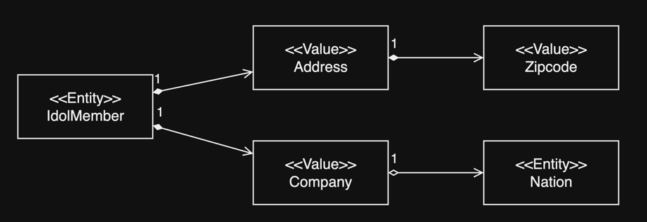

# 9. 값 타입

1. 기본값 타입
2. 임베디드 타입 (복합 값 타입)
3. 값 타입과 불변 객체
4. 값 타입의 비교
5. 값 타입 컬렉션
6. 정리

---

#### JPA 데이터 타입

- Entity 타입 : `@Entity`로 정의하는 객체
- 값 타입, Value : int, Integer, String 처럼 단순히 값으로 사용하는 자바 기본 타입이나 객체
    - 기본값 타입, basic tvalue type
        - 기본형, 래퍼, String
    - 임베디드 타입, embedded type, 복합 값 타입
        - JPA에서 사용자가 직접 정의한 값 타입
    - 컬렉션 값 타입, collection value type

## 1. 기본값 타입

```java

@Entity
public class IdolMember {

    @Id
    @GeneratedValue
    private Long id;

    private String name;
    private int age;
    private String team;

}
```

- `IdolMember` Entity는 `id` 필드를 식별자로 가짐
- `name`, `age`, `team` 필드는 기본값 타입
- 식별자가 없고, 생명주기를 엔티티에게 의존

## 2. 임베디드 타입 (복합 값 타입)


```java

@Entity
public class IdolMember {

    @Id
    @GeneratedValue
    private Long id;

    // 이름 
    // private String nameFirst, nameLast;
    @Embedded
    private NamePerson name; // hibernate의 components

    // 주소
    // private String city, street, zipcode;
    @Embedded
    private Address address; // hibernate의 components
}

@Embeddable
public class NamePerson {
    private String nameFirst;
    private String nameLast;
}

@Embeddable
public class Address {
    private String city;
    private String street;
    private String zipcode;
}
```

- `@Embeddable` : 값 타입을 정의하는 곳에 표시
- `@Embedded` : 값 타입을 사용하는 곳에 표시
- 타입을 새로 정의함
- 타입의 응집도가 높고, 재사용이 가능
- composition 관계

### 2.1 임베디드 타입과 테이블 매핑


- 임베디드 타입 사용 여부와 상관 없이, 매핑하는 테이블은 같음
- 잘 설계한 ORM 은 테이블 개수보다 클래수 개수가 많음
    - ORM이 아닌 경우 테이블 수와 클래스 수가 1:1 매핑
- 주소, 이름 값과 같은 타입을 정의해서 더 객체 지향적으로 개발 가능

### 2.2 임베디드 타입과 연관관계



```java

@Entity
public class IdolMember {

    @Id
    @GeneratedValue
    private Long id;

    @Embedded
    private Address address;

    @Embedded
    private Company company;
}

@Embeddable
public class Address {
    private String city;
    private String street;

    @Embedded
    private Zipcode zipcode;
}

@Embeddable
public class Zipcode {
    private String zip;
    private String plusFour;
}

@Embeddable
public class Company {
    private String name;
    @ManyToOne
    private Nation nation;
}

@Entity
public class Nation {
    @Id
    @GeneratedValue
    private Long id;
    private String name;
}
```

### 2.3 `@AttributeOverride` : 속성 재정의

```java

@Entity
public class IdolMember {

    @Id
    @GeneratedValue
    private Long id;

    @Embedded
    private Address addressHome;

    @Embedded
    @AttributeOverrides({
            @AttributeOverride(name = "city", column = @Column(name = "company_city")),
            @AttributeOverride(name = "street", column = @Column(name = "company_street")),
            @AttributeOverride(name = "zipcode", column = @Column(name = "company_zipcode")),
    })
    private Address addressCompany;
}
```

### 2.4 임베디드 타입과 null

- 임베디드 타입의 값이 null이면 매핑한 컬럼 값은 모두 null

## 3. 값 타입과 불변 객체

### 3.1 값 타입 공유 참조

````
karina.setAddressHome(new Address("서울", "강남", "테헤란로"));
Address gangnam = karina.getAddressHome();

// 값 타입 공유 참조
gangnam.setStreet("압구정1로");
winter.setAddressHome(karinaAddress); // side effect : karina 주소도 바뀜!
````

- 값 타입을 공유 참조하면 side effect 발생 가능
- 따라서, 값 타입을 공유할 땐 **복사**를 사용해야 함

### 3.2 값 타입 복사

````
karina.setAddressHome(new Address("서울", "강남", "테헤란로"));
Address gangnam = karina.getAddressHome().clone(); // 복사

gangnam.setStreet("압구정1로");
winter.setAddressHome(karinaAddress); // side effect : karina 주소도 바뀜!
````

- `clone()` 메서드를 사용해서 복사
- `=` 연산자로 참조 복사하는 것을 막을 수는 없음
    - **따라서 수정자 메서드를 모두 제거하는 것이 좋음**

### 3.3 불변 객체, immutable object

값 타입은 불변 객체로 설계해서 side effect가 일어나는 것을 방지해야함

```java

@Embeddable
public class Address {
    private String city;
    private String street;
    private String zipcode;

    protected Address() {
    }

    public Address(String city, String street, String zipcode) {
        this.city = city;
        this.street = street;
        this.zipcode = zipcode;
    }

    // getter

    // setter (X)
}
````

## 4. 값 타입의 비교

- 동일성 비교, Identity 비교 : `==`
- 동등성 비교, Equality 비교 : `equals()`
    - 값이 같으면 동등하다고 판단해야하므로, `equals()` 메서드를 반드시 재정의해야함

```java

@Embeddable
public class Address {
    // ...

    @Override
    public boolean equals(Object o) {
        if (this == o) return true;
        if (!(o instanceof Address)) return false;
        Address address = (Address) o;
        return Objects.equals(getCity(), address.getCity()) &&
                Objects.equals(getStreet(), address.getStreet()) &&
                Objects.equals(getZipcode(), address.getZipcode());
    }

    @Override
    public int hashCode() {
        return Objects.hash(getCity(), getStreet(), getZipcode());
    }
}
````

## 5. 값 타입 컬렉션


```java

@Entity
public class IdolMember {

    @Id
    @GeneratedValue
    private Long id;

    @ElelmentCollection
    @CollectionTable(name = "FAVORITE_SONG", joinColumns = @JoinColumn(name = "IDOL_MEMBER_ID"))
    @Column(name = "SONG_NAME")
    private Set<String> favoriteSongs = new HashSet<>(); // 기본 값 타입

    @ElelmentCollection
    @CollectionTable(name = "ADDRESS", joinColumns = @JoinColumn(name = "IDOL_MEMBER_ID"))
    private List<Address> addressHistory = new ArrayList<>(); // 임베디드 타입

}

@Embeddable
public class Address {
    private String city;
    private String street;
    private String zipcode;
}

```

### 5.1 값 타입 컬렉션 사용

````
Idolember karina = new IdolMember();

karina.setAddress(new Address("서울", "강남", "테헤란로"));

karina.getFavoriteSongs().add("NEXT_LEVEL");
karina.getFavoriteSongs().add("Attention");
karina.getFavoriteSongs().add("Spicy");

karina.getAddressHistory().add(new Address("서울", "강남", "압구정"));
karina.getAddressHistory().add(new Address("서울", "강동", "천호대로"));

em.persist(karina);
````

```sql
-- IDOL_MEMBER
INSERT INTO IDOL_MEMBER...;

-- FAVORITE_SONG
INSERT INTO FAVORITE_SONG (IDOL_MEMBER_ID, SONG_NAME)...;
INSERT INTO FAVORITE_SONG (IDOL_MEMBER_ID, SONG_NAME)...;
INSERT INTO FAVORITE_SONG (IDOL_MEMBER_ID, SONG_NAME)...;

-- ADDRESS
INSERT INTO ADDRESS (IDOL_MEMBER_ID, CITY, STREET, ZIPCODE)...;
INSERT INTO ADDRESS (IDOL_MEMBER_ID, CITY, STREET, ZIPCODE)...;
```

- Cascade + OrphanRemoval 필수로 가짐
- `fetch = FetchType.LAZY` 가 기본값

#### 컬렉션 값 타입 수정

````
Idolember karina = em.find(IdolMember.class, 1L);

// 임베디드 타입 수정
karina.setAddressHome(new Address("서울", "강남", "압구정"));

// 기본 값 타입 컬렉션 수정
Set<String> favoriteSongs = karina.getFavoriteSongs();
favoriteSongs.remove("Spicy");
favoriteSongs.add("Birthday");

// 임베디드 타입 컬렉션 수정
List<Address> addressHistory = karina.getAddressHistory();
addressHistory.remove(new Address("서울", "강동", "천호대로"));
addressHistory.add(new Address("서울", "강남", "압구정"));
````

### 5.2 값 타입 컬렉션의 제약사항

- JPA는 관련 데이터를 모두 제거하고 다시 컬렉션을 INSERT 함
    - 값 컬렉션이 크다면 성능 저하 등을 고려하여 값 타입 말고, 1:N 관계를 사용하는 것이 좋음
- 값 컬렉션의 테이블은 모든 컬럼이 복합 기본 키로 구성되어야함

````sql
DELETE
FROM FAVORITE_SONG
WHERE IDOL_MEMBER_ID = 1;

INSERT INTO FAVORITE_SONG (IDOL_MEMBER_ID, SONG_NAME)...;
INSERT INTO FAVORITE_SONG (IDOL_MEMBER_ID, SONG_NAME)...;
-- ...
````

## 6. 정리

#### Entity type

- 식별자가 있음 `@Id`
- 생명주기를 관리함
    - 생성, 영속, 소멸
- 공유 가능
    - 참조 값을 공유하여 Karina Entity를 다른 Entity에서도 참조가 가능

#### Value type

- 식별자 없음
- 생명주기를 본인의 Entity에 의존
- 공유하지 않는 것이 안전, side effect
    - 공유 시 복사해서 사용
- 식별자가 필요 + 지속해서 값 추적 + 변경이 잦다면 Entity로 변경 고려